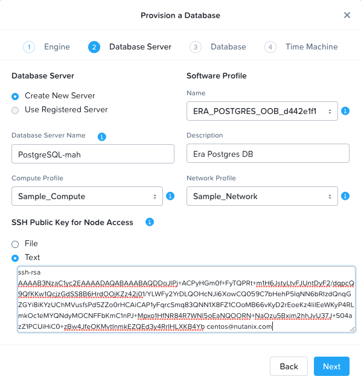
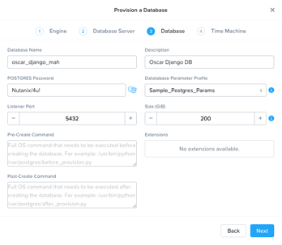
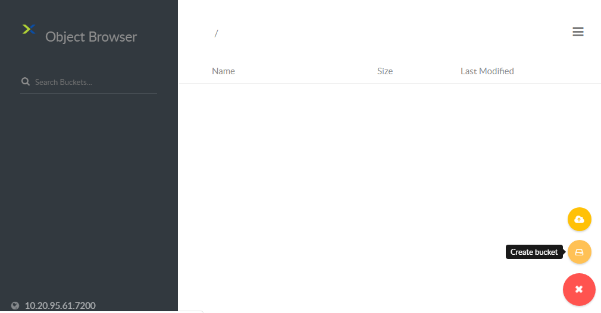
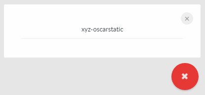
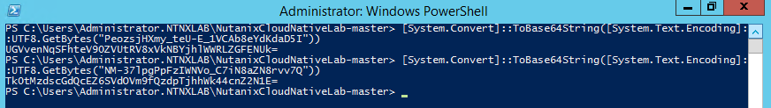
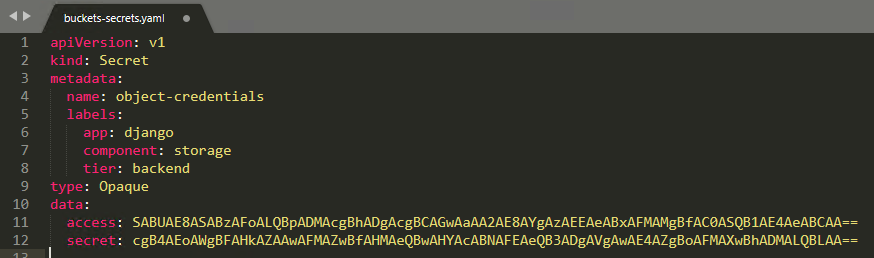
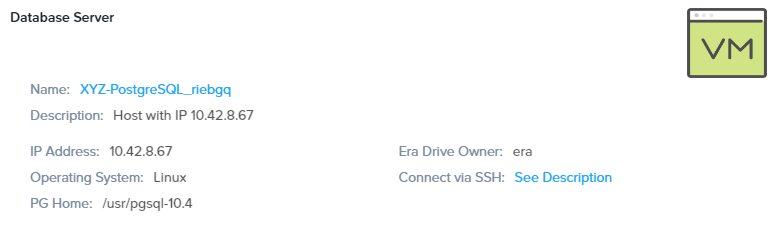
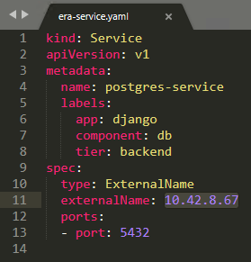

.. _cloud_native_lab:

------------
Cloud Native
------------

*The estimated time to complete this lab is 60 minutes.*

Overview
++++++++

Traditional Enterprise Applications face a variety of deployment challenges for IT and developers; provisioning a database for a new application may need to pass through a DBA, your storage, network, and virtualization teams. There’s unnecessary complexity as a developer shouldn’t care on which server the application runs, or which LUN the data is stored on. In addition, increasing the capacity of an application is a manual and time intensive process; developer workstations likely have different code, packages, and libraries from production servers. These challenges reduce productivity, extend release cycles, and increase software defects.

Enterprises are increasingly shifting towards cloud native applications as they’re simple to deploy and scale, they’re highly available, and they’re space and resource efficient.  Cloud Native applications and the public clouds enable developers to focus on developing applications rather than dealing with the underlying infrastructure.

**Nutanix Cloud Native** combines multiple Nutanix products, including Karbon, Era, Epoch, Buckets, Files, and Volumes, allowing developers to take advantage of on-prem reliable tooling and automation required for the development and management of scale-out applications. As each of these Nutanix products conform to a respective standard, no application code changes are required to target the deployment of an application on-prem or in the cloud.

**The goal of this lab is to experience first-hand how Nutanix Cloud Native products solve these challenges via a series of exercises that walk through the deployment of a fully functional cloud native eCommerce application, which leverages a Karbon based Kubernetes cluster, an Era DB, and Nutanix Buckets object storage.**

Lab Setup
+++++++++

.. raw:: html

  <strong>ATTENTION!</strong>

This lab requires you to have already completed the :ref:`era` and :ref:`karbon` labs.

After completing both labs you should have the following already deployed on your cluster:

- *Initials*-**Era** VM
- *Initials*-**karbon** Kubernetes cluster
- *Initials*-**Windows-ToolsVM** VM
  - ``kubectl`` configured with **kubeconfig** file from *Initials*-**karbon**

Deploying the App Database
++++++++++++++++++++++++++

In this exercise, you will use Nutanix Era to provision a database server which contains a PostgreSQL database, and set up **Time Machine** which provides data copy management.  This Postgres DB will store the persistent data for our web application.

Open \https://*ERA-VM-IP:8443*/ in a new browser tab and log in using these credentials:

- **Username** - admin
- **Password** - techX2019!

Click on the **Dashboard** drop-down menu in the toolbar and select **Databases**.

Select **Sources** from the sidebar and click **+ Provision** to begin provisioning a new database.

Select the **PostgreSQL** engine and click **Next**.

Fill out the following **Database Server** fields:

- **Database Server** - Select **Create New Server**
- **Database Server Name** - *Initials*-PostgreSQL
- **Compute Profile** - Lab
- **Network Profile** - DEFAULT_OOB_NETWORK
- **Software Profile** - POSTGRES_10.4_OOB
- **Description** - Cloud Native App DB
- **SSH Public Key for Node Access** -

.. code-block:: text

ssh-rsa
AAAAB3NzaC1yc2EAAAADAQABAAABAQDDoJlPj+ACPyHGm0f+FyTQPRt+m1H6JstyLtvFJUntDyF2/dqpcQ9QfKKw1QcjzGdSS8B6HrdOOjKZz42j01/YLWFy2YrDLQOHcNJi6XowCQ059C7bHehP5lqNN6bRIzdQnqGZGYi8iKYzUChMVusfsPd5ZZo0rHCAiCAP1yFqrcSmq83QNN1X8FZ1COoMB66vKyD2rEoeKz4lilEeWKyP4RLmkOc1eMYQNdyMOCNFFbKmC1nPJ+Mpxo1HfNR84R7WNl5oEaNQOORN+NaOzu5Bxim2hhJvU37J+504azZ1PCUiHiC0+zBw4JfeOKMvtInmkEZQEd3y4RrIHLXKB4Yb centos@nutanix.com

Click **Next**.

Fill out the following **Database** fields:

.. note::

  Record your **Database Name** and **POSTGRES Password** entries, as the will be used later in the lab.

- **Database Name** - *initialsLowerCase*_oscar_django
- **Description** - (Optional) Description
- **POSTGRES Password** - Nutanix/4u!
- **Database Parameter Profile** - DEFAULT_POSTGRES_PARAMS
- **Listener Port** - 5432
- **Size (GiB)** - 200

Click **Next**.

Review the default **Time Machine** configuration and click **Provision**.

Select **Operations** from the Era drop-down menu to monitor the status of the **Provision Database** job.

Proceed to the next exercise while the database is provisioned.

Creating the Object Storage Bucket
++++++++++++++++++++++++++++++++++

In this exercise you will create an object storage bucket utilizing Nutanix Buckets. This bucket will be used to store all of our web app’s images.

Open \https://*BUCKETS-CLUSTER-PC-IP:8443*/ in a new browser tab and log in using these credentials:

- **Username** - admin
- **Password** - Nutanix.123

Select :fa:`bars` **> Services > Buckets**.

Select **Access Keys** and click **Add People**.

.. figure:: images/buckets_add_people.png

Select **Add people not in Active Directory** and provide your e-mail address.

.. figure:: images/buckets_add_people2.png

Click **Next**.

Click **Download Keys** to download a .csv file containing your **Secret Key**.

.. figure:: images/buckets_add_people4.png

Click **Close**.

Record the **Access Key** associated with your e-mail.

.. figure:: images/buckets_add_people5.png

Log in to the Buckets Object Store Browser at \https://*BUCKETS-ENDPOINT-IP*:7200/ using your **Access Key** and **Secret Key**.

.. figure:: images/buckets_add_people6.png

.. note::

  If you mistakenly did not download your **Secret Key**, **Regenerate** the keys from the Buckets web interface.

Click the :fa:`circle-plus` icon in the lower-right and select **Create bucket**.

In the pop-up that appears, fill in the following and press **Enter**:

- **Bucket Name** - *initialsLowerCase*-oscarstatic

.. note::

  Record your **Bucket Name** entry, as the will be used later in the lab for the django-jet/django-configmap.yaml file.

Ensure your newly created bucket appears in the Object Browser sidebar.

Configuring the Application YAML Files
++++++++++++++++++++++++++++++++++++++

In this exercise you will download Kubernetes YAML files that define the application to be provisioned.

The application is an implementation of `Oscar <https://github.com/django-oscar/django-oscar>`_, an open source eCommerce framework written for `Django <https://www.djangoproject.com/>`_, a popular Python framework for developing web applications.

You will review each of the individual YAML files, and make some minor modifications.

Using your *Initials*\ **-Windows-ToolsVM** web browser, download  :download:`NutanixCloudNativeLab.zip <NutanixCloudNativeLab.zip>`, which contains all YAML files required for the lab.

Once the download has completed, extract the **NutanixCloudNativeLab-master** directory.

Review buckets-secret.yaml File
...............................

In *Initials*\ **-Windows-ToolsVM**, open and review the contents of the **buckets-secrets.yaml** file within the **buckets** directory.

This file provides the **Access Key** and **Secret Key** required for the application to access the previously configured bucket.

`Kubernetes secrets <https://kubernetes.io/docs/concepts/configuration/secret/>`_ store obfuscate credential data as base64-encoded strings.

Substituting your **Access Key** and **Secret Key** values, execute the following in PowerShell to convert your keys into base64-encoded strings:

.. code-block:: powershell

  [System.Convert]::ToBase64String([System.Text.Encoding]::UTF8.GetBytes("YOUR-ACCESS-KEY"))
  [System.Convert]::ToBase64String([System.Text.Encoding]::UTF8.GetBytes("YOUR-SECRET-KEY"))

.. note::

  To convert to base64 on macOS or Linux, use ``echo -n "YOUR-STRING-HERE" | base64``

Update the **access:** and **secret:** values in **buckets-secrets.yaml** using the base64-encoded strings.

Save and close **buckets-secrets.yaml**.

Review era-secret.yaml File
...........................

In *Initials*\ **-Windows-ToolsVM**, open and review the contents of the **era-secrets.yaml** file within the **era** directory.

Similar to **buckets-secrets.yaml**, this file provides the credentials for the PostgreSQL database provisioned by Era.

**No modifications are necessary.**

.. note::

  If you did **NOT** use the provided **Nutanix/4u!** password for the PostgreSQL database during provisioning, you will need to encode your password string using the ``[System.Convert]::ToBase64String([System.Text.Encoding]::UTF8.GetBytes("YOUR-STRING-HERE"))`` command and update the **password** value in **era-secrets.yaml**.

Close **era-secrets.yaml**.

Review era-service.yaml File
............................

In **Era > Databases > Sources**, click *Initials*_**oscar_django** and note the IP Address under **Database Server**.

In *Initials*\ **-Windows-ToolsVM**, open and review the contents of the **era-service.yaml** file within the **era** directory.

This file creates a Kubernetes Service of type `ExternalName <https://kubernetes.io/docs/concepts/services-networking/service/#externalname>`_, which indicates that it is external from Kubernetes.

Update the value of the **externalName** key to match the IP of your *Initials*_**oscar_django** VM.

Save and close **era-service.yaml**.

Review django-configmap.yaml File
.................................

Open and review the contents of the **django-configmap.yaml** file within the **django-jet** directory.

This file sets various environment variables in our web application.

Update the following:

- **S3_ENDPOINT_URL** - https://Buckets-IP:7200/
- **STATIC_BUCKET** -  *initialsLowerCase*-oscarstatic **(ALL LOWER CASE)**
- **DATABASE_NAME** - *initialsLowerCase*_oscar_django **(ALL LOWER CASE)**

Save and close **django-configmap.yaml**.

Review django-deployment.yaml File
..................................

Open and review the contents of the **django-deployment.yaml** file within the **django-jet** directory.

**No modifications are necessary**.

Please review the following:

- The **kind** is a **Deployment**, which is a Kubernetes Controller that defines a set of Pods.
- The **replicas** key indicates how many pods (which generally, but not always, contain a single container) to spin up.
- The **containers name, image**, and **ports** keys specify what we should name our pods once deployed, the image source of the container (stored on Docker Hub), and the port that the containers communicate on.
- The env section contains many entries that should look familiar:
    - Our Era database user and password, which is sourced from our **era-secrets.yaml** file (named **postgres-credentials**).
    - Our Era database host, which is sourced from our **era-service.yaml** file (named **postgres-service**).
    - Our Nutanix Buckets Object Storage access and secret access keys, which is sourced from our **buckets-secrets.yaml** file (named **object-credentials**).
- The **envFrom** entry ties in the **django-configmap.yaml** from the previous step to set the necessary environment variables in our application to our runtime values.

Close **django-deployment.yaml**.

Review django-migration.yaml File
.................................

Open and review the contents of the **django-migration.yaml** file within the **django-jet** directory.

**No modifications are necessary**.

Note the **kind** of this file is a **Job**. Jobs create one or more pods to complete a task, and once that task is completed, the pods are cleaned up.

In our app, this task is to seed the PostgreSQL database and Object storage with our sandbox data. Without that, we would have an empty and boring application.

Close **django-migration.yaml**.

Review django-service.yaml File
...............................

Open and review the contents of the **django-service.yaml** file within the **django-jet** directory.

**No modifications are necessary**.

This creates a Kubernetes **Service**, of type **NodePort**, which means it exposes a port (8000) externally from the Kubernetes cluster.

Once we have a running application, this will be what allows us to access the app from a web browser.

Close **django-service.yaml**.

Running the Application
+++++++++++++++++++++++

In this section, we’ll deploy the application using **kubectl** commands, and then access the application via our web browser.

Deploy the Application
......................

In PowerShell, change directories to **NutanixCloudNativeLab-master** and run the following commands:

.. code-block:: bash

  kubectl apply -f era\
  kubectl apply -f buckets\
  kubectl apply -f django-jet\

Next run the following command to verify your pods are up and running:

.. code-block:: bash

  kubectl get pods

After a couple of minutes, assuming everything is working properly, you should see the **oscar-django-migrations-xxxxx** pod change status from **Running** to **Completed**.

.. note::

  If this does not happen, you can troubleshoot the issue by running the following command (substituting in your unique 5 digit key instead of xxxxx):

  ``kubectl logs oscar-django-migrations-xxxxx``

Accessing the Application
..........................

In your Terminal or PowerShell window run the following command two commands to get Node and Service information:

.. code-block:: bash

  kubectl describe nodes | Select-String -Pattern "InternalIP"

  kubectl get svc

Using this information, we can access our application by combining one of the Internal IPs and the 30000 port number of the **oscar-django-service**.

Run the following command:

.. code-block:: bash

  Start "http://<InternalIP>:3XXXX"

You should now be able to open a new browser tab and see the online store we created.

Takeaways
+++++++++

- Nutanix Karbon, Era, and Buckets can be combined to make a full Cloud Native stack

- Cloud Native applications help reduce infrastructure silos and the time it takes to release new application features

- Nutanix Cloud Native can easily be integrated into 3rd party tools like Jenkins to create a CI/CD pipeline

Getting Connected
+++++++++++++++++

Have a question about **Nutanix and Cloud Native**? Please reach out to the resources below:

+---------------------------------------------------------------------------------+
|  Karbon Product Contacts                                                        |
+================================+================================================+
|  Slack Channel                 |  #karbon                                       |
+--------------------------------+------------------------------------------------+
|  Product Manager               |  Denis Guyadeen, dguyadeen@nutanix.com         |
+--------------------------------+------------------------------------------------+
|  Product Marketing Manager     |  Maryam Sanglaji, maryam.sanglaji@nutanix.com  |
+--------------------------------+------------------------------------------------+
|  Technical Marketing Engineer  |  Dwayne Lessner, dwayne@nutanix.com            |
+--------------------------------+------------------------------------------------+
|  Solutions Architect           |  Andrew Nelson, andrew.nelson@nutanix.com      |
+--------------------------------+------------------------------------------------+
|  SME EMEA                      |  Christophe Jauffret, christophe@nutanix.com   |
+--------------------------------+------------------------------------------------+
|  SME EMEA                      |  Jose Gomez, jose.gomez@nutanix.com            |
+--------------------------------+------------------------------------------------+

+---------------------------------------------------------------------------------------------------+
|  Era Product Contacts                                                                             |
+============================================+======================================================+
|  Slack Channel                             |  #era                                                |
+--------------------------------------------+------------------------------------------------------+
|  Product Manager                           |  Jeremy Launier, jeremy.launier@nutanix.com          |
+--------------------------------------------+------------------------------------------------------+
|  Product Marketing Manager                 |  Maryam Sanglaji, maryam.sanglaji@nutanix.com        |
+--------------------------------------------+------------------------------------------------------+
|  Technical Marketing Engineer              |  Mike McGhee, michael.mcghee@nutanix.com             |
+--------------------------------------------+------------------------------------------------------+
|  Engineering                               |                                                      |
+--------------------------------------------+------------------------------------------------------+
|  Solutions Architect Americas - Era        |  Murali Sriram, murali.sriram@nutanix.com            |
+--------------------------------------------+------------------------------------------------------+
|  Solutions Architect Americas - Oracle/Era |  Mandar Surkund, mandar.surkund@nutanix.com          |
+--------------------------------------------+------------------------------------------------------+
|  Solutions Architect Americas - SQL/Era    |  Mike Matthews, mike.matthews@nutanix.com            |
+--------------------------------------------+------------------------------------------------------+
|  Solutions Architect APAC - Oracle/Era     |  Kim Hock Cheok, kimhock.cheok@nutanix.com           |
+--------------------------------------------+------------------------------------------------------+
|  Solutions Architect APAC - Oracle/Era     |  Predee Kajonpai, predee.kajonpa@nutanix.com         |
+--------------------------------------------+------------------------------------------------------+
|  Solutions Architect EMEA - Oracle/Era     |  Olivier Parcollet, olivier.parcollet@nutanix.com    |
+--------------------------------------------+------------------------------------------------------+
|  Solutions Architect EMEA - Oracle/Era     |  Karsten Zimmermann, karsten.zimmermann@nutanix.com  |
+--------------------------------------------+------------------------------------------------------+

+---------------------------------------------------------------------------------------------+
|  Buckets Product Contacts                                                                   |
+================================+============================================================+
|  Slack Channel                 |  #nutanix-buckets                                          |
+--------------------------------+------------------------------------------------------------+
|  Product Manager               |  Priyadarshi Prasad, priyadarshi@nutanix.com               |
+--------------------------------+------------------------------------------------------------+
|  Product Marketing Manager     |  Krishnan Badrinarayanan, krishnan.badrinaraya@nutanix.com |
+--------------------------------+------------------------------------------------------------+
|  Technical Marketing Engineer  |  Laura Jordana, laura@nutanix.com                          |
+--------------------------------+------------------------------------------------------------+

+---------------------------------------------------------------------------------------------+
|  Cloud Native Contacts                                                                      |
+================================+============================================================+
|  Technical Marketing Engineer  |  Michael Haigh, michael.haigh@nutanix.com                  |
+--------------------------------+------------------------------------------------------------+
