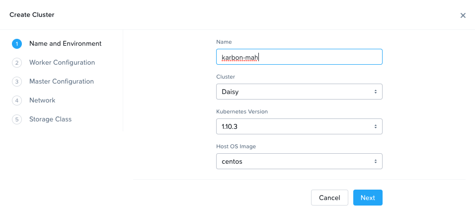
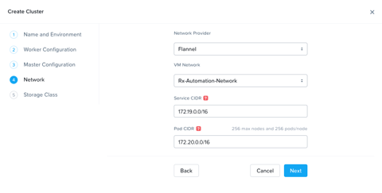
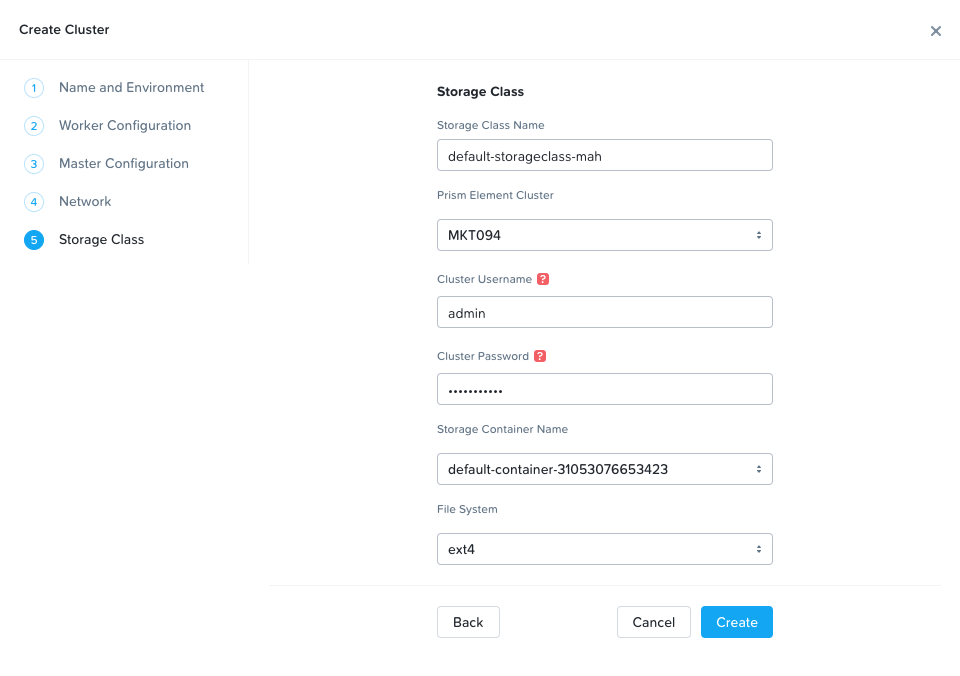

.. _cloud_native_lab:

---------------------------------
Lab - Nutanix Cloud Native Lab
---------------------------------

Overview
++++++++

.. note::

  Estimated time to complete: **1 HOUR**

  **Due to limited resources, this lab should be completed as a group.**

Traditional Enterprise Applications face a variety of deployment challenges for IT and developers; provisioning a database for a new application may need to pass through a DBA, your storage, network, and virtualization teams. There’s unnecessary complexity as a developer shouldn’t care on which server the application runs, or which LUN the data is stored on. In addition, increasing the capacity of an application is a manual and time intensive process; developer workstations likely have different code, packages, and libraries from production servers. These challenges reduce productivity, extend release cycles, and increase software defects.

The goal of this lab is to experience first-hand how Nutanix Cloud Native products solve these challenges via a series of exercises that walk through the deployment of a fully functional cloud native application, which leverages a Karbon based Kubernetes cluster, an Era DB, and Nutanix Buckets object storage, all of which you will get a chance to deploy, provision, and create respectively.

Getting Engaged with the Product Team
.....................................

- **Karbon Slack** - #karbon
- **Karbon Product Manager** - Denis Guyadeen, dguyadeen@nutanix.com
- **Karbon Product Marketing Manager** - Maryam Sanglaji, maryam.sanglaji@nutanix.com
- **Karbon Technical Marketing Engineer** - Dwayne Lessner, dwayne@nutanix.com

- **Era Slack** - #era
- **Era Product Manager** - Jeremy Launier, jeremy.launier@nutanix.com
- **Era Product Marketing Manager** - Maryam Sanglaji, maryam.sanglaji@nutanix.com
- **Era Technical Marketing Engineer** - Mike McGhee, michael.mcghee@nutanix.com

- **Buckets Slack** - #nutanix-buckets
- **Buckets Product Manager** - Priyadarshi Prasad, priyadarshi@nutanix.com
- **Buckets Product Marketing Manager** -
- **Buckets Technical Marketing Engineer** -

Create a Karbon Kubernetes Cluster
++++++++++++++++++++++++++++++++++

In this exercise you will create a production ready Kubernetes cluster with Nutanix Karbon. This Karbon Kubernetes cluster will run our ephemeral web application containers.

Navigate to **Prism Central > Explore > Karbon** and ensure you see a ‘Karbon is successfully enabled’ notification.

 Click the link to open the Karbon Console, then click **+ Create Cluster**.

Fill in the following:

**Name and Environment**

- **Name** - karbon-*initialsLowerCase*
- **Cluster** - Leave Default selected
- **Kubernetes Version** - 1.10.3
- **Host OS Image** - centos

Click **Next**

**Worker Configuration**

.. note::

  This defines the number of worker nodes that will run the Kubernetes pods.

Leave all defaults and click **Next**.

**Master Configuration**

.. note::

  This defines the number of master nodes that controls the Kubernetes cluster, and the number of etcd VMs, which manages the cluster state.

Leave all defaults and click **Next**.

**Network**

- **Network Provider** - Flannel
- **VM Network** - Primary
- **Service CIDR** - Leave the default of 172.19.0.0/16
- **Pod CIDR** - Leave the default of 172.20.0.0/16

Click **Next**

**Storage Class**

- **Storage Class Name** - default-storageclass-*initialsLowerCase*
- **Prism Element Cluster** - Leave default selected
- **Cluster Username** - admin
- **Cluster Password** - *HPOC Password*
- **Storage Container Name** - default-container-XXXXXXX
- **File System** - ext4

Click **Create**

.. note::

  Move on to the next step while the Karbon cluster is being provisioned, but occasionally check back in on the status.

Deploy Era Database and Database Server
+++++++++++++++++++++++++++++++++++++++

In this section, you will provision a database server which contains a PostgreSQL database, and set up **Time Machine** which provides data copy management.  This Postgres DB will store the persistent data for our web application.

Takeaways
+++++++++
