.. _dr_runbooks:

------------------------
Leap: DR Runbooks
------------------------

Overview
++++++++

**Estimated time to complete: 60 MINUTES**

Legacy disaster recovery configurations, which are created with Prism Element, use protection domains and third-party integrations to protect VMs, and they replicate data between on-premises Nutanix clusters.
Protection domains provide limited flexibility in terms of supporting operations such as VM boot order and require you to perform manual tasks to protect new VMs as an application scales up.

Leap uses an entity-centric approach and runbook-like automation to recover applications.
It uses categories to group the entities to be protected and to automate the protection of new entities as the application scales.
Application recovery is more flexible with network mappings, configurable stages to enforce a boot order, and optional inter-stage delays. Application recovery can also be validated and tested without affecting production workloads. All the configuration information that an application requires upon failover are synchronized to the recovery location.

You can use Leap between two physical data centers or between a physical data center and Xi Cloud Services.
Leap works with pairs of physically isolated locations called availability zones.
One availability zone serves as the primary location for an application while a paired availability zone serves as the recovery location.
While the primary availability zone is an on-premises Prism Central instance, the recovery availability zone can be either on-premises or in Xi Cloud Services.

Lab Setup
+++++++++

For this lab you will be using the HPOC you were assigned, as well as the secondary Prism Central you were assigned.

This lab depends on the availability of a multi-tier **Wordpress** web application.

Refer to the :ref:`wordpress` lab for instructions on importing and launching the completed **Wordpress** blueprint.

Once you have initiated the **Wordpress** deployment, you can proceed with the lab below.

Create Category
...............

In **Prism Central** > select :fa:`bars` **> Virtual Infrastructure > Categories**, and click **Create Category**.

Fill out the following fields:

- **Name**  - *initials*-DR
- **Purpose** - DR Runbooks
- **Values**  - DB
- **Values**  - web

.. figure:: images/drrunbooks_01.png

Click **Save**.

Assign Category
...............

In **Prism Central** > select :fa:`bars` **> Virtual Infrastructure > VMs**

Select the DRDB VM you created, and click **Manage Categories** from the **Actions** dropdown.

.. figure:: images/drrunbooks_02.png

Search for *initials*-**DR** you just created, and select *initials*-**DR:DB**.

.. figure:: images/drrunbooks_03.png

Click **Save**.

Select the DRWeb VM you created, and click **Manage Categories** from the **Actions** dropdown.

Search for *initials*-**DR** you just created, and select *initials*-**DR:Web**.

Click **Save**.

Create Protection Policy
++++++++++++++++++++++++

Leap is built into Prism Central and requires no additional appliances or consoles to manage. Before you can begin managing DR-Orchestration with Leap, the service must be enabled.

.. note::

  Leap can only be enabled once per Prism Central instance. If **Leap** displays a green check mark next to it, that means Leap has already been enabled for the Prism Central instance being used.

Enable Leap and Connect Availability Zone (Local)
.................................................

In **Prism Central**, click the **?** drop down menu, expand **New in Prism Central** and select **Leap**.

In **Prism Central** > select :fa:`bars` **> Administration > Availability Zones**, and click **Connect to Availability Zone**.

.. note::

  You can only setup the **Connect to Availability Zone** once to a given Prism Central.

Fill out the following fields:

- **Availability Zone Type**  - Physical location
- **IP Address for Remote PC**  - *Assigned DR PC IP*
- **Username**  - admin
- **Password**  - techX2019!

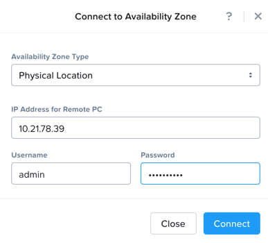

Click **Connect**.

Enable Leap and Connect Availability Zone (Remote)
.................................................

In **DR Prism Central**, click the **?** drop down menu, expand **New in Prism Central** and select **Leap**.

In **DR Prism Central** > select :fa:`bars` **> Administration > Availability Zones**, and click **Connect to Availability Zone**.

.. note::

  You can only setup the **Connect to Availability Zone** once to a given Prism Central.

Fill out the following fields:

- **Availability Zone Type**  - Physical location
- **IP Address for Remote PC**  - *Assigned PC IP*
- **Username**  - admin
- **Password**  - techX2019!

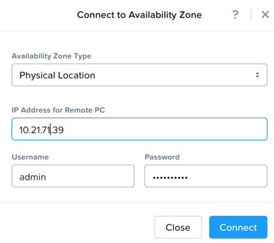

Click **Connect**.

.. note::

  If Leap has been enabled on both PC's and the PC’s have been paired, proceed.

Create Protection Policy
++++++++++++++++++++++++

In **Prism Central** > select :fa:`bars` **> Policies > Protection Policies**, and click **Create Protection Policy**.

Fill out the following fields:

- **Name**  - *initials*-Protection
- **Primary Location**  - Local AZ
- **Remote Location** - Assigned DR PC
- **Target Cluster**  - Assigned DR HPOC
- **Recovery Point Objective**  - Hours
- **Start immediately** - 1
- **Remote Retention**  - 2
- **Local Retention**  - 2

- Select **+ Add Categories**
    - **Select Categories - *initials*-**DR:Web**
    - **Select Categories - *initials*-**DR:DB**
    Select **Save**

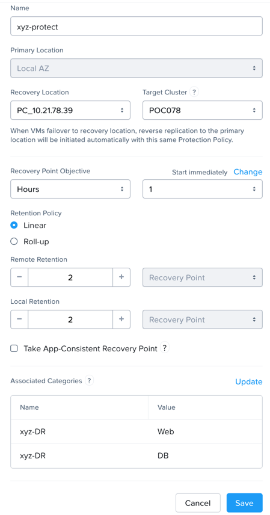

Click **Save**

Create Recovery Plan
++++++++++++++++++++++++

In **Prism Central** > select :fa:`bars` **> Policies > Recovery Plans**, and click **Create Recovery Plan**.

Fill out the following fields:

- **Primary Location**  - Local AZ
- **Remote Location** - Assigned DR PC

Click **Proceed**

Fill out the following fields:

- **Name**  - *initials*-Recover
- **Recovery Plan Description** - optional

Click **Next**

Select **+ Add Entities**

- **Search Entities by**  - VM Name
    - Add *DRDB1 - DRDB12 based on assignment*
    Select **Add**

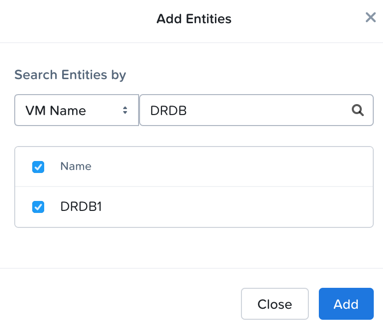

Click **+ Add New Stage**

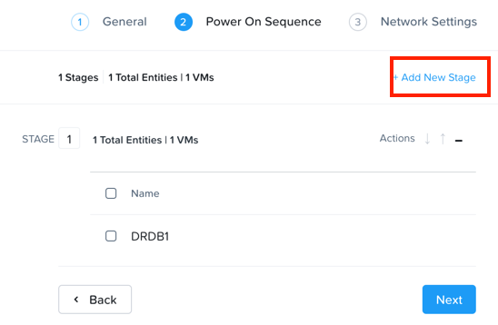

Select **+ Add Entities**

- **Search Entities by**  - VM Name
    - Add *DRWeb1 - DRWeb12 based on assignment*
    Select **Add**

.. note::

  Sometimes it can take up to 5 minutes for the individual VMs to be added to the protection policy.
  Since we added the policy at the start you should be good to go.

  If you don’t want to wait you can manually protect the VM by using “Protect” on the VM menu in PC.

Add in a delay between stages 1 and 2 or 60 seconds to make sure the database is up first before the web front end loads.

Click **+ Add Delay**

- **Seconds** - 60

Click **Add**

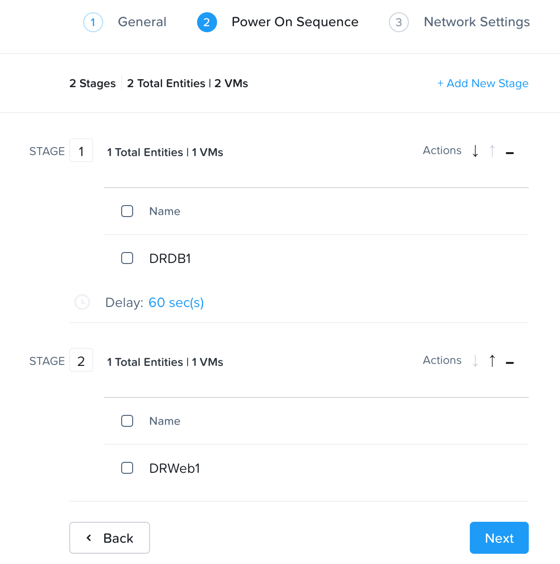

Click **Next**

Virtual networks in on-premises Nutanix clusters are virtual subnets that are bound to a single VLAN.

At physical locations, including the recovery location, administrators must create these virtual subnets manually, with separate virtual subnets created for production and test purposes.

.. note::

  You must create these virtual subnets before configuring recovery plans.

When configuring a recovery plan, map the virtual subnets at the source location to the virtual subnets at the recovery location.

Fill out the following fields:

- Local AZ
    - **Virtual Network or Port Group** - Secondary

- Remote AZ
    - **Virtual Network or Port Group** - Secondary

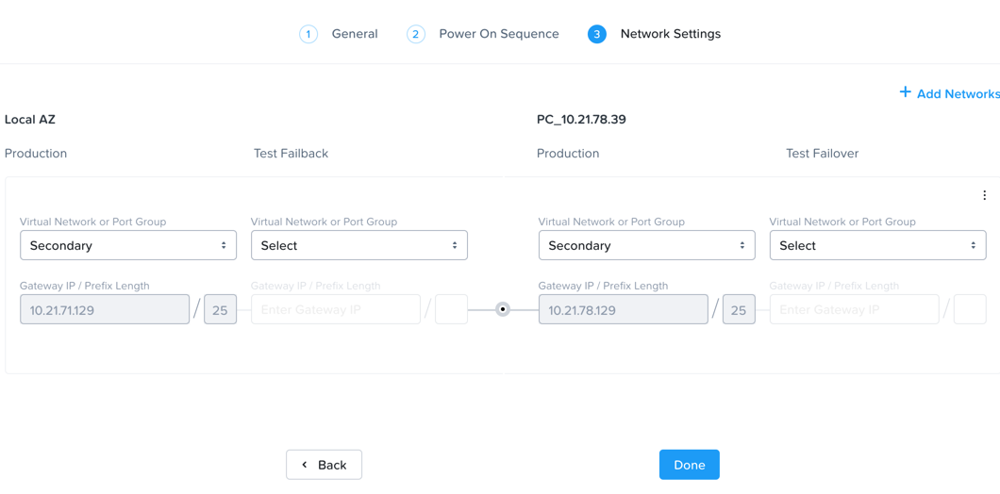

.. note::

  You can leave out the Test Failback Network as we don’t have enough networks setup. Typically, the Test Network will be a non-routable network.

  If you are not using Nutanix AHV IPAM and need to retain your IP addresses, you would need to install NGT. ESXi will always need NGT to reserve IP address.

Click **Done**, and click **Continue** on the "incomplete Network Mapping" warning.

Perform a Failover to the Remote AZ (PC)
++++++++++++++++++++++++++++++++++++++++

Failover operations in Leap are of the following types:

**Test Failover**
You perform a test failover when you want to test a recovery plan. When you perform a test failover, the VMs are started in the virtual network designated for testing purposes at the recovery location (a manually created virtual network on on-premises clusters and a virtual subnet in the Test VPC in Xi Cloud Services).
However, the VMs at the primary location are not affected. Test failovers rely on the presence of VM snapshots at the recovery location.

**Planned Failover**
You perform planned failover when a disaster that disrupts services is predicted at the primary location. When you perform a planned failover, the recovery plan first creates a snapshot of each VM, replicates the snapshots at the recovery location, and then starts the VMs at the recovery location.
Therefore, for a planned failover to succeed, the VMs must be available at the primary location. If the failover process encounters errors, you can resolve the error condition.
After a planned failover, the VMs no longer run in the source availability zone.
After failover, replication begins in the reverse direction. For a planned failover the MAC address will be maintained.

**Unplanned Failover**
You perform unplanned failover when a disaster has occurred at the primary location. In an unplanned failover, you can expect some data loss to occur.
The maximum data loss possible is equal to the RPO configured in the protection policy or the data that was generated after the last manual backup for a given VM.
In an unplanned failover, by default, VMs are recovered from the most recent snapshot. However, you can recover from an earlier snapshot by selecting a date and time.
Any errors are logged but the execution of the failover continues.
After failover, replication begins in the reverse direction.

You can perform an unplanned failover operation only if snapshots have been replicated to the recovery availability zone.
At the recovery location, failover operations cannot use snapshots that were created locally in the past.
For example, if you perform a planned failover from the primary availability zone AZ1 to recovery location AZ2 (Xi Cloud Services) and then attempt an unplanned failover from AZ2 to AZ1, recovery will succeed at AZ1 only if snapshots were replicated from AZ2 to AZ1 after the planned failover operation.
The unplanned failover operation cannot perform recovery based on snapshots that were created locally when the entities were running in AZ1.

Perform Failover
................

In **DR Prism Central** > select :fa:`bars` **> Policies > Recovery Plans**.

Select your *initials*-\**Recovery** recovery plan and select **Failover** from the **Actions** dropdown.

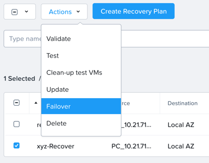

You should see your assigned HPOC PC as the **Primary Location**, and your assigned DR PC (that you are logged into) as the **Recovery Location**.

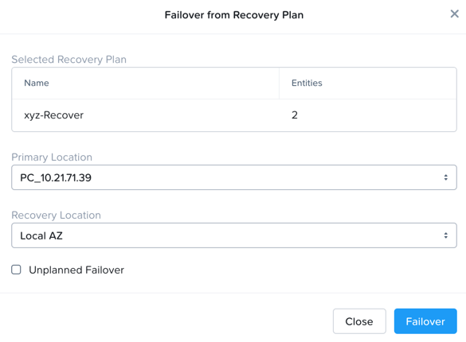

Click **Failover**.

Change the **Action** to **Execute Anyway**, and click **Proceed**..

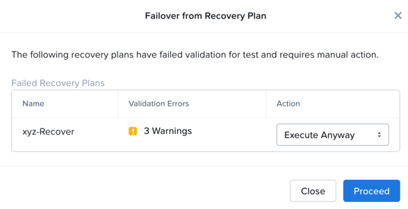

Check Failover Status
.....................

Click the *Initials*-**Recovery** recovery plan to see the status and details.

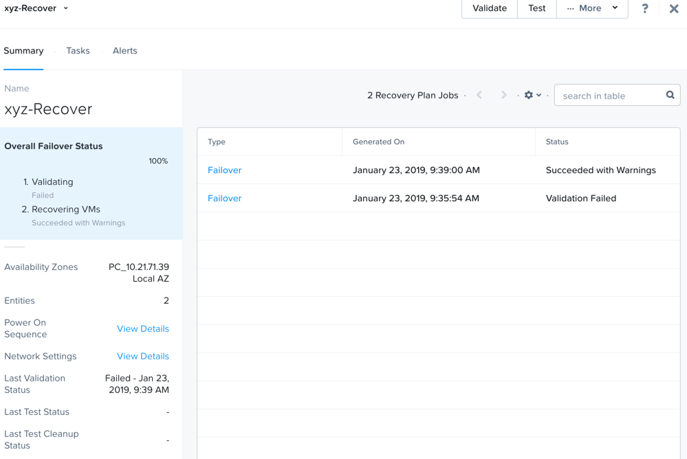

.. note::

  The failed validation is due to the licensing error earlier.

Click on Failover to see more details.

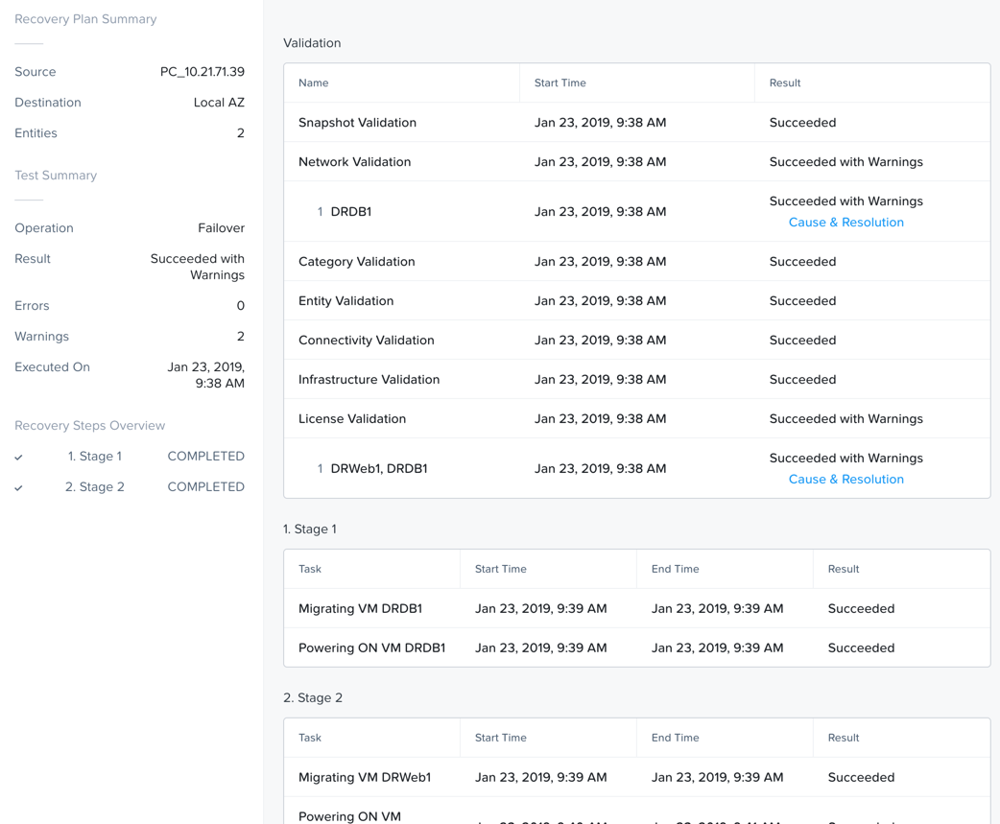

In **Prism Central** > select :fa:`bars` **> Virtual Infrastructure > VMs**.

You can make sure that the DB and Web VMs are up.

You can also go to the Wordpress url in your *initials*-**Windows-ToolsVM**, http://drweb1.ntnxlab.local and check that the service is up.

Fail Back to the Original AZ (PC)
+++++++++++++++++++++++++++++++++

In **Prism Central** > select :fa:`bars` **> Policies > Recovery Plans**.

Select your *initials*-\**Recovery** recovery plan and select **Failover** from the **Actions** dropdown.

You should see your assigned DR PC as the **Primary Location**, and your assigned HPOC PC (that you are logged into) as the **Recovery Location**.

Click **Failover**.

Change the **Action** to **Execute Anyway**, and click **Proceed** when se the licensing error.

Check Failover Status
.....................

Click the *initials*-\**Recovery** recovery plan to see the status and details.

.. note::

  The failed validation is due to the licensing error earlier.

Click on Failover to see more details.

In **Prism Central** > select :fa:`bars` **> Virtual Infrastructure > VMs**.

You can make sure that the DB and Web VMs are up.

You can also go to the Wordpress url in your *initials*-**Windows-ToolsVM**, http://drweb1.ntnxlab.local and check that the service is up.

Takeaways
+++++++++

What are the key things you should know about **Nutanix Leap DR Runbooks**?

- All new Runbook functionality is in PC and required on both sides.

- Runbooks don't require you to setup remote sites or storage mappings anymore.

- The last octet of IP address can be kept the same in a new subnet in case DNS doesn't work.

- `Tech Note 2027 <https://portal.nutanix.com/#/page/solutions/details?targetId=TN-2027_Data_Protection_and_Disaster_Recovery:TN-2027_Data_Protection_and_Disaster_Recovery>`_

- `Best Practice Guide <https://portal.nutanix.com/#/page/solutions/details?targetId=BP-2005_Data_Protection:BP-2005_Data_Protection - best practice>`_

Getting Connected
+++++++++++++++++

Have a question about **Nutanix Leap DR Runbooks**? Please reach out to the resources below:

+---------------------------------------------------------------------------------+
|  DR Runbooks Product Contacts                                                   |
+================================+================================================+
|  Slack Channel                 |  #dr-orchestration                             |
+--------------------------------+------------------------------------------------+
|  Product Manager               |  Mark Nijmeijer, mark.nijmeijer@nutanix.com    |
+--------------------------------+------------------------------------------------+
|  Product Marketing Manager     |  Mayank Gupta, mayank.gupta@nutanix.com        |
+--------------------------------+------------------------------------------------+
|  Technical Marketing Engineer  |  Dwayne Lessner, dwayne@nutanix.com            |
+--------------------------------+------------------------------------------------+
|  Founders Team Manager         |  Diane Genova, diane.genova@nutanix.com        |
+--------------------------------+------------------------------------------------+
|  Founders Team                 |  Archish Dalal, archish.dalal@nutanix.com      |
+--------------------------------+------------------------------------------------+
|  Founders Team                 |  Norbert Thier, norbert.thier@nutanix.com      |
+--------------------------------+------------------------------------------------+
|  SME                           |                                                |
+--------------------------------+------------------------------------------------+
|  SME                           |                                                |
+--------------------------------+------------------------------------------------+
