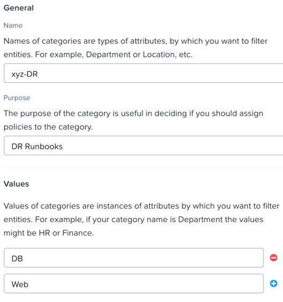
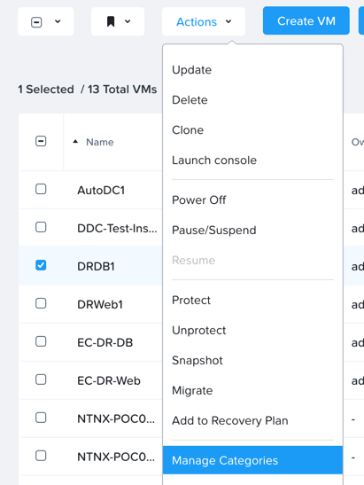

.. _dr_runbooks:

------------------------
Xi Leap: DR Runbooks
------------------------

Overview
++++++++

**Estimated time to complete: 60 MINUTES**

Legacy disaster recovery configurations, which are created with Prism Element, use protection domains and third-party integrations to protect VMs, and they replicate data between on-premises Nutanix clusters.
Protection domains provide limited flexibility in terms of supporting operations such as VM boot order and require you to perform manual tasks to protect new VMs as an application scales up.

Leap uses an entity-centric approach and runbook-like automation to recover applications.
It uses categories to group the entities to be protected and to automate the protection of new entities as the application scales.
Application recovery is more flexible with network mappings, configurable stages to enforce a boot order, and optional inter-stage delays. Application recovery can also be validated and tested without affecting production workloads. All the configuration information that an application requires upon failover are synchronized to the recovery location.

You can use Leap between two physical data centers or between a physical data center and Xi Cloud Services.
Leap works with pairs of physically isolated locations called availability zones.
One availability zone serves as the primary location for an application while a paired availability zone serves as the recovery location.
While the primary availability zone is an on-premises Prism Central instance, the recovery availability zone can be either on-premises or in Xi Cloud Services.

Lab Setup
+++++++++

For this lab you will be using the HPOC you were assigned, as well as the secondary Prism Central you were assigned.

You will also need to deploy two CentOS7 VMs, and deploy Wordpress and MariaDB.

Create Multi-Tier Wordpress App
...............................

.. note::

  When creating the VMs you will use the **Secondary**, and adding static IPs you have been assigned in the .230-.253 range.
  You will be using the same last octet in the 2nd assigned hosted POC cluster.
  The 2nd HPOC cluster will also have a secondary network that we will use as well. Also check that X.X.X.230+ is also free.

Check Web and DB name, and Secondary Prism Central assignments here - https://docs.google.com/spreadsheets/d/1gN5wEcsQrs2B6NFFom3md5VuPqQizyaafudA5HIghb0/edit?ts=5c475e5d#gid=0

In **Prism Central** > select :fa:`bars` **> Virtual Infrastructure > VMs**, and click **Create VM**.

Fill out the following fields:

- **Name** - *DRWeb1 - DRWeb12 based on assignment*
- **Description** - (Optional) Description for your VM.
- **vCPU(s)** - 2
- **Number of Cores per vCPU** - 1
- **Memory** - 2 GiB

- Select **+ Add New Disk**
    - **Type** - DISK
    - **Operation** - Clone from Image Service
    - **Image** - CentOS7.qcow2
    - Select **Add**

- Select **Add New NIC**
    - **VLAN Name** - Secondary
    - **IP Address**  - *DRWeb1 - DRWeb12 Assigned IP*
    - Select **Add**

Click **Save** to create the VM.

Click **Create VM**, and fill out the following fields:

- **Name** - *DRDB1 - DRDB12 based on assignment*
- **Description** - (Optional) Description for your VM.
- **vCPU(s)** - 2
- **Number of Cores per vCPU** - 1
- **Memory** - 2 GiB

- Select **+ Add New Disk**
    - **Type** - DISK
    - **Operation** - Clone from Image Service
    - **Image** - CentOS7.qcow2
    - Select **Add**

- Select **Add New NIC**
    - **VLAN Name** - Secondary
    - **IP Address**  - **DRDB1 - DRDB12 Assigned IP*
    - Select **Add**

Click **Save** to create the VM.

Power On the VMs.

Create Category
...............

In **Prism Central** > select :fa:`bars` **> Virtual Infrastructure > Categories**, and click **Create Category**.

Fill out the following fields:

- **Name**  - *initials*-DR
- **Purpose** - DR Runbooks
- **Values**  - DB
- **Values**  - web

Click **Save**.

Assign Category
...............

In **Prism Central** > select :fa:`bars` **> Virtual Infrastructure > VMs**

Select the DRDB VM you created, and click **Manage Categories** from the **Actions** dropdown.

Search for *initials*-**DR** you just created, and select *initials*-**DR:DB**.

.. figure:: images/drrunbooks_03.png

Click **Save**.

Select the DRWeb VM you created, and click **Manage Categories** from the **Actions** dropdown.

Search for *initials*-**DR** you just created, and select *initials*-**DR:Web**.

Click **Save**.

Configure DRDB VM
.................

Login to *DRDB1 - DRDB12 based on assignment* via ssh or Console session.

- **Username** - root
- **password** - nutanix/4u

First lets update all installed packages.

.. code-block:: bash

  yum -y update

Now set the hostname:

.. code-block:: bash

  nmtui

- **Hostname**  - drdbXX.ntnxlab.local (drdb1-drdb12 based on assignment)

Install MariaDB:

.. code-block:: bash

  yum install -y mariadb mariadb-server

Start MariaDB, and set it to start on reboot:

.. code-block:: bash

  systemctl start mariadb

  systemctl enable mariadb

Create database for Wordpress (Use root user account):

.. code-block:: bash

  mysql -u root

  MariaDB [(none)]> CREATE DATABASE wpdb;

Create new MariaDB user for wordpress:

.. code-block:: bash

  CREATE USER 'wpuser'@'localhost' IDENTIFIED BY 'techsummit';

  CREATE USER 'wpuser'@'drdbXX.ntnxlab.local' IDENTIFIED BY 'techsummit';

  GRANT ALL PRIVILEGES ON wpdb.* TO 'wpuser'@’localhost’;

   GRANT ALL PRIVILEGES ON wpdb.* TO 'wpuser'@'%';

  MariaDB [(none)]> FLUSH PRIVILEGES;

  MariaDB [(none)]> quit

Configure the MariaDB server on database to listen on public IP (or all interfaces).

Edit the MariaDB configuration file (/etc/my.cnf.d/server.cnf).

.. code-block:: bash

  vi /etc/my.cnf.d/server.cnf

Add the following line:

.. code-block:: bash

  bind-address = 0.0.0.0

Restart MariaDB for the changes to take effect:

.. code-block:: bash

  systemctl restart mariadb

Configure DRWeb VM
..................

Login to *DRWeb1 - DRWeb12 based on assignment* via ssh or Console session.

- **Username** - root
- **password** - nutanix/4u

First lets update all installed packages.

.. code-block:: bash

  yum -y update

  yum install -y unzip

Now set the hostname:

.. code-block:: bash

  nmtui

- **Hostname**  - drwebXX.ntnxlab.local (drweb1-drweb12 based on assignment)

Install the Apache web server:

.. code-block:: bash

  yum install -y httpd

Start the web server, and enable it to start upon server boot:

.. code-block:: bash

  systemctl start httpd

  systemctl enable httpd

In order to install and use PHP 7.2, we need to install REMI repositories:

.. code-block:: bash

  rpm -Uvh http://rpms.remirepo.net/enterprise/remi-release-7.rpm

  yum install -y yum-utils

  yum-config-manager --enable remi-php72

Next, install PHP 7.2 along with the required PHP extensions:

.. code-block:: bash

  yum install -y php php-cli php-mbstring php-gd php-mysqlnd php-xmlrpc php-xml php-zip php-curl

Finally, complete the LAMP installation by installing MariaDB client package:

.. code-block:: bash

  yum install -y mariadb mariadb-server

Start MariaDB, and set it to start on reboot:

.. code-block:: bash

  systemctl start mariadb

  systemctl enable mariadb

Configure the MariaDB server on database to listen on public IP (or all interfaces).

Edit the MariaDB configuration file (/etc/my.cnf.d/server.cnf).

.. code-block:: bash

  vi /etc/my.cnf.d/server.cnf

Add the following line:

.. code-block:: bash

  bind-address = 0.0.0.0

Restart MariaDB for the changes to take effect:

.. code-block:: bash

  systemctl restart mariadb

Download the latest WordPress version:

.. code-block:: bash

  curl https://wordpress.org/latest.zip -o wordpress.zip

Extract it to the /var/www//html directory on your server:

.. code-block:: bash

  unzip -d /var/www/html/ wordpress.zip

Set proper permissions on WordPress files and directories:

.. code-block:: bash

  chown apache:apache -R /var/www/html/wordpress/

Rename wp-config-sample.php WordPress configuration file to wp-config.php:

.. code-block:: bash

  mv /var/www/html/wordpress/wp-config-sample.php /var/www/html/wordpress/wp-config.php

Edit the wp-config.php file and modify the following lines

.. code-block:: bash

  vi /var/www/html/wordpress/wp-config.php

  /** The name of the database for WordPress */
  define('DB_NAME', 'wpdb');

  /** MySQL database username */
  define('DB_USER', 'wpuser');

  /** MySQL database password */
  define('DB_PASSWORD', 'techsummit');

  /** MySQL hostname */
  define('DB_HOST', ‘drdbXX.ntnxlab.local');

You will have to add these ones

.. code-block:: bash

  define( 'WP_HOME', 'http://drwebXX.ntnxlab.local' );
  define( 'WP_SITEURL', ‘http://drwebXX.ntnxlab.local' );

Now we will have to setup the Apache configuration so it can serve the WordPress directory.

Add the contents below in the /etc/httpd/conf.d/wordpress.conf file using vi or your favorite editor:

.. code-block:: bash

  vi /etc/httpd/conf.d/wordpress.conf

  Add the following lines (Update ServerName & ServerAlias):

  <VirtualHost *:80>
  ServerAdmin admin@your-domain.com
  DocumentRoot /var/www/html/wordpress
  ServerName drwebXX.ntnxlab.local
  ServerAlias drwebXX.ntnxlab.local

  Alias /matomo “/var/www/html/wordpress/”
  <Directory /var/www/html/wordpress/>
  Options +FollowSymlinks
  AllowOverride All

  </Directory>

  ErrorLog /var/log/httpd/wordpress-error_log
  CustomLog /var/log/httpd/wordpress-access_log common
  </VirtualHost>

Save the changes and restart Apache for the changes to take effect:

.. code-block:: bash

  systemctl restart httpd

Open http://drwebXX.ntnxlab.local in the web browser on your *initials*-**Windows-ToolsVM**, and finish the WordPress installation.

Getting Engaged with the Product Team
+++++++++++++++++++++++++++++++++++++

+---------------------------------------------------------------------------------+
|  DR Runbooks Product Contacts                                                   |
+================================+================================================+
|  Slack Channel                 |  #Prism-Pro                                    |
+--------------------------------+------------------------------------------------+
|  Product Manager               |  Mark Nijmeijer, hmark.nijmeijer@nutanix.com   |
+--------------------------------+------------------------------------------------+
|  Product Marketing Manager     |                                                |
+--------------------------------+------------------------------------------------+
|  Technical Marketing Engineer  |  Dwayne Lessner, dwayne@nutanix.com            |
+--------------------------------+------------------------------------------------+

Takeaways
+++++++++
