.. _xi_frame:

--------
Xi Frame
--------

*The estimated time to complete this lab is 90 minutes.*

Overview
++++++++

Frame is... <overview, DaaS definitions, supported clouds, VDI differentiation, frame architecture (would like to minimize this in the overview and see how much we can spread out through the lab), maybe a couple proof point references?>

**In this lab you will access a Frame environment similar to Test Drive, allowing you to walk through the same experience as a prospect who has signed up for access to the free 2-hour Test Drive. The environment will allow you to access sample applications, add your own apps, invite users, customize settings, and more.**

Lab Setup
+++++++++

Specifically for Tech Summit, this lab will **NOT** use the standard Frame Test Drive offering.

A separate environment has been created with pre-provisioned accounts to eliminate the ~15 minute wait when activating a Test Drive account. These accounts will remain active for 14 days, allowing you to fully explore the environment.

Before beginning the lab, you must see a GTS proctor to be provided with administrator credentials for a dedicated Frame tenant account.

Running Apps & Desktops
+++++++++++++++++++++++

Once you have received your custom credentials, open https://frame.nutanix.com/ in a new browser tab.

Select **Sign in with Email and Password** and provide your credentials.

Accept the usage agreements and you will be taken to the Test Drive Launchpad. Launchpads provide a way of organizing and presenting applications and desktops to Frame users. As you will see later in the lab, a user can have access to multiple Launchpads - potentially even spanning different organizations utilizing the same credentials.

Multiple applications have been pre-published, allowing a user to quickly test the user experience of accessing a desktop via their browser.

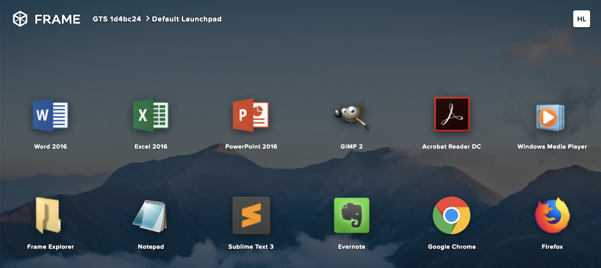

Note the status bar at the bottom at the bottom of the Launchpad.

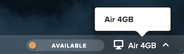

The **Air 4GB** denotes the **Instance Type**. An Instance Type is the VM configuration which will be launched to run applications. The Test Drive environment limits the account to the 2 vCPU/4GB RAM configuration, appropriate for general purpose 2D applications, but full accounts can take advantage of other configurations including:

- **Air 8GB** - 2 vCPU/8GB RAM
- **Pro 16GB** - 4 vCPU/16GB RAM/1 NVIDIA GRID GPU
- **Pro 64GB** - 16 vCPU/64GB RAM/4 NVIDIA GRID GPU

Log in with your new user credentials and you should be presented with your applications Launchpad.

Click on **Google Chrome** to launch your first Frame session.

Your initial session may take ~2 minutes to launch, this is because a VM used to run the application is provisioned and booted on-demand at the time of clicking the application. Later in the exercise you will explore options for pre-provisioning resources, allowing administrators to balance user experience and the cost overhead of idle, public cloud resources.

Maximize the application to occupy the entire browser tab.

Note the changes to the status bar that appears at the bottom of your session.

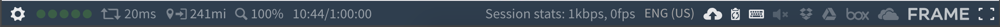

Click the :fa:`gear` icon on the status bar to explore the actions available to a user during the session, such as launching and switching to other applications and network QoS settings.

Click :fa:`gear` **> Show/hide stats**. Try playing a YouTube video with the highest available FPS and video bit rate values versus a max of 5 FPS and 0.5 Mbps bit rate.

Hover over the remaining elements in the status bar to see what they do.

Working with Files
++++++++++++++++++

Sessions on Frame are stateless, which means that any changes you make to the C: drive will not persist on the virtual machine beyond your session. User files and settings are persisted separately. In this exercise, you'll explore options for how to work with your own files.

Uploading and Downloading
.........................

In the group of icons on the right side of the status bar, click on the up arrow to upload a file. Alternatively, you can drag and drop any file onto the session window in your browser.

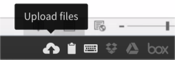

You can open the file from the **Uploads** folder found within the Frame Explorer.

.. note::

  If accessing the full desktop, the **Uploads** and **Download Now** folders can be found in ``C:\Users\Frame\``.

.. figure:: images/17.png

When you’re done editing, simply save the file to the **Download Now** folder and it will automatically download to your browser's default local downloads directory. Alternatively, you can right-click any file within File Explorer and select **Download with Frame**.

Using Cloud Storage
...................

Users can attach cloud storage accounts from Google Drive, Dropbox, OneDrive, or Box to the Frame desktop via a simple, one-time process initiated from the Launchpad.

Click :fa:`gear` **> Disconnnect > Disconnect** to temporarily disconnect from your session.

Select the **User Initials** icon in the top, right-hand side of the Launchpad and click your username to access **My Profile**.

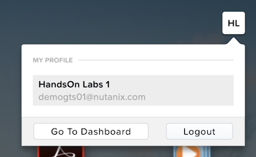

Under **Storage providers**, click the :fa:`circle-plus` icon next to your preferred cloud storage solution and authorize Frame to access the account.

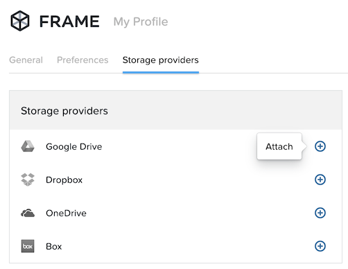

Click **Go Back** to return to your Launchpad and then **Resume** your disconnected session.

Open **Frame Explorer** and note your cloud storage has been automatically mounted as a network drive (e.g. F:, G:, etc.).

.. figure:: images/19.png

Try opening a document from your cloud storage account. Files are not synced, only files you open are temporarily transferred to your Frame session for use.

Corporate Files
...............

<Anything we want to share here about VPN/VPC, joining the image to AD (even possible?), and using some corporate filer as a mapped network drive?>

Adding New Applications
+++++++++++++++++++++++

Disconnect from your session and launch the administrative console by selecting the **User Initials** icon clicking **Go To Dashboard**.

Accounts can be provisioned with Frame-provided OS images for Windows Server 2012 R2, Windows Server 2016, and multiple Linux distributions - but Frame makes it very simple to customize your "Gold" image and add new appslications.

.. note::

  *If each user sessions utilizes a dedicated VM, as in traditional VDI (rather than a shared model like RDS or XenApp), why does Frame use Windows Server OS images?*

  <Need brief overview of licensing advantages of using Windows Server vs Windows for DaaS>

Select **Systems** from the sidebar and **Power On** your **Sandbox** VM. The Sandbox is a special instance that allows you to make changes to your master image.

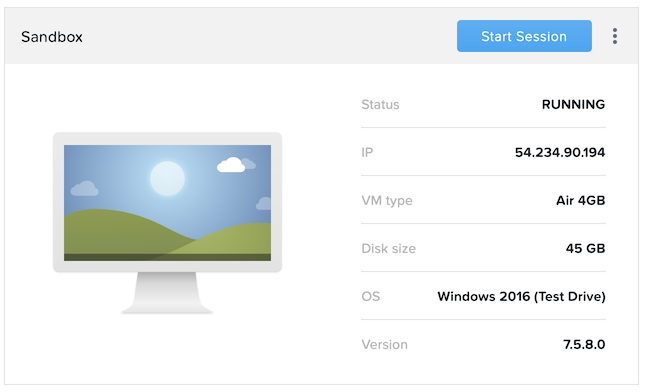

Once your Sandbox VM is **Running**, click **Start Session** to connect through your browser.

Install a new application (the example below uses the `Atom <https://atom.io/`_ text editor) and simply right-click the application icon and select **Onboard to Frame**. Alternatively you could onboard another application already installed within the image such as OneNote or MSPaint.

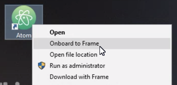

Click :fa:`gear` **> Disconnect** to return to the Dashboard.

Your newly onboarded app will appear under **Applications**, which you can hover over to edit properties or remove the application. Deleting the application in the Dashboard, referred to as offboarding, will not remove it from your image, but will remove it from your Launchpad(s).

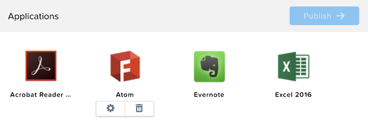

Remove any unwanted applications from the Dashboard.

.. note::

  If a user has access to the full desktop via a Launchpad, they will be able to access all applications within the image, regardless of whether or not they have been onboarded and published as individual apps.

Next we will publish our changes to the Sandbox image to allow users to access the new applications.

Under **Sandbox**, click :fa:`ellipsis-v` **> Close Session** to end the active Sandbox session.

Under **Applications**, click **Publish > Publish**.

Publishing typically takes ~15 minutes, <description of what's going on behind the scenes during publishing>

During this process you will still be able to connect to and use your original production pool – *zero end-user downtime!* If a user was connected to a session when you initiated a publish, they could continue to work, uninterrupted. Once a user closes (not just disconnect) their session, the instance will be terminated and replaced with a clone of the updated Sandbox image.

Each time you publish an updated version of your Sandbox image, Frame will automatically create a backup, allowing you to easily and rapidly roll back your production environment if necessary.

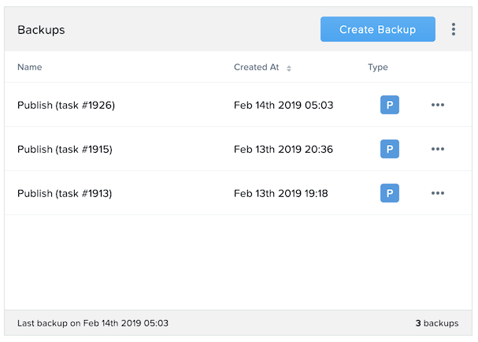

While you wait for the publishing operation to complete, continue to explore the Frame Dashboard.

Configuring Capacity
++++++++++++++++++++

Click **Capacity** in the sidebar.

Frame provides considerable flexibility to define the minimum and maximum number of available desktops, allowing administrators to balance cost and instant availability. Capacity can also be configured on a per instance type basis (not available in Test Drive).

Hover over the :fa:`info-circle` icons to understand the different controls available.

On the **Air 4GB** tab, increase the **Buffer instances** to **1** and click **Save**.

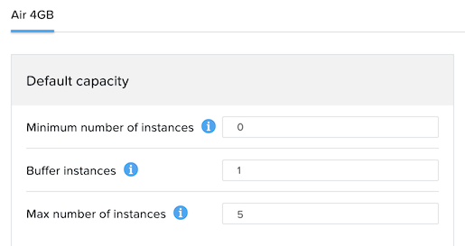

Configuring Launchpads
++++++++++++++++++++++

Select **Launchpads** from the sidebar.

As previously stated, the Test Drive environment features a Launchpad with several pre-published apps.

Under **Applications**, click **Manage Applications** and use the toggle switches to add or remove applications on your Launchpad.

.. note::

  Once your updated Sandbox image has completed publishing, you should see all new, onboarded applications appear under **Manage Applications**. Newly onboarded applications will **not** be added to Launchpads by default.

Application icons can be dragged around to re-order how they will appear to end users, or dragged on top of one another (similar to a mobile phone OS) to create folders for grouping apps within the Launchpad.

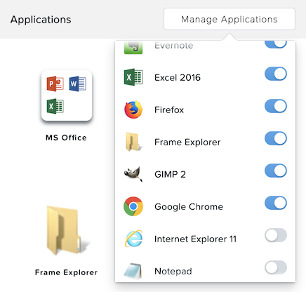

Note the **Air 4GB** toggle under **Instance Pools**. When multiple types are available, Launchpads can be enabled or disabled on a per Instance Type basis. This is used in two ways:

- When you want to restrict a user to a certain Instance Type (typically due to cost control), as users are assigned to Launchpads, and not specific Instance Pools.

- When you want to make certain apps, such as a high end 3D drafting application, available to only a particular Instance Type, such as a high performance, GPU accelerated VM.

After you've finished making any customizations to your Launchpad, click **Save**.

----------------------------------------------------------------

Click **Add Launchpad** to add a **Desktop** launchpad with a customized name and URL slug.

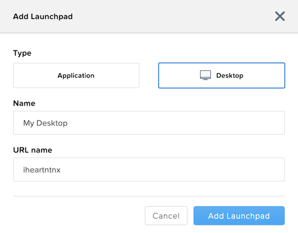

Note that there are no individual applications to select, as this Launchpad will provide a single icon to launch a full desktop session.

Select an alternate background image (or upload your own) to visually differentiate the two Launchpads.

<Some context as to when/why people would want to run desktops rather than apps>

Exploring Settings
++++++++++++++++++

Click **Settings** in the sidebar and select the **Session** tab.

The **Session** tab allows an administrator to adjust the default session behavior for all Launchpads.

.. note::

  Session settings can also be customized on a per Launchpad basis, or as previously seen, directly by the end user if allowed.

  .. figure:: images/7b.png

You can choose to give your users access to cloud storage, toggle various features such as upload/download, configure session time limits, and even customize session QoS settings in the **Network** section.

Enable all **Storage** options and click **Save**.

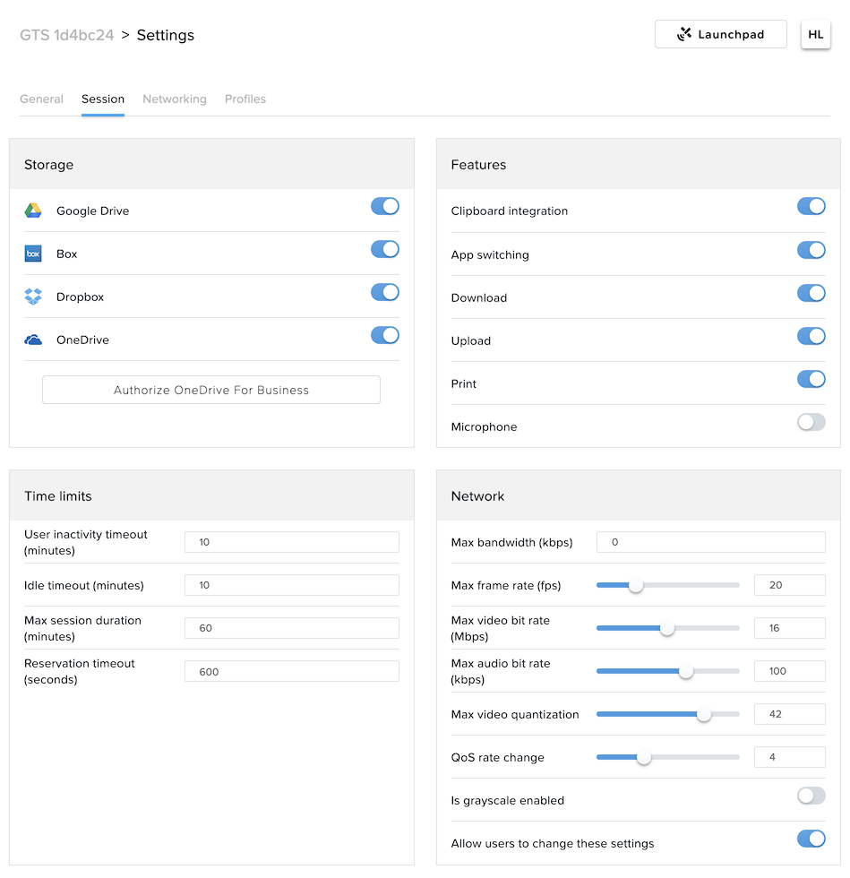

<Do we want to include anything here about the Networking tab allowing to place VMs in custom VPCs for access to other corporate apps/resources or how the profiles tab is used to integrate with profile management solutions, maybe what profile management solutions have been deployed/are supported with Frame?>

Adding Users
++++++++++++

While you can access applications and desktops using your administrative Frame account, adding new users is fast and simple.

Click **Users** in the sidebar.

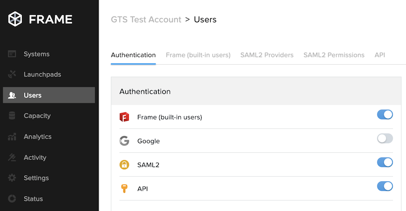

<Could provide short background on the different IDP solutions supported by Frame here? Maybe an external link on what API auth is used for?>

Select the **Frame (built-in users)** tab and click **Invite User**.

Enter your business or personal e-mail address and add **Launchpad User** roles for each of the Launchpads you have created.

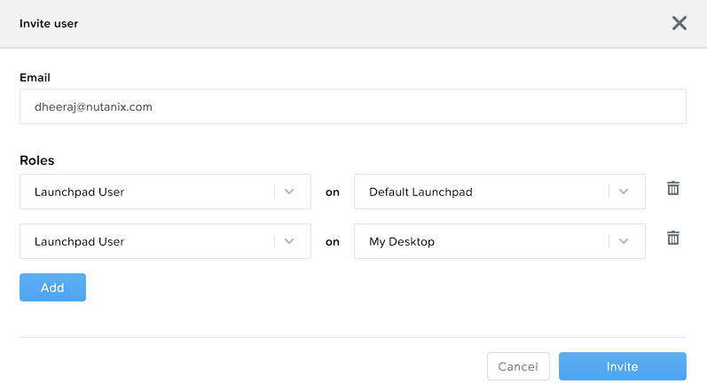

Click **Invite**.

Once you have received the **You’ve been invited to join Nutanix Frame** e-mail, launch the **Get Started** link and provide your name and a password.

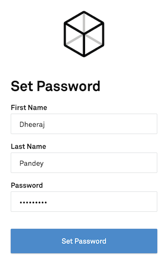

Open https://frame.nutanix.com/ in a new browser tab and log in with user credentials you just created.

Unlike the beginning of the lab, the status bar should should resources as **Running** instead of **Available** due to your changes to the **Capacity** configuration.

.. note::

  To see an overview of all provisioned VMs across different Instance Types, view the **Status** page on the Dashboard.

Open **Google Chrome** from the Launchpad to compare the launch time to your previous experience.

After Chrome launches, disconnect (**not** close) the session.

Switch Launchpads by clicking the rectangular icon in the top, center of your current Launchpad.

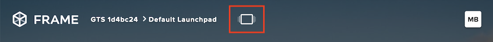

Select your **Desktop** Launchpad and launch the **Desktop** icon.

Note that despite being part of a different Launchpad, you are reconnected to the full desktop view of your existing session, with any open applications still running.

.. note::

  This behavior only applies to applications and desktops running in the same Instance Pool.

You now have access to a full desktop VM experience, including all applications not individually onboarded to Frame.

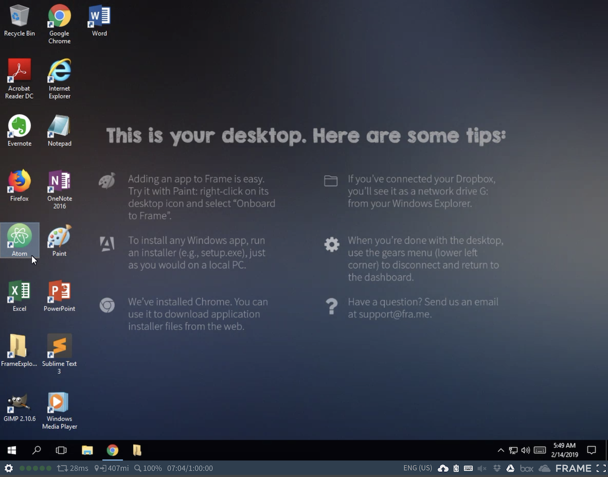

That's all there is to it! With simple administration and a SaaS control plane, Frame makes it easy to deliver applications to any device through your browser.

Takeaways
+++++++++

- Key value props

- and

- Core functionality summary (e.g. support for AWS, Azure)

Identifying Opportunities
.........................

- Questions to ask

- Things to look out for/avoid

Getting Connected
+++++++++++++++++

Have a question about **Nutanix Frame**? Please reach out to the resources below:

+---------------------------------------------------------------------------------+
|  Frame Product Contacts                                                         |
+================================+================================================+
|  Slack Channel                 |  #frame                                        |
+--------------------------------+------------------------------------------------+
|  Product Manager               |                                                |
+--------------------------------+------------------------------------------------+
|  Product Marketing Manager     |                                                |
+--------------------------------+------------------------------------------------+
|  Technical Marketing Engineer  |                                                |
+--------------------------------+------------------------------------------------+
|  SME                           |                                                |
+--------------------------------+------------------------------------------------+

<Any other key contacts we should be identifying here?>

Additional Resources
++++++++++++++++++++

<Anything that's partner facing we can link to - documentation, training, case studies, sizing guidance, etc.>
<And we can tack on "Additional Internal Resources" with a link to your microsite>
