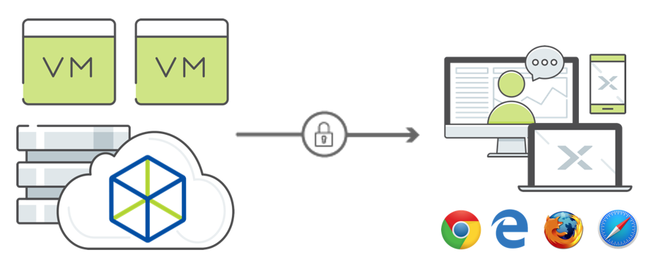

.. _xi_frame:

--------
Xi Frame
--------

*The estimated time to complete this lab is 60 minutes.*

Overview
++++++++

Nutanix Xi Frame is secure cloud apps and desktops as a service that enables customers and partners to deliver Windows (and Linux) applications and desktops to any connected device with an HTML5 browser.

Xi Frame is **multi-cloud**. Customers can choose to deliver their applications and desktops from AWS commercial and US government regions, Azure commercial and US government regions, and soon from Nutanix HCI AHV on-premises. Other IaaS providers will follow.

Frame platform as a service makes it easy for customers to respond quickly and easily to end user needs for applications and desktops. Frame is **easy to administer**. Nutanix operates the control plane in the cloud. IT administrators use a web browser to create Frame accounts, install their applications, and publish apps and desktops to production pools for users in minutes.

Because Frame leverages the public cloud, IT administrators can grow and shrink capacity on the fly without having to commit to spending OpEx or CapEx upfront to account for possible future growth. With AHV coming soon, IT administrators can keep predictable application/desktop workloads on-premises while putting variable/seasonal/project-driven application/desktop workloads in the public cloud. They can also host environments to control access by third-party partners and remote users to specific applications and datasets.

**In this lab you will access a Frame environment similar to Frame Test Drive, allowing you to walk through the same experience as a prospect who has signed up for access to the** `free 2-hour Test Drive <https://fra.me/test-drive>`_. **The environment will allow you to access sample applications, add your own apps, invite users, customize settings, and more.**

Lab Setup
+++++++++

Specifically for Tech Summit, this lab will **NOT** use the standard Frame Test Drive offering.

A separate environment has been created with pre-provisioned accounts to eliminate the ~15 minute wait when activating a Test Drive account. These accounts will remain active through the end of Global Tech Summit, allowing you to fully explore the environment.

.. raw:: html

  <strong>Before beginning the lab, you must see a GTS proctor to be provided with administrator credentials for a dedicated Frame tenant account.</strong>

Running Apps & Desktops
+++++++++++++++++++++++

Once you have received your custom credentials, open https://frame.nutanix.com/ in a new browser tab.

Select **Sign in with Email and Password** and enter your administrator credentials.

Accept the usage agreements and you will be taken to the Test Drive Launchpad. Launchpads provide a way of organizing and presenting applications and desktops to Frame users. As you will see later in the lab, a user can have access to multiple Launchpads - potentially even spanning different organizations utilizing the same credentials.

Multiple applications have been pre-published, allowing a user to quickly test the user experience of accessing a desktop via their browser.

.. figure:: images/1b.png

Note the status bar at the bottom at the bottom of the Launchpad.

.. figure:: images/2b.png

The **Air 4GB** denotes the **Instance Type**. An Instance Type is the VM configuration which will be launched to run applications. The Test Drive environment limits the account to a 2 vCPU/4GB RAM Instance Type, appropriate for general purpose 2D applications. Full accounts can take advantage of other configurations, including:

- **Air 8GB** - 2 vCPU/8GB RAM (e.g. AWS t2.large, Azure Standard_D2_v2)
- **Pro 16GB** - 4 vCPU/16GB RAM/1 NVIDIA GRID GPU (e.g. AWS g2.2xlarge)
- **Pro 64GB** - 16 vCPU/64GB RAM/4 NVIDIA GRID GPU (e.g. AWS g2.8xlarge)

Depending on whether the account is using AWS or Azure, there are many additional Instance Types (offering varying number of vCPU, memory, and GPU types).

Log in with your new user credentials and you should be presented with your applications Launchpad.

Click on **Google Chrome** to launch your first Frame session. You will be launching Google Chrome in “application mode,” as opposed to full desktop delivery.

Your initial session may take ~2 minutes to launch, this is because a VM used to run the application is provisioned and booted on-demand at the time of clicking the application. Later in the exercise you will explore options for powering on VMs ahead of time, allowing administrators to balance user experience and the cost overhead of idle, public cloud resources.

Once your browser is connected into your Frame session, you will see Chrome within your browser. Maximize the application to occupy the entire browser tab.

Note the changes to the status bar that appears at the bottom of your session.

.. figure:: images/13.png

Click the :fa:`gear` icon on the status bar to explore the actions available to a user during the session, such as launching and switching to other applications and network QoS settings.

Click :fa:`gear` **> Show/hide stats**. Try playing a YouTube video with the highest available FPS and video bit rate values versus a max of 5 FPS and 0.5 Mbps bit rate. Note that when the display is not changing, the Frame Remoting Protocol will adapt to drop frame rate to 0. Consumed bandwidth will fall to 1 kbps.

*Fun Fact: Did you know that last year Autodesk streamed their 3D applications to their entire user conference in Dubai from AWS Singapore?*

Hover over the remaining elements in the status bar to see what they do.

Working with Files
++++++++++++++++++

Sessions on Frame are *stateless*, which means that any changes you make to the C: drive will not persist on the virtual machine beyond your session. User files and settings are persisted separately. In this exercise, you'll explore options for how to work with your own files.

Uploading and Downloading
.........................

In the group of icons on the right side of the status bar, click on the up arrow to upload a file. Alternatively, you can drag and drop any file onto the session window in your browser.

.. figure:: images/16.png

You can open the file from the **Uploads** folder found within the Frame Explorer.

.. note::

  If accessing the full desktop, the **Uploads** and **Download Now** folders can be found in ``C:\Users\Frame\``.

.. figure:: images/17.png

When you’re done editing, simply save the file to the **Download Now** folder and it will automatically download to your browser's default local downloads directory. Alternatively, you can right-click any file within File Explorer and select **Download with Frame**.

Using Cloud Storage
...................

Users can attach cloud storage accounts from Google Drive, Dropbox, OneDrive, or Box to the Frame desktop via a simple, one-time process initiated from the Launchpad.

Click :fa:`gear` **> Disconnnect > Disconnect** to temporarily disconnect from your session.

Select the **User Initials** icon in the top, right-hand side of the Launchpad and click your username to access **My Profile**.

.. figure:: images/3b.png

Under **Storage providers**, click the :fa:`circle-plus` icon next to your preferred cloud storage solution and authorize Frame to access the account.

.. figure:: images/18.png

Click **Go Back** to return to your Launchpad and then **Resume** your disconnected session.

Open **Frame Explorer** and note your cloud storage has been automatically mounted as a network drive (e.g. F:, G:, etc.).

.. figure:: images/19.png

Try opening a document from your cloud storage account. Files are not synced, only files you open are temporarily transferred to your Frame session for use.

Corporate Files
...............

For enterprise customers, they may want to have users access their corporate file resources, either on-premises or cloud hosted.

With a WAN networking solution in place, such as VPN, VPC/VNet peering, Direct Connect, etc., Frame desktops can access corporate resources and even join traditional Active Directory domains.

.. figure:: images/20.png

Adding New Applications
+++++++++++++++++++++++

Disconnect from your session and launch the administrative console by selecting the **User Initials** icon clicking **Go To Dashboard**.

Accounts can be provisioned with Frame-provided OS images for Windows Server 2012 R2, Windows Server 2016, and multiple Linux distributions. Each is built from standard AWS or Azure supplied Windows Server and Linux images.

Frame makes it very simple to customize your "Gold" image and add new applications.

.. note::

  *If each user sessions utilizes a dedicated VM, as in traditional VDI (rather than a shared model like RDS or XenApp), why does Frame use Windows Server OS images?*

  Historically, due to Microsoft Windows licensing restrictions, AWS and Azure provide Windows Server OS images. The Windows Server images are presented with a familiar Windows desktop UI, and generally support all of the same applications.

  Microsoft has made some adjustments in their Windows licensing so Xi Frame will be able to support Windows 10 on Azure and Nutanix AHV. Customers must confirm that they have the appropriate enterprise license agreement that allows them to do so.

Select **Systems** from the sidebar and **Power On** your **Sandbox** VM. The Sandbox is a special instance that allows you to make changes to your master image.

.. figure:: images/8b.png

Once your Sandbox VM is **Running**, click **Start Session** to connect through your browser.

Download your application installer to the Sandbox desktop (the example below uses the `Atom <https://atom.io/`_ text editor) and install the new application. Frame will recognize that you just installed an application and ask you if you wish to onboard the application (for application delivery). Alternatively, you can simply right-click the application icon and select **Onboard to Frame**.

Instead of downloading and running an application installer, you could onboard another application already installed within the image such as OneNote or MSPaint.

.. figure:: images/9b.png

.. note::

  If a customer plans to deliver a desktop, the customer simply installs the applications in the Sandbox. They do not have to onboard the applications.

Click :fa:`gear` **> Disconnect** to return to the Dashboard.

Your newly onboarded app will appear under **Applications**, which you can hover over to edit properties or remove the application. Deleting the application in the Dashboard, referred to as offboarding, will not remove it from your image, but will remove it from your Launchpad(s).

.. figure:: images/10b.png

Remove any unwanted applications from the Dashboard.

.. note::

  If a user has access to the full desktop via a Launchpad, they will be able to access all applications within the image, regardless of whether or not they have been onboarded and published as individual apps.

Next we will publish our changes to the Sandbox image to allow users to access the new applications.

Under **Sandbox**, click :fa:`ellipsis-v` **> Close Session** to end the active Sandbox session.

Under **Applications**, click **Publish > Publish**.

Publishing typically takes ~15 minutes or more, depending on the number of VMs that need to be provisioned with the Sandbox image. When the Account Administrator publishes the Sandbox, Frame Platform will backup the Sandbox image and prepare the image. Next, Frame Platform will provision VMs in a shadow pool using the new image. The max capacity for a given production pool determines the number of VMs provisioned.

During this process you will still be able to connect to and use your original production pool – *zero end-user downtime!* If a user was connected to a session when you initiated a publish, they could continue to work, uninterrupted. Once a user closes (not just disconnect) their session, the instance will be terminated and replaced with a VM from the shadow pool.

Each time you publish an updated version of your Sandbox image, Frame will automatically create a backup, allowing you to easily and rapidly roll back your production environment if necessary.

.. figure:: images/12b.png

While you wait for the publishing operation to complete, continue to explore the Frame Dashboard.

Configuring Capacity
++++++++++++++++++++

Click **Capacity** in the sidebar.

Frame provides considerable flexibility to define the minimum and maximum number of available desktops, allowing administrators to balance cost and instant availability. Capacity can also be configured on a per Instance Type basis (not available in Test Drive).

Hover over the :fa:`info-circle` icons to understand the different controls available.

As each VM supports 1 concurrent user in Frame, the number of concurrent users supported by a production pool should equal the **Max number of instances**.

On the **Air 4GB** tab, increase the **Buffer instances** to **1** and click **Save**.

.. figure:: images/11b.png

Increasing **Buffer instances** to 1 directs Frame to have at least one VM powered on and available for the next user. As each user connects into a Frame session, Frame will power on the next VM to maintain **Buffer instances** = 1 (until the **Max number of instances** of 5 is reached).

.. note::

  Each VM that is powered on results in a VM charge by AWS or Azure, regardless of whether the VM is being used. Unless there are justifiable reasons, the **Minimum number of instances** powered on and **Buffer instances** values should be set to 0 for Default capacity. If these two parameters are greater than 0, then AWS or Azure will be charging for any powered on VMs.

Configuring Launchpads
++++++++++++++++++++++

Select **Launchpads** from the sidebar.

As previously stated, the Test Drive environment features a Launchpad with several pre-published apps.

Under **Applications**, click **Manage Applications** and use the toggle switches to add or remove applications on your Launchpad.

.. note::

  Once your updated Sandbox image has completed publishing, you should see all new, onboarded applications appear under **Manage Applications**. Newly onboarded applications will **not** be added to Launchpads by default.

Application icons can be dragged around to re-order how they will appear to end users, or dragged on top of one another (similar to a mobile phone OS) to create folders for grouping apps within the Launchpad.

.. figure:: images/4b.png

Note the **Air 4GB** toggle under **Instance Pools**. When multiple types are available, Launchpads can be enabled or disabled on a per Instance Type basis. This is used in two ways:

- When you want to restrict a user to a certain Instance Type (typically due to cost control), as users are assigned to Launchpads, and not specific Instance Pools.

- When you want to make certain apps, such as a high end 3D drafting application, available to only a particular Instance Type, such as a high performance, GPU accelerated VM.

After you've finished making any customizations to your Launchpad, click **Save**.

----------------------------------------------------------------

Click **Add Launchpad** to add a **Desktop** launchpad with a customized name and URL slug.

.. figure:: images/5b.png

Note that there are no individual applications to select, as this Launchpad will provide a single icon to launch a full desktop session.

Select an alternate background image (or upload your own) to visually differentiate the two Launchpads.

If Account Administrators wish to deliver individual applications (common when supporting task work or delivering applications into an existing desktop environment such as a corporate laptop), then an application Launchpad is appropriate. For user groups that are more comfortable with a desktop (even if it is non-persistent session and user data and files need to be persisted in a file server or cloud storage), then the Account Administrator can offer a Desktop Launchpad.

Exploring Settings
++++++++++++++++++

Click **Settings** in the sidebar and select the **Session** tab.

The **Session** tab allows an administrator to adjust the default session behavior for all Launchpads.

.. note::

  Session settings can also be customized on a per Launchpad basis, or as previously seen, directly by the end user if allowed.

  .. figure:: images/7b.png

You can choose to give your users access to cloud storage, toggle various features such as upload/download, configure session time limits, and even customize session QoS settings in the **Network** section.

Enable all **Storage** options and click **Save**.

.. figure:: images/6b.png

Adding Users
++++++++++++

While you can access applications and desktops using your administrative Frame account, adding new users is fast and simple.

Click **Users** in the sidebar.

.. figure:: images/8.png

Frame supports several authentication mechanisms.

For most enterprises who have an identity provider (IdP) such as Okta, Ping, Azure AD, ADFS, we recommend the SAML2 integration. For enterprises who use Google Sign-In, Frame integrates with Google Identity via OAuth2.

For customers who do not have an IdP, Frame provides a native identity provider **Frame (built-in users)**, allowing an administrator to create and control local e-mail address based accounts.

Because Frame is a Platform as a Service, there are both Javascript and Web Services APIs for enterprises and partners used to embed Frame into their own web applications. In the case of Web Services APIs, the API mechanism is used to generate API keys to authenticate to the Frame API endpoints.

Select the **Frame (built-in users)** tab and click **Invite User**.

Enter your business or personal e-mail address and add **Launchpad User** roles for each of the Launchpads you have created.

.. figure:: images/9.png

Click **Invite**.

Once you have received the **You’ve been invited to join Nutanix Frame** e-mail, launch the **Get Started** link and provide your name and a password.

.. figure:: images/10.png

Open https://frame.nutanix.com/ in a new browser tab and log in with user credentials you just created.

Unlike the beginning of the lab, the status bar should list resources as **Running** instead of **Available** due to your changes to the **Capacity** configuration (e.g. **Buffer instances** = 1).

.. note::

  To see an overview of all provisioned VMs across different Instance Types, view the **Status** page on the Dashboard. You should see at least 1 running VM from the production pool.

Open **Google Chrome** from the Launchpad to compare the launch time to your previous experience.

After Chrome launches, disconnect (**not** close) the session.

Switch Launchpads by clicking the rectangular icon in the top, center of your current Launchpad.

.. figure:: images/13b.png

Select your **Desktop** Launchpad and launch the **Desktop** icon.

Note that despite being part of a different Launchpad, you are reconnected to the full desktop view of your existing session, with any open applications still running.

.. note::

  This behavior only applies to applications and desktops running in the same Instance Pool.

You now have access to a full desktop VM experience, including all applications not individually onboarded to Frame.

.. figure:: images/14b.png

That's all there is to it! With simple administration and a SaaS control plane, Frame makes it easy to deliver applications to any device through your browser.

Takeaways
+++++++++

- Multi-cloud to take advantage of pay as you go workloads on AWS and Azure and soon predictable workloads with Nutanix AHV on-premises.

- Simple Day 1 setup and Day 2+ operations.

- Any client with an HTML5 browser is a Frame client. No additional software to install.

- Frame offers 1:1 non-persistent VDI desktops or published applications.

- Capable of delivering high-end graphics-intensive experience with GPUs.

Key Use Cases
.............

- High-end graphics for enterprise users

- Global collaboration

- Simplify enterprise client-server deployments

- Run legacy applications on any device

- Run web-based apps that require plugins on any device

- Support unmanaged BYOD initiatives

- Seasonal and short-term workloads (like training, conferences)

- SaaSify Windows apps (expensive to convert to Web applications)

- Virtual computer laboratories for K-12 and higher education

- Cloud-based workflow service providers, needing Windows apps too

- Windows app delivery into the Google ecosystem

Getting Connected
+++++++++++++++++

Have a question about **Nutanix Frame**? Please reach out to the resources below:

+---------------------------------------------------------------------------------+
|  Frame Product Contacts                                                         |
+================================+================================================+
|  Slack Channels                |  #frame (General Frame questions)              |
|                                |  #frame-sales (Frame deal support)             |
+--------------------------------+------------------------------------------------+
|  Product Management            |  Carsten Puls, carsten.puls@nutanix.com        |
|                                |  Param Desai, param.desai@nutanix.com          |
+--------------------------------+------------------------------------------------+
|  Solution Architecture/Delivery|  William Wong, william.wong@nutanix.com        |
|                                |  Jon Eugenio, jon.eugenio@nutanix.com          |
+--------------------------------+------------------------------------------------+

For sales-related questions, including requests for sales assistance or quote reviews, contact fram-sales@nutanix.com.

Additional Internal Resources
+++++++++++++++++++++++++++++

The Xi Frame team has assembled the following Frame-related resources that can be accessed by Nutanix employees (*partner access coming soon!*):

- `How to sell Frame presentation <https://drive.google.com/file/d/1GjILIJs_jqmxHBF35IUSyIoRN0qMM1Vs/view?usp=sharing>`_
- `Qualification/discovery questions <https://sites.google.com/nutanix.com/frame-onboarding#h.p_U3YqyoYLcm9q>`_
- `SKUs and quoting <https://sites.google.com/nutanix.com/frame-onboarding#h.p_IcvCaRLpuysG>`_
- `Demo accounts <https://sites.google.com/nutanix.com/frame-onboarding/home/internal-nutanix-test-account?authuser=0>`_
- `Requesting customer POCs <https://sites.google.com/nutanix.com/frame-onboarding/home/poc-information?authuser=0>`_
- `Frame architecture presentation <https://drive.google.com/file/d/1Wyh6e-J1pcegsgRayEe4byTMA2a7fbTe/view?usp=sharing>`_
- `Customer references <https://sites.google.com/nutanix.com/frame-onboarding#h.p_XaJ0TKhSfx1K>`_
