.. _peer:

------------------------
Peer Global File Service
------------------------

*The estimated time to complete this lab is 45 minutes.*

Overview
++++++++

The explosive growth of unstructured data has driven organizations to seek solutions to efficiently store, share, manage and protect an ever-growing universe of data while deriving new value and intelligence. Since 1993, Peer Software has focused on these requirements and more by building best-of-breed data management and real-time replication solutions for distributed on-premises and cloud storage environments.

Peer’s flagship offering, Peer Global File Service (PeerGFS), features enterprise-class replication technology with integrated file locking, and a globally accessible namespace that powers multi-site, multi-vendor, and multi-cloud deployment.

PeerGFS enables fast local data access for users and applications at different locations, protects against version conflicts, makes data highly available, and allows Nutanix Files to co-exist with legacy NAS platforms to ease adoption of Files into existing environments.

Key use cases for combining Peer Software with Nutanix Files include:

- **Global File Sharing and Collaboration** - Deliver fast local access to shared project files for distributed teams while ensuring version integrity and high availability.
- **HA and Load Balancing for VDI and Application Data** - Enable high availability and load balancing of end user data for VDI implementations as well as custom application data.
- **Storage Interoperability and Migration** - Introduce Nutanix Files into an existing environment by allowing replication between storage vendors and helping migrate off of existing platforms.

*How does it work?*

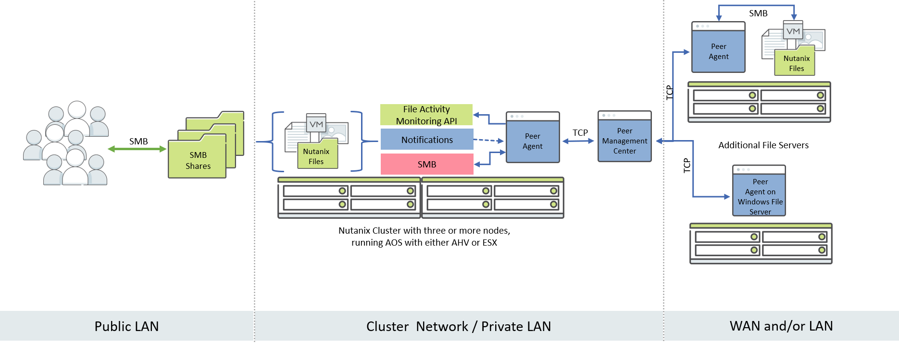

Working from left to right, users interact with the SMB shares on the Nutanix Files cluster via a public LAN. When SMB activity occurs on the Files cluster through these shares, the Peer Partner Server (referred to as a Peer Agent) is notified via the File Activity Monitoring API from Files. The Peer Agent accesses the updated content via SMB then facilitates the flow of data to one or many remote and/or local file servers.

**In this lab you will deploy and configure the Peer Global File Service software to create an Active-Active file services solution with Nutanix Files.**

Lab Setup
+++++++++

Files
.....

This lab requires an existing Nutanix Files deployment on your assigned cluster. If you have not yet already completed the :ref:`files` lab, please complete the :ref:`deploying_files` section before proceeding.

Create a new **SMB** share on your Files cluster named *Initials*\ **-Peer**.

Peer VMs
........

In this exercise you will use Prism Central to stage 3 VMs which will later be used to install Peer software. The **Primary** cluster is the same assigned cluster you have been using for all other labs. Refer to :ref:`clusterassignments` to determine the Prism Central IP for your **Secondary** cluster.

.. list-table::
   :widths: 20 20 40
   :header-rows: 1

   * - **VM Name**
     - **Nutanix Cluster**
     - **Description**
   * - *Initials*\ -**PeerMgmt**
     - Primary
     - This server will host the Peer Management Center
   * - *Initials*\ -**PeerAgentA**
     - Primary
     - This server will manage the Nutanix Files cluster
   * - *Initials*\ -**PeerAgentB**
     - Secondary
     - This Windows File Server will be used as a target for replication

Once complete, your lab environment will resemble the diagram below:

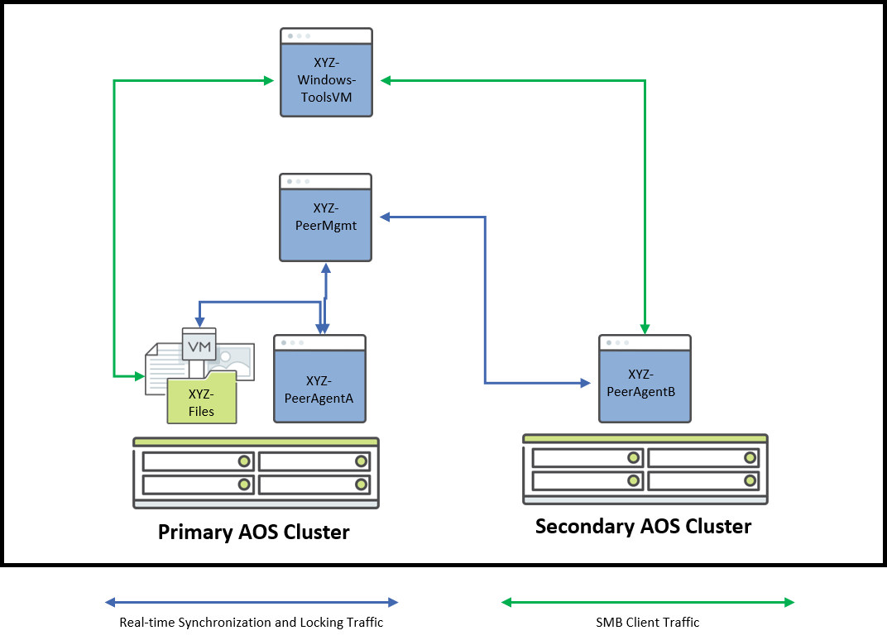

--------------------------------------------------------------------

On your **Primary Prism Central**, select :fa:`bars` **> Virtual Infrastructure > VMs**.

.. figure:: images/1.png

Click **Create VM**.

.. note::

  Selecting the **Secondary** network is important as it is configured as the Client network for the Files deployment. VMs on the **Primary** network (configured as the Files Storage network) are unable to access shares.

.. note::

  If you are comfortable working with **unattend.xml** files, you can edit the **<ComputerName>\*</ComputerName>** line to reflect the respective VM Name during VM creation. This will simplify identification of the Peer Agent VMs later in the lab.

Fill out the following fields:

- **Name** - *Initials*\ -PeerMgmt
- **Description** - (Optional) Description for your VM.
- **vCPU(s)** - 2
- **Number of Cores per vCPU** - 1
- **Memory** - 4 GiB

- Select **+ Add New Disk**
    - **Type** - DISK
    - **Operation** - Clone from Image Service
    - **Image** - Windows2012R2.qcow2
    - Select **Add**

- Select **Add New NIC**
    - **VLAN Name** - Secondary
    - Select **Add**
- Select **Custom Script**
- Select **Type or Paste Script**

.. literalinclude:: unattend.xml
   :caption: PeerMgmt and PeerAgentA Unattend.xml
   :language: xml

Click **Save** to create the VM.

Repeat the above steps to create a second VM named *Initials*\ **-PeerAgentA**.

**Power On** your *Initials*\ **-PeerMgmt** and *Initials*\ **-PeerAgentA** VMs.

--------------------------------------------------------

Log in to your **Secondary Prism Central** and create the following VM:

- **Name** - *Initials*\ -PeerAgentB
- **Description** - (Optional) Description for your VM.
- **vCPU(s)** - 2
- **Number of Cores per vCPU** - 1
- **Memory** - 4 GiB

- Select **+ Add New Disk**
    - **Type** - DISK
    - **Operation** - Clone from Image Service
    - **Image** - Windows2012R2.qcow2
    - Select **Add**

- Select **Add New NIC**
    - **VLAN Name** - Secondary
    - Select **Add**
- Select **Custom Script**
- Select **Type or Paste Script**

.. literalinclude:: unattendpeeragentB.xml
   :caption: PeerAgentB Unattend.xml
   :language: xml

Click **Save** and **Power on** the VM.

.. note::

  There is a slight difference in the Sysprep script for PeerAgentB where the VM is not automatically joined to the NTNXLAB.local domain. This is because each cluster has an independent domain controller and we require that all VMs in the lab authenticate against the same Active Directory environment.

Once *Initials*\ **-PeerAgentB** has powered on and completed its initial Sysprep process (~2 minutes), connect to the VM via RDP using the following credentials:

- **Username** - Administrator
- **Password** - nutanix/4u

Open **PowerShell** and execute the following command, replacing **10.XX.YY.40** with the IP address of your primary cluster's **AutoDC2** (Domain Controller) VM:

.. code-block:: Powershell
  :emphasize-lines: 1

  # Updates your network adapter to use your Primary cluster DC for DNS
  Set-DnsClientServerAddress -InterfaceAlias "Ethernet" -ServerAddress "10.XX.YY.40"

.. note::

  When copying and pasting via RDP, pasting directly into PowerShell is inconsistent. If this is an issue, first paste into Notepad within the VM, then copy and paste into PowerShell.

Run ``ipconfig /all`` and verify your **DNS Server** is set to the IP address of the **AutoDC2** VM on your primary cluster.

Execute the following to join the domain and reboot *Initials*\ **PeerAgentB**:

.. code-block:: Powershell
  :emphasize-lines: 1

  # Joins the NTNXLAB.local domain of your Primary cluster and reboots the VM
  $pass = convertto-securestring "nutanix/4u" -asplaintext -force
  $domaincred = new-object system.management.automation.pscredential "NTNXLAB\Administrator",$pass
  add-computer -credential $domaincred -domainname "NTNXLAB.local" -restart -force

Windows File Server
...................

The final step of staging the lab is configuring *Initials*\ **-PeerAgentB** as a Windows File Server. Peer is capable of replicating between multiple Files clusters as well as between a mix of Files and other NAS platforms. For this lab, you will be replicating between your Nutanix Files cluster and a Windows File Server.

Connect to *Initials*\ **-PeerAgentB** via RDP using the following credentials:

- **Username** - NTNXLAB\\Administrator (**NOT** the local Administrator account)
- **Password** - nutanix/4u

Open **File Explorer** and create a new folder under ``C:\`` named **Data**.

Right-click **Data** and select **Properties**.

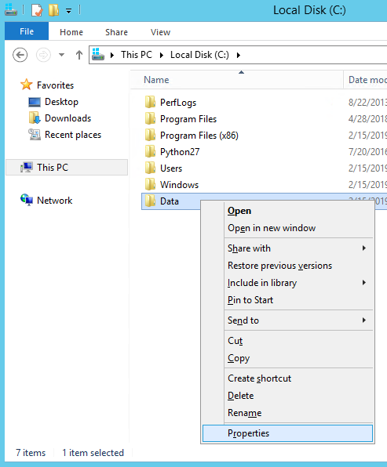

Under the **Sharing** tab, click **Share**.

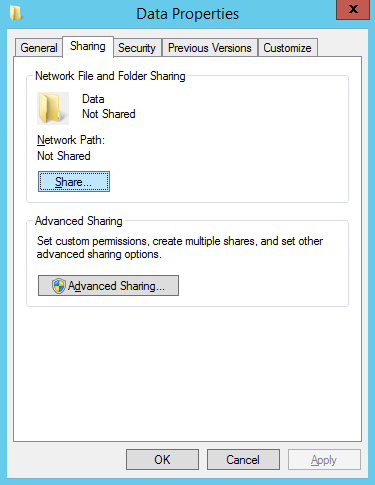

Enter **Everyone** and click **Add**. Change the **Permission Level** to **Read/Write**.

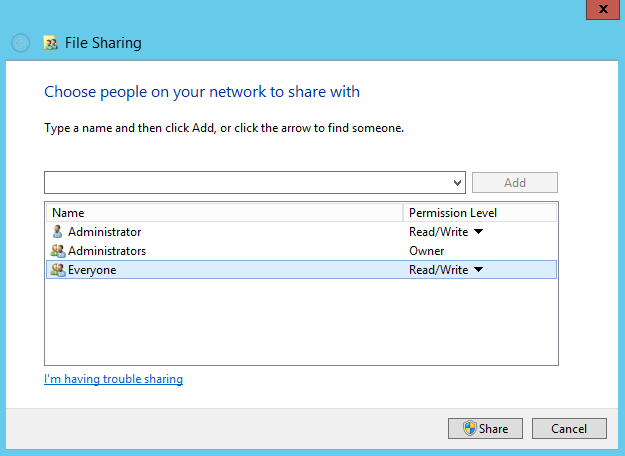

Click **Share > Done > Close**.

Finally, you will populate your newly created Windows file share with sample data.

Within your *Initials*\ **-PeerAgentB** VM, download the **SampleData_Small.zip** file from http://10.42.8.50/peer/ and extract its contents in ``C:\Data\``. When complete, your Data directory should resemble the screenshot below:

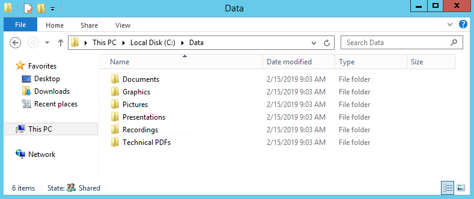

Port Diagram
............

The following illustration shows necessary ports and communication flow for the joint Nutanix Files and Peer Global File Service environment. It is informational only, as the lab environment will only leverage a single Nutanix Files cluster.

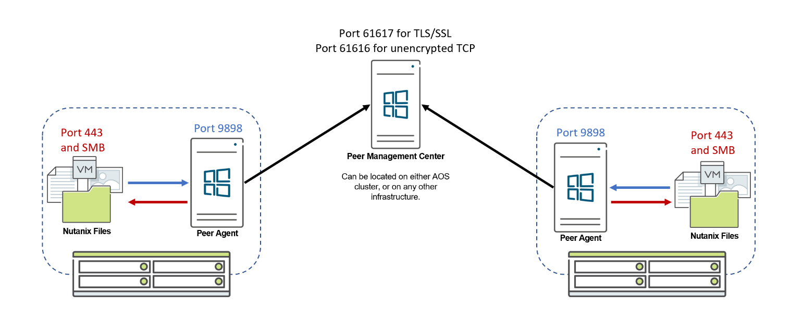

.. note::

  For complete details on firewall requirements for Nutanix Files, Peer Agents, and Peer Management Center, click `here <https://kb.peersoftware.com/tb/firewall-ports-and-communication-flow-for-nutanix-files>`_.

Configuring Nutanix Files
+++++++++++++++++++++++++

Peer Global File Service requires both a File Server Admin account as well as RESI API access to orchestrate replication to or from Nutanix Files.

Log in to **Prism Element** (e.g. 10.XX.YY.37) on your **Primary** Nutanix cluster.

Navigate to **File Server** from the drop down navigation and select your *Initials*\ **-Files** cluster.

Click **Manage roles**.

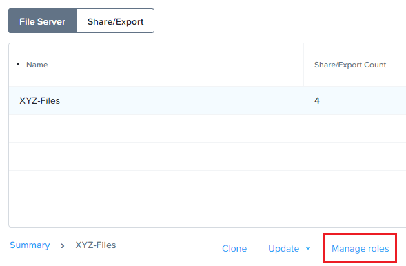

Under **Add admins**, **NTNXLAB\\Administrator** should already be added as a **File Server Admin**. If not, click **+ New user** and add **NTNXLAB\\Administrator**.

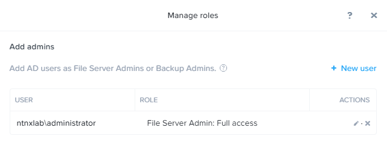

.. note::

  In a production environment you would likely use an Active Directory service account for Peer.

Under **REST API access users**, click **+ Add new user**.

Fill out the following fields and click **Save**:

- **Username** - peer
- **Password** - nutanix/4u

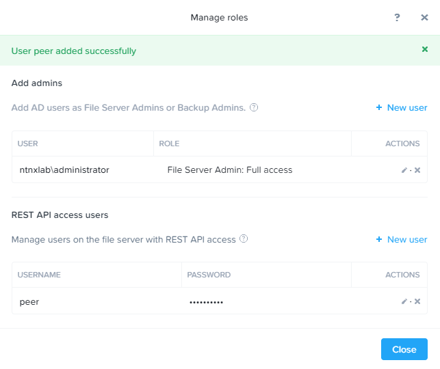

Click **Close**.

Installing Peer Management Center
+++++++++++++++++++++++++++++++++

In this exercise you'll walk through the installation of Peer Management Center (PMC). PMC serves as the centralized management component for the Peer Global File Service.

PMC does not store any file data but does facilitate communication between locations so it should be deployed at a location with the best connectivity. A single deployment of PMC can manage 50 or more Agents/file servers.

Connect to your *Initials*\ -**PeerMgmt** VM on your **Primary** cluster via RDP or VM console using the following credentials:

- **Username** - NTNXLAB\\Administrator
- **Password** - nutanix/4u

Within the VM, download **PMC_Installer_Win64.exe** AND **PeerGlobalFileService\*.lic** from http://10.42.8.50/peer/.

Run **PMC_Installer_Win64.exe** and proceed with the default selections **UNTIL** you reach **Peer Management Center Web Server Configuration**.

While this lab uses the rich client included with the PMC, the installer also offers a web service that mirrors all the capabilities of the rich client with the addition of role-based web access.

Note that for security purposes the PMC Web Service can be restricted to only allow access from the host on which the PMC is installed. **Leave the default configuration, as shown below**.

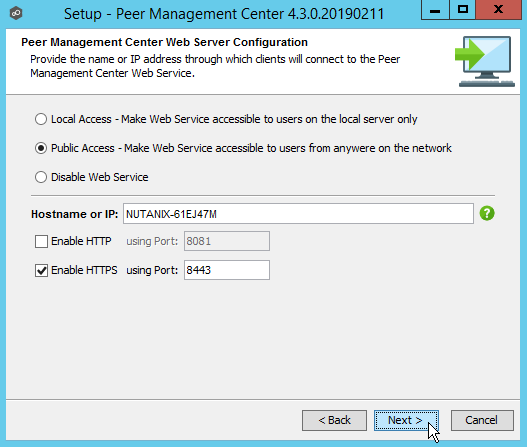

Complete the installation using the default selections and click **Finish** to launch the PMC Client.

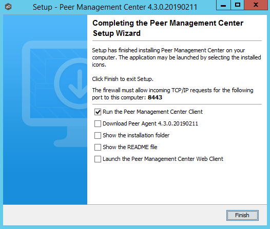

Once services have started, the PMC Client will open and prompt for a license file.

Click **Add/Update**, browse to the previously downloaded **PeerGlobalFileService\*.lic** file and click **Open**.

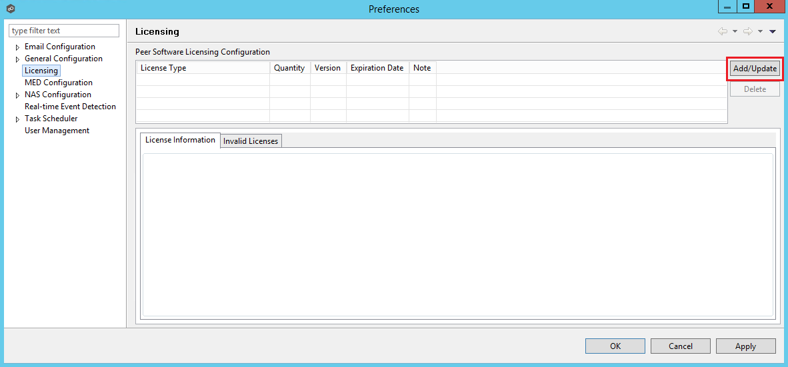

.. note::

  If accessing the *Initials*\ -**PeerMgmt** from the VM console, you may need to scroll the **Licensing** screen to the right in order to access the **Add/Update** button.

After the license is installed, click **OK** to close Preferences.

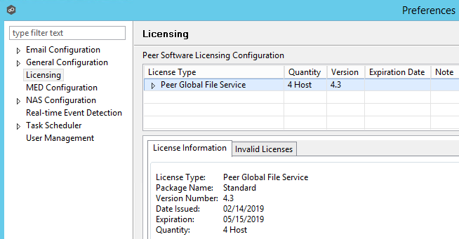

Installing the Peer Agent
+++++++++++++++++++++++++

The Peer Agent is one of the core components of Peer Global File Service. Each Agent directly interacts with an assigned file server to perform management, synchronization, and locking operations.

PeerAgentA
..........

Connect to your *Initials*\ -**PeerAgentA** VM on your **Primary** cluster via RDP or VM console using the following credentials:

- **Username** - NTNXLAB\\Administrator
- **Password** - nutanix/4u

Within the VM, download **P-Agent_Installer_win64.exe** from http://10.42.8.50/peer/.

Run **P-Agent_Installer_win64.exe** and proceed with the default selects **UNTIL** you reach **Peer Management Broker Configuration**.

Fill out the following fields and click **Next**:

- **Hostname** - *Initials*\ -PeerMgmt IP Address
- **Protocol** - TCP
- **Port** - *Leave default*

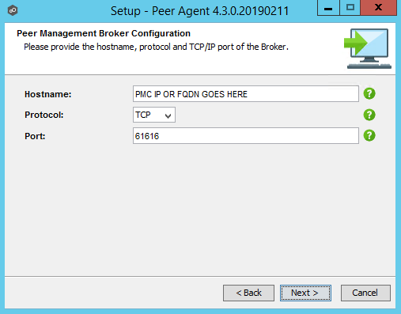

.. note::

  When the Agent will communicate with the PMC over a secure VPN or local connection it is recommended to set the protocol to **TCP**. Otherwise, the Agent will use TLS 1.2 to secure communication with the PMC.

Provide the following credentials for the **Agent Service Account**:

- Select **Enter Domain Admin Credentials**
- **Domain\\UserName** - NTNXLAB\\Administrator
- **Password** - nutanix/4u
- **Re-enter Password** - nutanix/4u

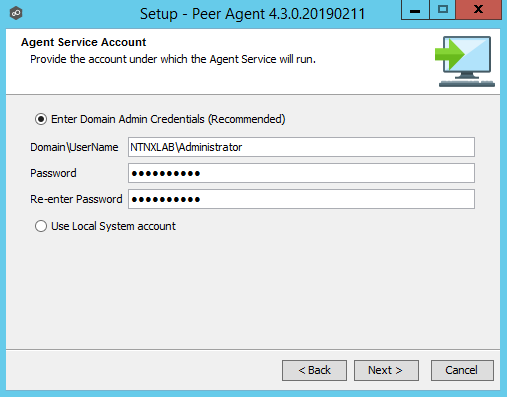

The Peer Agent service account must be a domain user with local administrator rights on both the Agent VM as well as the Nutanix Files cluster that it will manage.

Click **Next > Next > Finish** to complete the installation of the Peer Agent software.

Return to the **PMC Client** on your *Initials*\ -**PeerMgmt** VM and verify the hostname of your *Initials*\ -**PeerAgentA** VM appears as **Connected** under **Agent Detail Summary**.

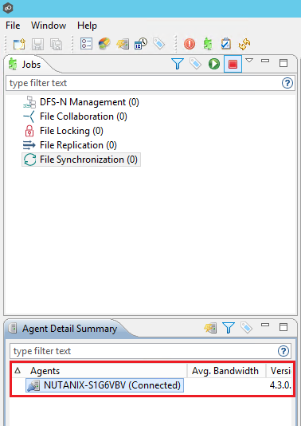

.. note::

  If it is not listed, check local firewall policies on the PMC server.  The PMC requires that inbound port 61617 be open for SSL/TLS communication and the inbound port 61616 be open for non-SSL/TLS communication.

PeerAgentB
..........

Connect to your *Initials*\ -**PeerAgentB** VM on your **Secondary** cluster via RDP or VM console using the following credentials:

- **Username** - NTNXLAB\\Administrator
- **Password** - nutanix/4u

Repeat the steps in `PeerAgentA`_ to install the Peer Agent software on *Initials*\ -**PeerAgentB**.

Once you have completed Agent installation, both Agent VMs should appear as **Connected** in the **PMC Client**.

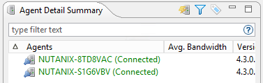

Creating a New Job
++++++++++++++++++

Peer Global File Service utilizes a job-based configuration engine. Several different job types are available to help tackle different file management challenges. A job represents a combination of:

- Peer Agents.
- The file servers that are being monitored by those Agents.
- A specific share/volume/folder of data on each file server.
- Various settings tied to replication, synchronization and/or locking.

When creating a new job, you will be prompted by a dialog outlining the different job types with graphics and text outlining why you would use each type.

Available job types include:

- **Cloud Sync** - Real-time replication from enterprise NAS devices to public and private object storage with support for volume-wide point-in-time recovery. Each file is stored as a single, transparent object with optional version tracking.
- **DFS-N Management** - Manages new and existing Microsoft DFS Namespaces. Can be combined with File Collaboration, File Synchronization, and/or File Replication jobs to automate DFS failover and failback.
- **File Collaboration** - Real-time synchronization combined with distributed file locking to power global collaboration and project sharing across enterprise NAS platforms, locations, cloud infrastructures, and organizations.
- **File Locking** - Distributed file locking between Windows File Servers. This can be paired with Microsoft DFS Replication for a basic collaboration solution.
- **File Replication** - One-way real-time replication from enterprise NAS platforms to any SMB destination.
- **File Synchronization** - Multi-directional real-time synchronization powering high availability of user and application data across enterprise NAS platforms, locations, cloud infrastructures, and organizations.

In this lab, we will focus on **File Collaboration**.

In the **PMC Client**, click **File > New Job**.

Select **File Collaboration** and click **Create**.

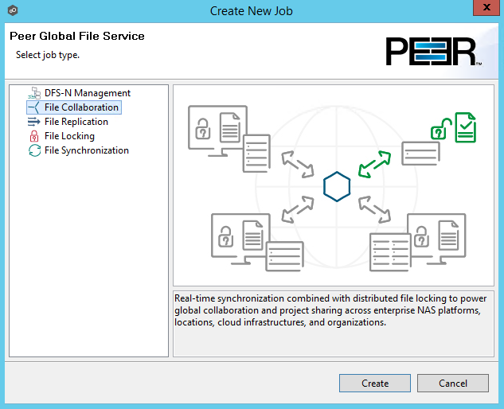

Provide a name for the job and click **OK**.

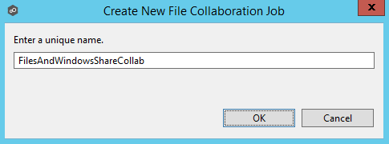

Files and PeerAgentA
....................

Click **Add** to begin pairing a Peer Agent with your Nutanix Files cluster.

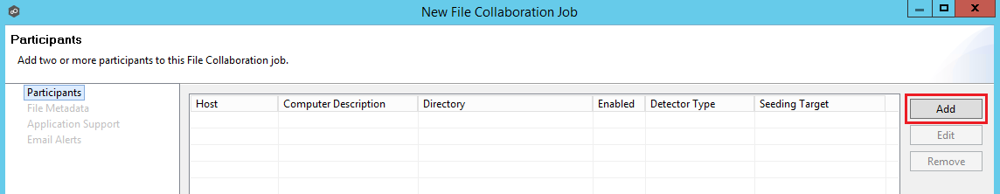

Select **Nutanix Files** and click **Next**.

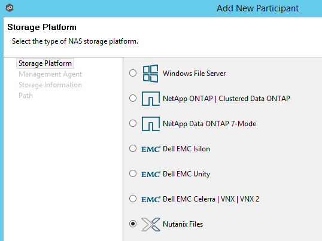

Select the VM hostname that corresponds to your *Initials*\ **-PeerAgentA** VM and click **Next**. This Agent will manage the Files cluster.

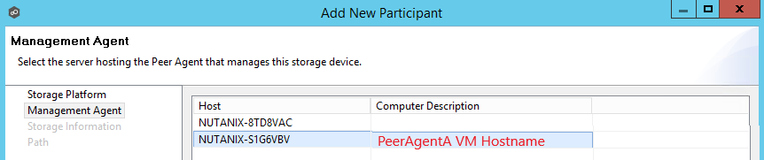

On the **Storage Information** page, fill out the following fields:

- **Nutanix Files Cluster Name** - *Initials*\ -Files

  *The NETBIOS name of the Files cluster that will be paired with the Agent selected in the previous step.*

- **Username** - peer

  *This is the Files API account username configured earlier in the lab.*

- **Password** - nutanix/4u

  *The password associated with the Files API account.*

- **Peer Agent IP** - *Initials*\ -PeerAgentA IP Address

  *The IP address of the Agent server that will receive real-time notifications from the Files File Activity Monitoring API.*

Click **Validate** to confirm Files can be accessed via API using the provided credentials.

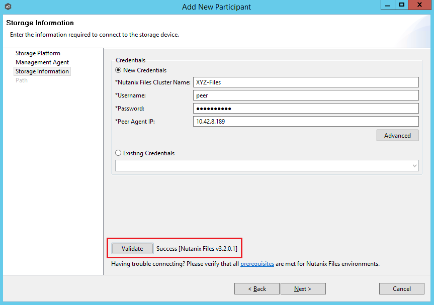

.. note::

  Once you enter these credentials, they will be reusable when creating new jobs that use this particular Agent.  When you create your next job, select **Existing Credentials** on this page to display a list of previously configured credentials.

Click **Next**.

Click **Browse** to select the share you wish to replicate. You can also navigate to a subfolder below a share.

Select your *Initials*\ **-Peer** share and click **OK**.

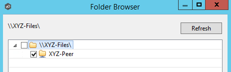

.. note::

  While Nutanix Files 3.2 supports nested shares, they are not currently supported for replication with Peer Global File Service. Support for this feature is being targeted for Files 3.5 timeframe.

.. note::

  You can only select a single share or folder. You will need to create an additional job for each additional share you wish to replicate.

Click **Finish**. You have now completed pairing the Peer Agent to Nutanix Files.

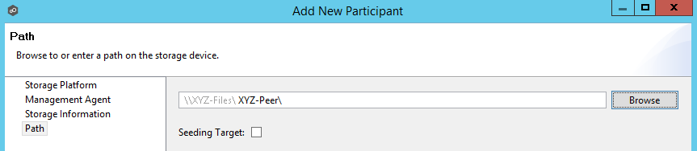

PeerAgentB
..........

To simplify the lab exercise, the Peer Agent running on your **Secondary** cluster will also function as a standard Windows File Server. While Peer can be used to replicate shares between Nutanix Files clusters, one of its key advantages is the ability to work with mixed NAS platforms. This can help drive adoption of Nutanix Files when only a single site has been refreshed with Nutanix Files, but replication is still required to support collaboration or disaster recovery.

Repeat the steps in `Files and PeerAgentA`_ to add *Initials*\ **-PeerAgentB** to the job, making the following changes:

- **Storage Platform** - Windows File Server
- **Management Agent** - *Initials*\ **-PeerAgentB** Hostname
- **Path** - C:\\Data

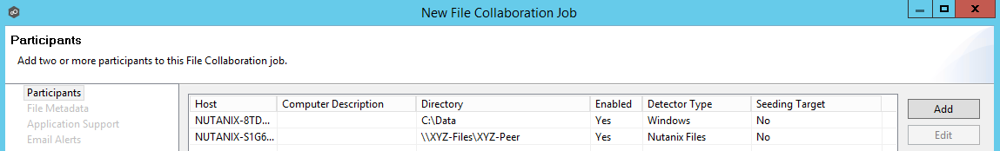

Click **Next**.

Completing Job Configuration
............................

Peer offers robust functionality for handling the synchronization of NTFS permissions between shares:

- **Enable synchronizing NTFS security descriptors in real-time**

  *Select this checkbox if you want changes to file and folder permissions to be replicated to the remote file servers as they occur.*

- **Enable synchronizing NTFS security descriptors with master host during initial scan**

  *Select this if you want the initial scan to look for and replicate any permissions that are not in sync across file servers.  This requires selecting a master host to help resolve situations where the engine cannot pick a winner in a permission discrepancy.*

- **Synchronize Security Description Options**

  *(Optional) Select the NTFS permission types you would like to replicate*

  - **Owner**

    *The NTFS Creator-Owner who owns the object (which is, by default, whomever created it).*

  - **DACL**

    *A Discretionary Access Control List identifies the users and groups that are assigned or denied access permissions on a file or folder.*

  - **SACL**

    *A System Access Control List enables administrators to log attempts to access a secured file or folder. It is used for auditing.*

- **File Metadata Conflict Resolution**

  *If there is a permission discrepancy between two or more sites, the permissions set on the file server tied to the Master Host will override those on the other file servers.*

For the purposes of this lab exercise, leave the default configuration and click **Next**.

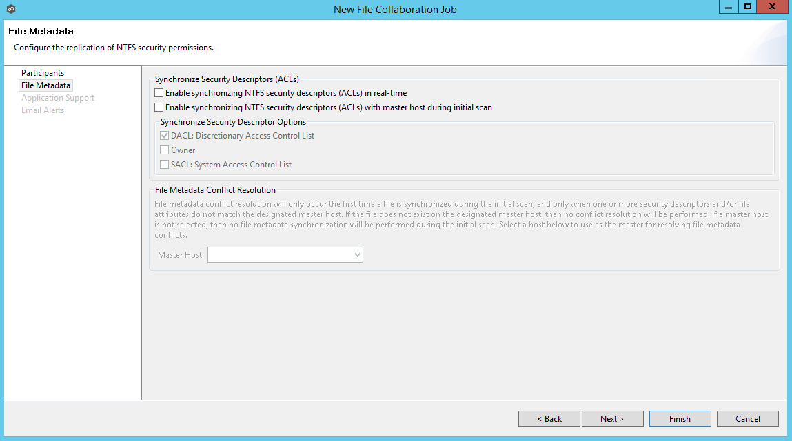

Under **Application Support**, select **Microsoft Office**.

The Peer synchronization and locking engine is automatically optimized to best support any of the selected applications.

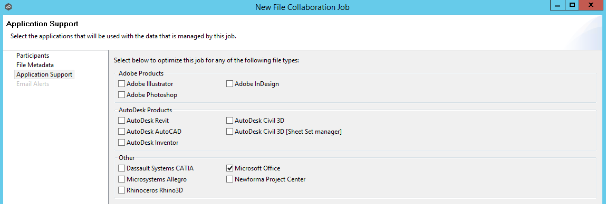

Click **Next > Finish** to complete the job setup.

Starting a Job
++++++++++++++

*Show up on time, try to make a good impression*

Once a job has been created, it must be started to initiate synchronization and file locking.

In the **PMC Client**, under **Jobs**, right-click your newly created job and select **Start**.

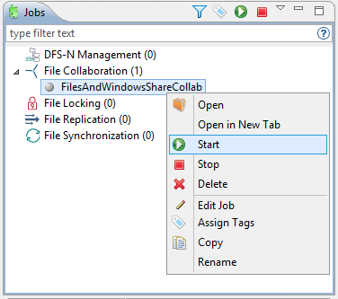

When the job starts:

- Connectivity to all Agents and Files clusters (or other NAS devices) is checked.
- The real-time monitoring engine is initialized.
- A background scan is kicked off to ensure all file servers are in sync with another.

Double-click the job in the **Job** pane to view its runtime information and statistics.

.. note::

  Click **Auto-Update** to have the console regularly refresh as files begin replicating.

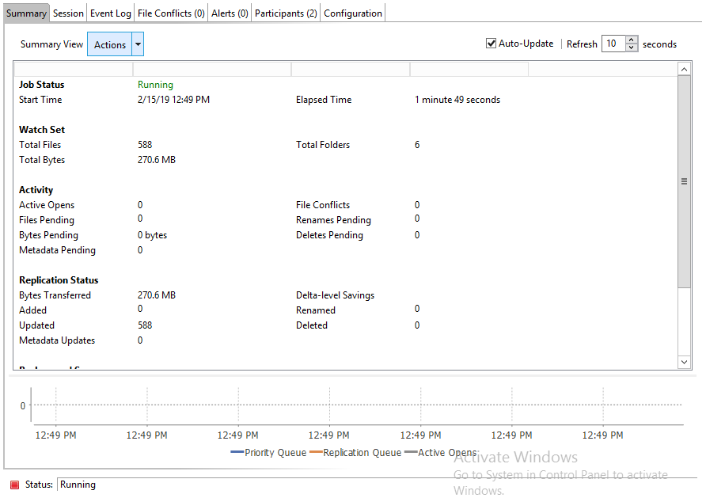

Testing the Share
+++++++++++++++++

.. note::

  This exercise requires the :ref:`windows_tools_vm`.

The easiest way to verify synchronization is functioning properly is to open 2 different File Explorer windows to the respective Nutanix Files and Windows File Server paths.

.. note::

  Do **NOT** test using an Agent server VM. Peer automatically filters all activity from these servers to reduce overhead on the Nutanix Files cluster.

Connect to your *Initials*\ **-Windows-ToolsVM** via RDP using the following credentials:

- **Username** - Administrator
- **Password** - nutanix/4u

Open File Explorer and browse to your Nutanix Files share, e.g. ``\\Initials-Files\Initials-Peer``. Drag this window to the left side of the desktop.

Note that the sample data seeded into the Windows File Server during lab setup has already been replicated to Nutanix Files.

.. note::

  You can also verify the replicated files in **Prism > File Server**.

Open a second File Explorer and browse to your Windows File Server share, e.g. ``\\Initials-PeerAgentB-IP\Data``. Drag this window to the right side of the desktop.

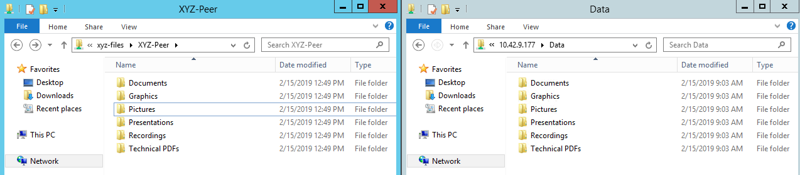

In the File Explorer on the left, create a copy of one of the sample data directories by copying and pasting within the root of the share (shown below).

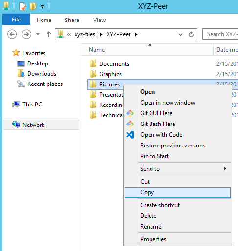

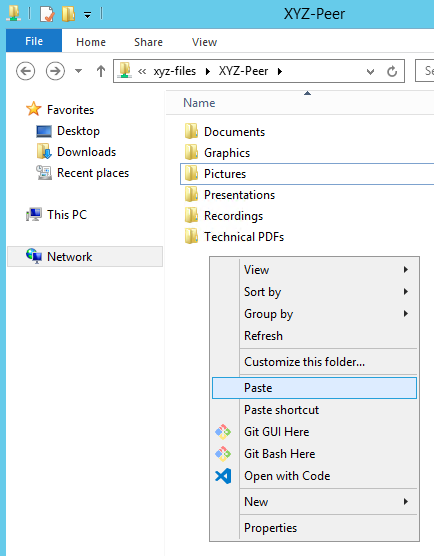

The changes that are performed on the Nutanix Files share will be sent to its paired Agent, the Agent will then facilitate the replication of these files and folders to the other server (and vice versa).

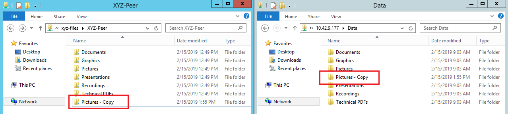

To test file locking, create a new OpenDocument Text file within the root of your Nutanix Files share, e.g. ``\\Initials-Files\Initials-Peer``.

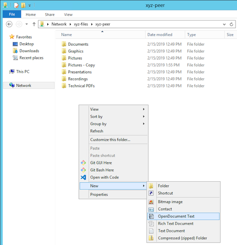

Give the file a name. Within a few seconds, it should appear under your Windows File Server share, e.g. ``\\Initials-PeerAgentB-IP\Data``.

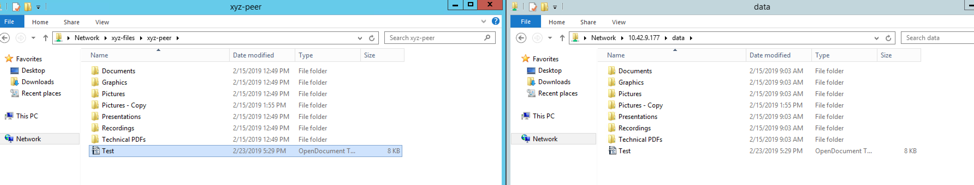

Open the file under the Nutanix Files share with OpenOffice Writer. Then open the file by the same name under ``\\Initials-PeerAgentB-IP\Data``. You should see the following warning that the file is locked.

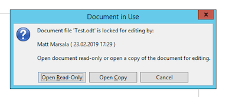

**Congratulations!** You have successfully deployed an Active-Active file share replicated across 2 sites. Using Peer, this same approach can be leveraged to support file collaboration across sites, migrations from legacy solutions to Nutanix Files, or disaster recovery for use cases such as VDI, where user data and profiles need to be accessible from multiple sites for business continuity.

Integrating with Microsoft DFS Namespace
++++++++++++++++++++++++++++++++++++++++

Peer Global File Service includes the ability to create and manage Microsoft DFS Namespaces (DFS-N). When this DFS-N integration is combined with its real-time replication and file locking engine, PeerGFS powers a true global namespace that spans locations and storage devices.

As part of its DFS namespace management capabilities, PeerGFS will also automatically redirect users away from a failed file server. When that failed server comes back online, PeerGFS will bring this file server back in-sync then re-enable user access to it. *This is a must have Disaster Recovery feature for any deployment looking to leverage Nutanix Files for user profile & user data shares for VDI environments.*

The following screenshot shows the PMC with a DFS Namespace under management.

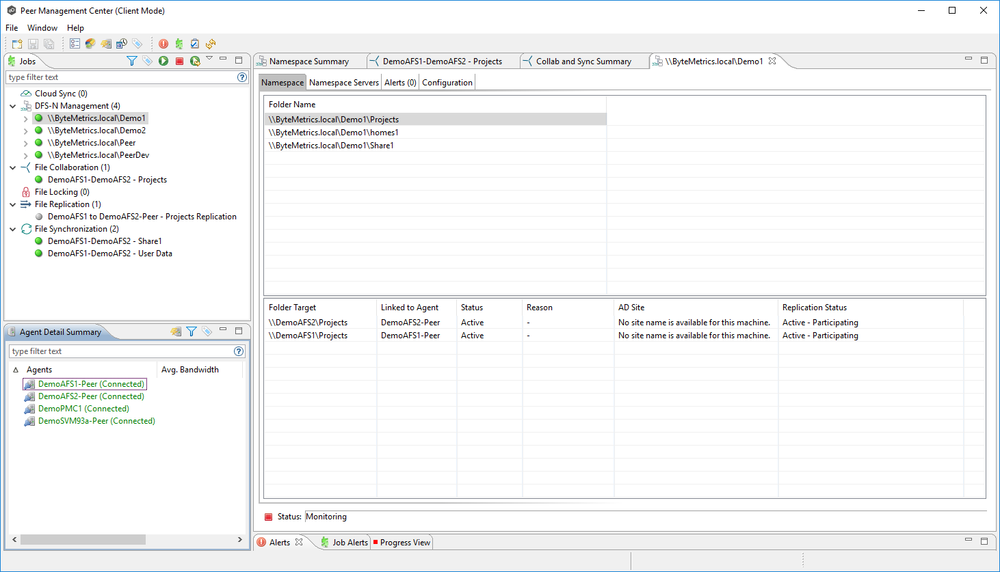

While this lab is not designed to showcase DFS Namespace management, we encourage you to reach out to us on Slack via the **#_peer_software_ext** channel for more information. We are happy to give you NFR licenses for your own lab and can walk you through DFS-N integration.

(Optional) Analyzing Existing Environments
++++++++++++++++++++++++++++++++++++++++++

As the capacity of file server environments increase at a record pace, storage admins often do not know how users and applications are leveraging these file server environments. This fact becomes most evident when it is time to migrate to a new storage platform. The File System Analyzer is a tool from Peer Software that is designed to help partners discover and analyze existing file and folder structures for the purpose of planning and optimization.

The File System Analyzer performs a very fast scan of one or more specified paths, uploads results to Amazon S3, assembles key pieces of information into one or more Excel workbooks, and emails reports with links to access the workbooks.

As this tool is primarily for our partners, we would love to hear any feedback you have on it. Reach out to us on Slack via the **#_peer_software_ext** channel with comments and suggestions.

Connect to your *Initials*\ -**PeerAgentA** VM on your **Primary** cluster via RDP or VM console using the following credentials:

- **Username** - NTNXLAB\\Administrator
- **Password** - nutanix/4u

Within the VM, download the File System Analyzer installer: https://www.peersoftware.com/downloads/fsa/FileSystemAnalyzer_Installer_v1.1.3.4.exe.

Run the installer and select **Standard Installation**.

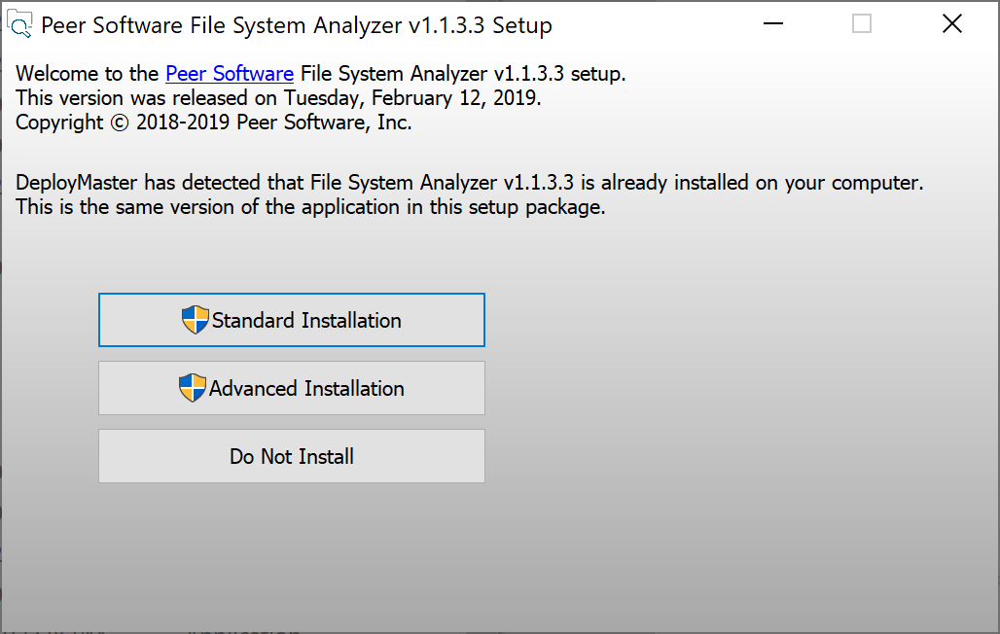

Once the installation is complete, the File System Analyzer wizard will automatically be launched.

The **Introduction** screen provides details on information collected and reported by the utility. Click **Next**.

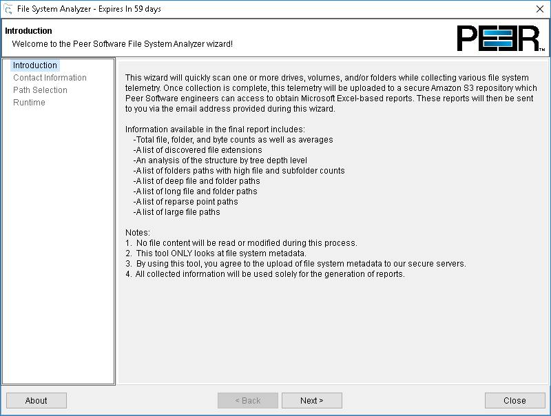

The **Contact Information** screen collects information used to organize the output of the File System Analyzer and to send the final reports. Fill out the following fields:

- **Company** – Enter your company name.
- **Location** – Enter the physical location of the server that is running the File System Analyzer. In multi-site environments, this could be a city or state name. A data center name also works.
- **Project** – Enter a project name or business reason for running this analysis. This (and the Company and Location fields) are strictly used to organize the final reports.
- **Name/Phone/Title** – *Optionally* enter your name and contact information.
- **Email** – Enter the email address to which the final reports will be sent. This can include more than one address in a comma separated list.
- **Upload Region** – Select US, EU, or APAC to tell the File System Analyzer which S3 location to use for uploading the final reports.

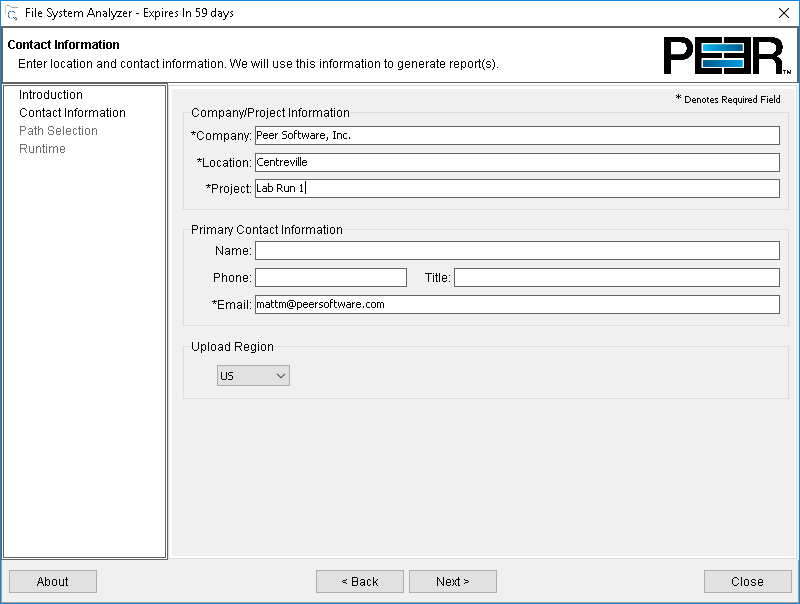

Click **Next**.

The File System Analyzer can be configured to scan one or more paths. These paths can be local (e.g. ``D:\MyData``) or a remote UNC Path (e.g. ``\\files01\homes1``).

Add the following paths:

- ``C:\`` - The local C: drive of *Initials*\ -**PeerAgentA**
- ``\\<Initials>-Files\<Initials>-Peer\`` - The share previously created on your Files cluster

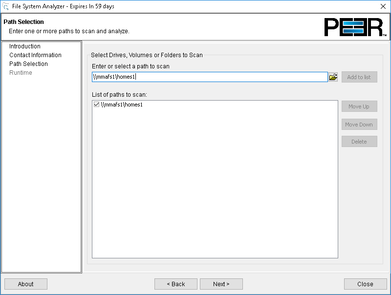

Click **Next**.

The File System Analyzer will automatically begin scanning the entered paths. When all scans, analyses, and uploads are complete, you will see a status that is similar to the following:

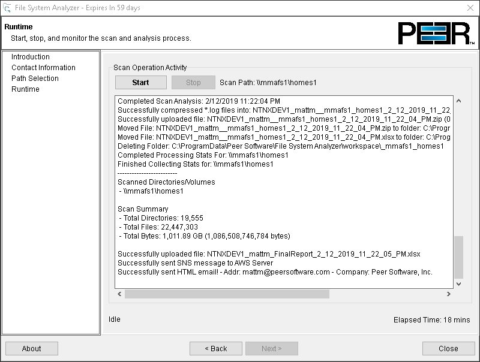

File System Analyzer will also e-mail the report to all configured addresses. To view the full report, click the hyperlink(s) listed under **Detailed Reports** in the e-mail. If multiple paths were scanned, you will also see a link to a cumulative report across all paths.

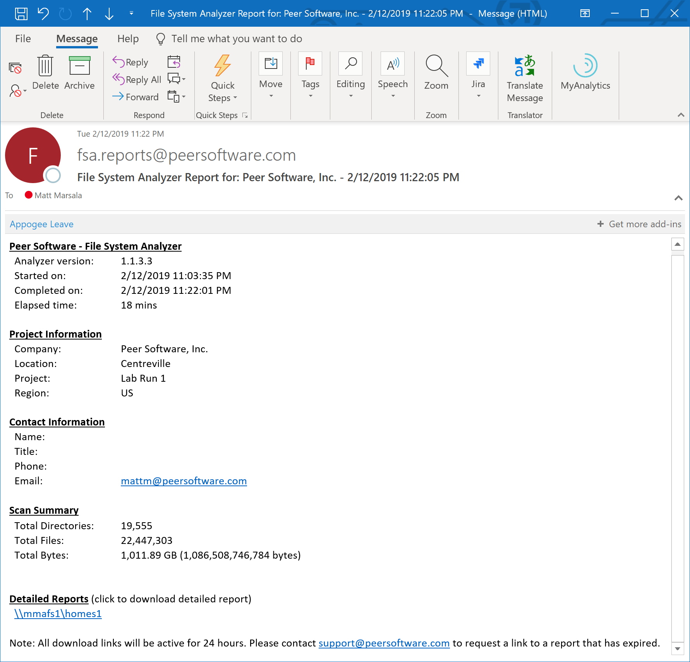

.. note::

  Report download links are only active for **24 hours**. Contact Peer Software to access any expired reports.

The full report contains the following information:

- **InfoSheet** – Details about this specific scan.
- **OverallStats** – Overall statistics for the folder that was scanned. This includes total bytes, files, folders, etc.
- **FileExtSize** – A list of all discovered extensions, sorted by total bytes.
- **FileExtCount** – A list of all discovered extensions, sorted by total files.
- **TreeDepth** – A tally of bytes, folders, and files found at each depth level of the folder structure.
- **ReparsePoints** – A list of all folder reparse points discovered.
- **ReparsePointsSummary** – A summary of all reparse points discovered, regardless of file or folder.
- **HighSubFolderCounts** – A list of all folders containing more than 1000 child directories.
- **HighByteCounts** – A list of all folders containing more than 100GB of child file data.
- **HighFileCounts** – A list of all folders containing more than 10,000 child files.
- **LargeFiles** – A list of all discovered files that are 10GB or larger.
- **FileAttributes** – A summary of all file and folder attributes found.
- **TimeAnalysis** – A breakdown of total files, folders, and bytes by age.
- **TLDAnalysis** - A list of each folder immediately under a specified path with statistics for each of these subfolders. In a user home directory environment, each of these subfolders should represent a different user.

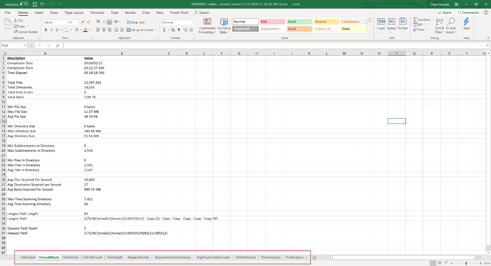

Takeaways
+++++++++

- Peer Global File Service is the only solution which can provide Active-Active replication for Nutanix Files clusters.

- Peer also supports multiple legacy NAS platforms, allowing for replication within mixed environments or easing migration to Nutanix Files.

- Peer can directly manage Microsoft Distributed File Services (DFS) namespaces, allowing multiple file servers to be presented through a single namespace. This is a key component for supporting true Active-Active DR solutions for file sharing.

- Peer offers tools for analyzing existing file servers to help with resource planning, optimization, and migration.

- Peer Global File Service is licensed per Nutanix Files cluster or storage device with a TB-based package structure.

- The latest Peer prerequisities for Nutanix Files can be found `here <https://kb.peersoftware.com/tb/nutanix-files-prerequisites>`_.

- An in-dept Peer/Nutanix battlecard can be found `here <https://gpnportal.peersoftware.com/engage/peer-nutanix-battle-card-for-nutanix-files-afs/?sales_rep=aVFZUU9VZDVvbWZFNGhCTDBmM2lMZz09>`_.

- NFR licenses are available for lab environments. Reach out via the #_peer_software_ext Slack channel to request one.

Cleanup
+++++++

.. raw:: html

  <strong>Once your lab completion has been validated, PLEASE do your part to remove any unneeded VMs to ensure resources are available for all users on your shared cluster.</strong>

Delete your *Initials*\ **-PeerAgentA**, *Initials*\ **-PeerAgentB**, and *Initials*\ **-PeerMgmt** VMs.

Getting Connected
+++++++++++++++++

Have a question about **Nutanix + Peer Software**? Please reach out to the resources below:

+---------------------------------------------------------------------------------+
|  Peer Product Contacts                                                          |
+================================+================================================+
|  Slack Channel                 | #_peer_software_ext                            |
+--------------------------------+------------------------------------------------+
|  Product Manager               | Vikram Gupta, vikram.gupta@nutanix.com         |
+--------------------------------+------------------------------------------------+
|  Technical Marketing Engineer  | Mike McGhee, mike.mcghee@nutanix.com           |
+--------------------------------+------------------------------------------------+
|  Product Marketing Manager     | Devon Helms, devon.helms@nutanix.com           |
+--------------------------------+------------------------------------------------+
|  Alliance Manager              | Abbas Sura, abbas.sura@nutanix.com             |
+--------------------------------+------------------------------------------------+

Looking to get connected with your **Peer Software** field counterpart? Reach out to kevinh@peersoftware.com.
