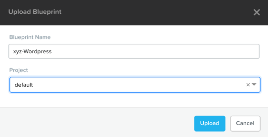
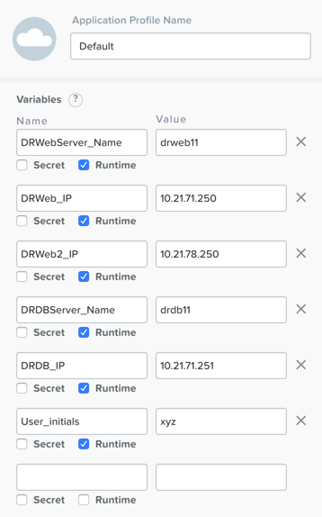
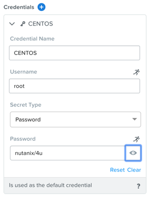
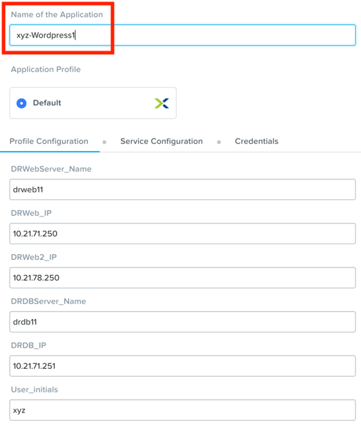

.. _wordpress:

----------------------
Deploying Wordpress
----------------------

*The estimated time to complete this lab is 10 minutes.*

Overview
++++++++

**This exercise walks you through importing and launching a Calm blueprint to deploy a Wordpress application used in the Leap: DR Runbooks lab. You do not need to complete this exercise unless directed to do so as staging for another lab.**

Importing the Blueprint
+++++++++++++++++++++++

Right-click on :download:`this link <Wordpress.json>` and **Save Link As...** to download the blueprint for the example application used in this exercise.

In **Prism Central**, select :fa:`bars` **> Services > Calm**.

.. figure:: images/wordpress_01.png

Click |blueprints| **Blueprints** in the left hand toolbar to view available Calm blueprints.

.. note::

  Mousing over an icon will display its title.

Click **Upload Blueprint** and select the **TaskManager.json** file previously downloaded.

Fill out the following fields:

- **Blueprint Name** - *Initials*-Wordpress
- **Project** - default

Click **Upload**.

Defining Credentials
++++++++++++++++++++

Before you can launch the blueprint, you must first provide credentials, as this information is not stored in exported Calm blueprints.

In the **Application Profile** pane on the right, fill out the following field:

- **DRWebServer_Name** - *DRWeb1 - DRWeb12 based on assignment*
- **DRWeb_IP**  - *DRWeb1 - DRWeb12 Assigned IP*
- **DRWeb2_IP**  - *Failover DRWeb1 - DRWeb12 Assigned IP*
- **DRDBServer_Name** - *DRDB1 - DRDB12 based on assignment*
- **DRDB_IP** - *DRDB1 - DRDB12 Assigned IP*
- **User_initials** - *initials*

Click **Save**.

.. figure:: images/wordpress_04.png

Click **Credentials**.

.. figure:: images/wordpress_05.png

Expand the **CENTOS** credential by clicking its name. Enter **nutanix/4u** as the **Password**.

Click **Save**.

Once the blueprint has been saved, click **Back**.

.. figure:: images/wordpress_07.png

Note that after the credentials have been provided, **Publish**, **Download**, and **Launch** are now available from the toolbar. Click **Launch**.

Fill out the following fields:

- **Name of the Application** - *Initials*-Wordpress1

Click **Create**.

You can monitor the status of your application deployment by clicking |applications| **Applications** and clicking your application's name.

Provisioning the complete application will take approximately 15 minutes. Proceed to the next section of the lab while the application is provisioning.

.. |blueprints| image:: ../images/blueprints_icon.png
.. |applications| image:: ../images/applications.png
