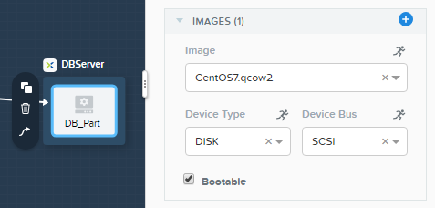

.. _wordpress:

----------------------
Deploying Wordpress
----------------------

*The estimated time to complete this lab is 10 minutes.*

Overview
++++++++

**This exercise walks you through importing and launching a Calm blueprint to deploy a Wordpress application used in the Leap: DR Runbooks lab. You do not need to complete this exercise unless directed to do so as staging for another lab.**

Verifying the Default Project
+++++++++++++++++++++++++++++

In **Prism Central**, select :fa:`bars` **> Services > Calm**.

.. figure:: images/0.png

Click |projects| **Projects** in the left hand toolbar and select the **default** project.

.. note::

  Mousing over an icon will display its title.

Under **AHV Cluster** verify your assigned cluster is selected from the drop-down list, otherwise select it.

.. figure:: images/1.png

Under **Network**, verify the **Primary** and **Secondary** networks are selected and the **Primary** network is the default. Otherwise, make the selections as shown below.

.. figure:: images/2.png

If changes were made, click **Save**.

Importing the Blueprint
+++++++++++++++++++++++

Right-click on :download:`this link <Wordpress.json>` and **Save Link As...** to download the blueprint for the example application used in this exercise.

Click |blueprints| **Blueprints** in the left hand toolbar to view available Calm blueprints.

Click **Upload Blueprint** and select the **Wordpress.json** file previously downloaded.

Fill out the following fields:

- **Blueprint Name** - *Initials*-Wordpress
- **Project** - default

.. figure:: images/wordpress_02.png

Click **Upload**.

.. note::

  If you receive an error trying to upload the blueprint, refresh your browser and try again.

Configuring the Blueprint
+++++++++++++++++++++++++

Before you can launch the blueprint, you must first provide specify the information not stored in exported Calm blueprints, including credentials.

In the **Application Profile** pane on the right, fill out the following fields using **your specific details** found in :ref:`clusterassignments`.

- **DRWebServer_Name** - *DR Web Hostname*
- **DRWeb_IP**  - *DR Web IP*
- **DRWeb2_IP**  - *DR Failover Web IP*
- **DRDBServer_Name** - *DR DB Hostname*
- **DRDB_IP** - *DR DB IP*
- **User_initials** - *Initials*

.. figure:: images/wordpress_03.png

Click **Save**.

.. figure:: images/wordpress_04.png

Select the **DB_Part** service and in the pane on the right, under the **VM** tab, ensure the **Image** is set to the **CentOS7** disk image as shown below.

Under **Network Adapters (NICs)**, ensure that **NIC 1** is set to **Secondary** as shown below. The **Static IP** macro will auto-populate based on information stored in the imported Blueprint.

.. figure:: images/4c.png

Repeat the steps above to configure **Image** and **NIC 1** for the **WebServer_Part** service.

Click **Credentials**.

.. figure:: images/wordpress_05.png

Expand the **CENTOS** credential by clicking its name. Enter **nutanix/4u** as the **Password**.

.. figure:: images/wordpress_06.png

Click **Save**.

Once the blueprint has been saved, click **Back**.

.. figure:: images/wordpress_07.png

Launching the Blueprint
+++++++++++++++++++++++

After the credentials have been provided, **Publish**, **Download**, and **Launch** are now available from the toolbar. Click **Launch**.

Fill out the following fields:

- **Name of the Application** - *Initials*-Wordpress1

.. figure:: images/wordpress_08.png

Click **Create**.

You can monitor the status of your application deployment by clicking |applications| **Applications** and clicking your application's name.

Provisioning the complete application will take approximately 15 minutes. Proceed to the next section of the lab while the application is provisioning.

.. |blueprints| image:: ../images/blueprints_icon.png
.. |applications| image:: ../images/applications.png
.. |projects| image:: images/projects.png
