.. _xplay:

------------------------
Prism Pro: X-Play
------------------------

Overview
++++++++

**Estimated time to complete: 60 MINUTES**

Lab Setup
+++++++++

For this lab you will need the Linux-ToolsVM.

If you have not deployed this yet, please do the lab below before continuing.

:ref:`linux_tools_vm`

Run Stress Test
...............

Lets add some load by initiating a stress test.

Login to the *initials*-**Linux-ToolsVM** via ssh or Console session.

- **Username** - root
- **password** - nutanix/4u

.. code-block:: bash

  stress -m 4 --vm-bytes 500M -t 40m &

.. note::

  It will take roughly 5min for Stress to generate the memory load to cause the alert.

Review Anomalies
++++++++++++++++

Review Memory of <*VM-A*> (Pre-Seeded for this lab).

In **Prism Central** > select :fa:`bars` **> Virtual Infrastructure > VMs**, and click **VM-A**

<Add more content from harry Yang here around Best Practices>

Automatically Add Memory to a VM When A Constraint is Detected
++++++++++++++++++++++++++++++++++++++++++++++++++++++++++++++

How often have you been on-call, and got that alert or service ticket for a VM that was having High memory or CPU?
Chances are a lot, and generally during dinner, while you are out with family, or sleeping.

What if you could use X-Play in Prism Pro to automatically take care of this for you when Prism Pro detected the constraint?
Good news, you can. Let's walk through how to set that up.

Create Alert Policy
...................

In **Prism Central** > select :fa:`bars` **> Virtual Infrastructure > VMs**, and click *initials*-**Linux-ToolsVM**.

Next select **Metrics > Memory Usage**.

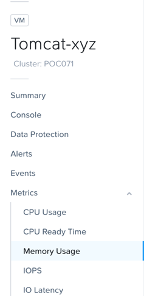

Click **Alert Settings**

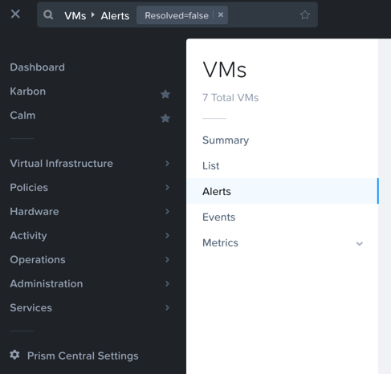

You will see the  **Create Alert Policy** window, fill out the following fields:

- **Entity Type** - VM
- **Entity (Line 1)** - One VM
- **Entity (Line 2)** - *initials*-**Linux-ToolsVM**
- **Metric** - Memory Usage
- **Impact Type** - Performance
- **Policy Name** - *initials* - VM Memory Constrained
- **Description** - Optional
- **Auto Resolve Alerts** - Checked
- **Enable Policy** - **Unchecked**
- **Trigger alert if conditions persist for** - 0 Minutes

- **Behavioral Anomaly**
    - **Every time there is an anomaly, alert** - Checked / Warning

- **Static Threshold**
    - **Alert Critical if** - Checked / >= 60

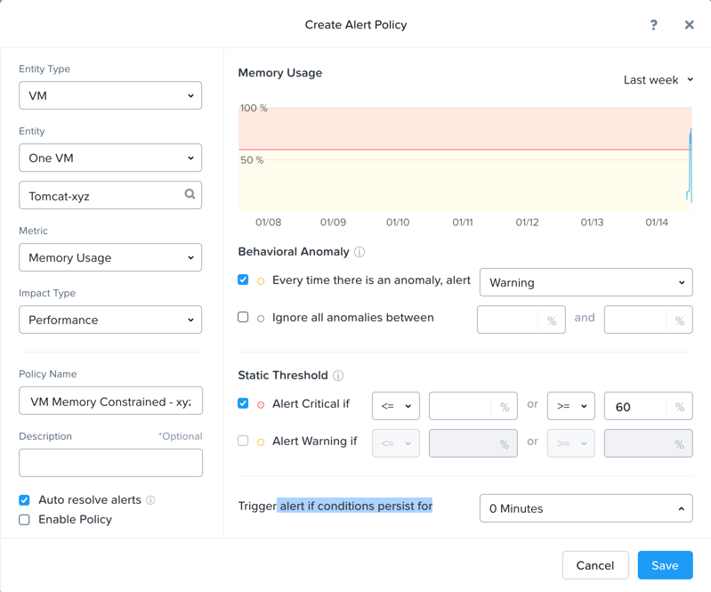

Click **Save**.

.. note::

  Customers can choose out-of-the-box alert policies (shown below) to detect the memory and cpu constraint by X-FIT.

  .. figure:: images/xplay_04.png

Create Playbook
...............

In **Prism Central** > select :fa:`bars` **> Operations > Playbooks**.

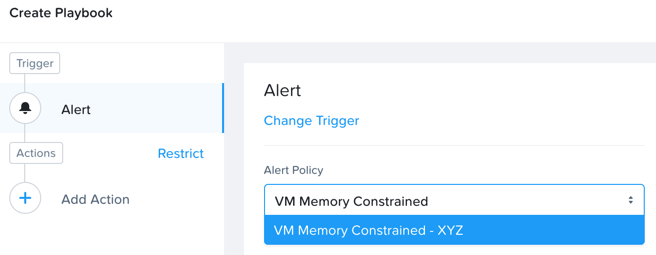

Click **Create Playbook**.

Select :fa:`bell` **Alert** as Trigger, and click **Select**.

.. figure:: images/xplay_06.png

.. note::

  When X-Play is GA in 5.11, we will also support a new trigger type “Manual” which allows you associate a playbook to VMs, Hosts, and Clusters and trigger it manually.

  .. figure:: images/xplay_07.png

Search “VM Memory Constrained” in **Alert Policy**, and select *initials* - **VM Memory Constrained**.

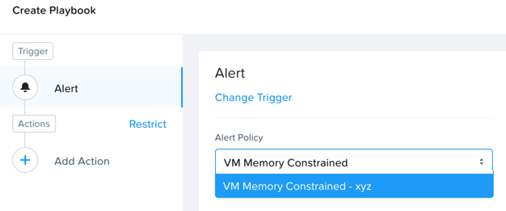

Click **Add Action**, and select the :fa:`camera` **VM Snapshot** action.

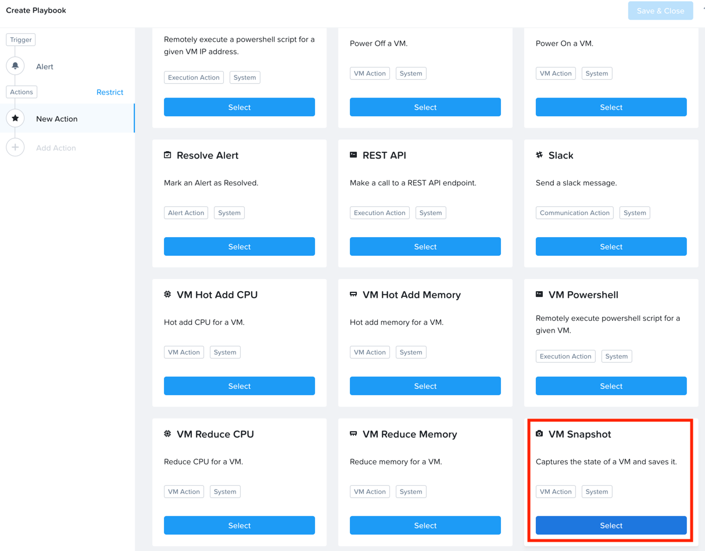

Select **Source Entity** from the parameters.

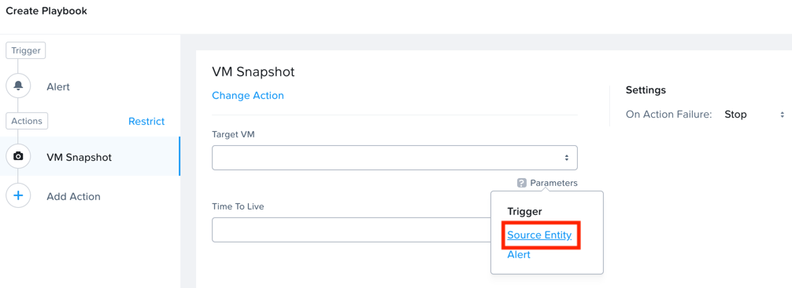

.. note::

  Source entity means the entity triggers the alert.

- **Target VM** - {{trigger[0].source_entity_info}}
- **Time To Live**  - 1 day(s)

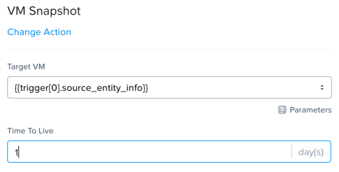

Click **Add Action**, and select the :fa:`memory` **VM Hot Add Memory** action.

Select **Source Entity** from the parameters.

- **Target VM** - {{trigger[0].source_entity_info}}
- **Add Absolute Memory** - 1 GiB
- **Absolute Maximum** -  20 GiB

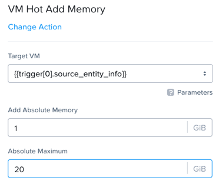

Click **Add Action**, and select the :fa:`envelope` **Email** action.

.. note::

  Please look at the example Subject below with parameters.

  Please try creating your own Subjects using parameters.

- **Recipient** - YourEmail@nutanix.com
- **Subject** - Playbook {{playbook.playbook_name}} addressed alert {{trigger[0].alert_entity_info.name}}
- **Message** - Prism Pro X-FIT detected  {{trigger[0].alert_entity_info.name}} in {{trigger[0].source_entity_info.name}}.  Prism Pro X-Play has run the playbook of "{{playbook.playbook_name}}". As a result, Prism Pro increased 1GB memory in {{trigger[0].source_entity_info.name}}.

.. note::

  There is a bug right now that when you click a parameter in the **parameter** popup, the parameter string will be appended at the end of the text string, not at the place of the cursor.

  You have to cut and paste it into the write place if that is the case.

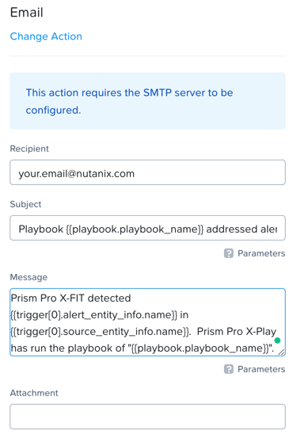

Click **Add Action**, and select the **Acknowledge Alert** action.

Select **Alert** from the parameters.

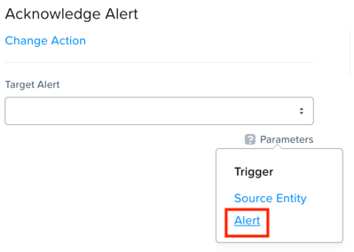

- **Target Alert**  - {{trigger[0].alert_entity_info}}

Click **Save & Close**, and fill out the following fields:

- **Name**  - *initials* - Auto Remove Memory Constraint
- **Description** - Optional
- **Status**  - Enabled

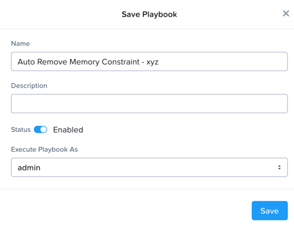

Click **Save**.

Cause Memory Constraint
.......................

In **Prism Central** > select :fa:`bars` **> Virtual Infrastructure > VMs**, and click *initials*-**Linux-ToolsVM**.

Take note of your *initials*-**Linux-ToolsVM** VM's memory capacity (should be 2 GiB).

Click **Alerts**, Select **Alert Policy** from **Configure** Dropdown.

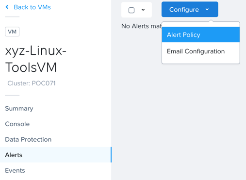

Select *initials* - **VM Memory Constrained**, and **Enable** the policy.

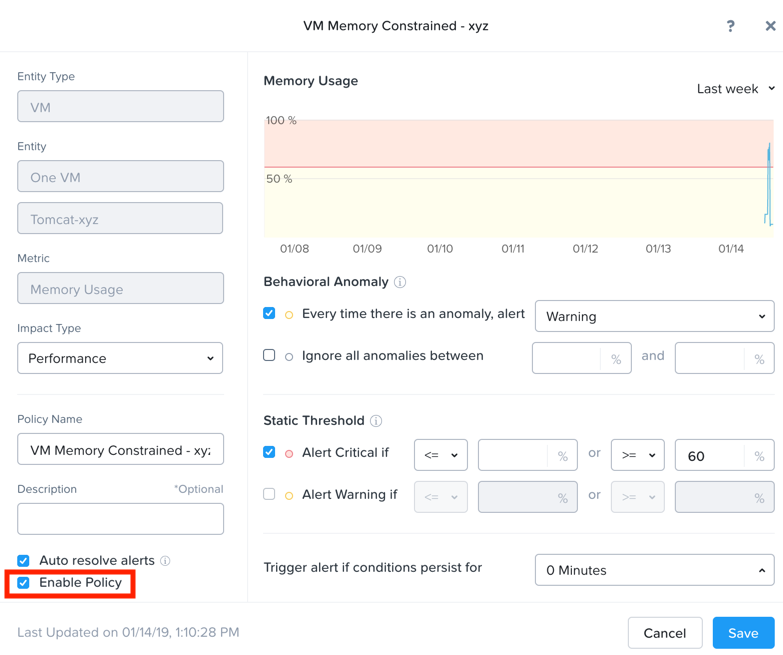

Open a console session or SSH into Prism Central, and run the **paintrigger.py** script.

- **Username** - nutanix
- **password** - nutanix/4u

.. code-block:: bash

  python PrismProLab/paintrigger.py

.. note::

  This will resolve all the alerts, force NCC check to run immediately and trigger the alert.

After 2-5 minutes you should receive an email from Prism.

Check the email to see that its subject and email body have filled the real value for the parameters you set up earlier.

Check the memory capacity on your *initials*-**Linux-ToolsVM** VM now, you should see that it has increased.

Review the Playbook Play
........................

In **Prism Central** > select :fa:`bars` **> Operations > Playbooks**.

Select your *initials* - **Auto Remove Memory Constraint**, and **disable** it.

Click **Plays**.

You should see that a Play has just completed.

Click the Play, and examine the details.

.. figure:: images/xplay_18.png

Reset VM Memory
...............

Change your *initials*-**Linux-ToolsVM** memory back to 2gb.

Reduce CPU Capacity For A VM During A Maintenance Window
++++++++++++++++++++++++++++++++++++++++++++++++++++++++

X-Fit in Prism Pro utilizes Machine Learning to continually analyze the environment.

This is helpful to detect resource constraints, such as our memory constraint in the last lab, as well as inefficiencies.

Inefficiencies could be Virtual Machines with over provisioned vCPU or Memory.

In this exercise we will create a playbook to take care of over-provisioned CPU.

Create Alert Policy
...................

In **Prism Central** > select :fa:`bars` **> Activity > Alerts**, and Select **Alert Policy** from **Configure** Dropdown.

Click **+ New Alert Policy**

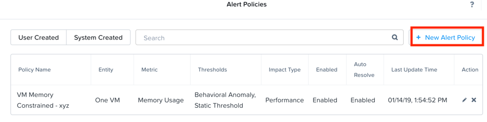

You will see the  **Create Alert Policy** window, fill out the following fields:

- **Entity Type** - VM
- **Entity (Line 1)** - One VM
- **Entity (Line 2)** - *initials*-**Linux-ToolsVM**
- **Metric** - CPU Usage
- **Impact Type** - Performance
- **Policy Name** - *initials* - VM CPU Overprovisioned
- **Description** - Optional
- **Auto Resolve Alerts** - Checked
- **Enable Policy** - **Unchecked**
- **Trigger alert if conditions persist for** - 0 Minutes

- **Static Threshold**
    - **Alert Critical if** - Checked / <= 30

.. figure:: images/xplay_20.png

Click **Save**.

.. note::

  Customers can choose out-of-the-box alert policies (shown below) to detect the overprovisioned memory and cpu by X-FIT.

Create Playbook
...............

In **Prism Central** > select :fa:`bars` **> Operations > Playbooks**.

Click **Create Playbook**.

Select :fa:`bell` **Alert** as Trigger, and click **Select**.

Search “VM CPU Overprovisioned” in **Alert Policy**, and select *initials* - **VM CPU Overprovisioned**.

Click **Add Action**, and select the :fa:`power-off` **Power Off VM** action.

Select **Source Entity** from the parameters.

- **Target VM** - {{trigger[0].source_entity_info}}
- **Type of Power Off Action**  - Guest Shutdown

.. note::

  If VM does not have NGT installed, select **Power Off** instead.

Click **Add Action**, and select the **VM Reduce CPU** action.

Select **Source Entity** from the parameters.

- **Target VM** - {{trigger[0].source_entity_info}}
- **vCPUs to Remove**  -
- **Minimum Number of vCPUs**  - 1
- **Cores per vCPU to Remove**  -
- **Minimum Number of Cores per vCPU**  -

.. note::

  There is a bug in 5.10 that missed the two fields allowing you change the vCPU counts. This is fixed in 5.11.

  .. figure:: images/xplay_21.png

Click **Add Action**, and select the :fa:`power-off` **Power On VM** action.

Select **Source Entity** from the parameters.

- **Target VM** - {{trigger[0].source_entity_info}}

Click **Add Action**, and select the :fa:`envelope` **Email** action.

.. note::

  Please look at the example Subject below with parameters.

  Please try creating your own Subjects using parameters.

- **Recipient** - YourEmail@nutanix.com
- **Subject** - Playbook {{playbook.playbook_name}} downsized  {{trigger[0].source_entity_info.name}}
- **Message** - Prism Pro's X-FIT detected that  {{trigger[0].source_entity_info.name}} is overprovisioned.  Prism Pro's X-Play has run the playbook of "{{playbook.playbook_name}}". As a result, Prism Pro downsized {{trigger[0].source_entity_info.name}}.

Many times, you can’t just power off the VM to do the resizing during the production time.

X-Play provides a way for the user to specify the time window where the actions can be executed.

Click **Restrict**.

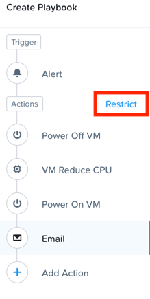

Set up the start time about 5 minutes after your current time.

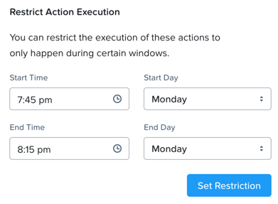

Click **Set Restriction**.

The **Restrict** label will change to **Restriction Set**. If you hover the mouse, you will see the schedule you just set.

.. note::

  The step above illustrate the way you can achieve this in 5.10 early access. However we made a major enhancement in 5.11.

  You will see three action types that will replace and enhance the “restrict” in 5.10, **Wait for Some Time** / **Wait for Some Day of Month** / **Wait for Some Day of Week**.

  .. figure:: images/xplay_24.png

  .. figure:: images/xplay_25.png

  .. figure:: images/xplay_26.png

  These action type can be used just any other regular action type in any part of the Playbook.
  It helps unlock not only the maintenance window setting but also allow a human approval process happening for a playbook.

Click **Save & Close**, and fill out the following fields:

- **Name**  - *initials* - Reduce VM CPU
- **Description** - Optional
- **Status**  - Enabled

Click **Save**.

Cause CPU Over-Provision
........................

In **Prism Central** > select :fa:`bars` **> Virtual Infrastructure > VMs**, and click *initials*-**Linux-ToolsVM**.

Take note of your *initials*-**Linux-ToolsVM** VM's CPU Cores (should be 2).

Click **Alerts**, Select **Alert Policy** from **Configure** Dropdown.

Select *initials* - **VM CPU Overprovisioned**, and **Enable** the policy.

Open a console session or SSH into Prism Central, and run the **paintrigger.py** script.

- **Username** - nutanix
- **password** - nutanix/4u

.. code-block:: bash

  python PrismProLab/paintrigger.py

.. note::

  This will resolve all the alerts, force NCC check to run immediately and trigger the alert.

In **Prism Central** > select :fa:`bars` **> Operations > Playbooks**.

Select your *initials* - **Reduce VM CPU -**, and Click **Plays**.

You should see that there is a play with your playbook name is in **scheduled** status.

Wait for 1-2 minutes past the start time you set earlier, and you should receive an email from Prism.

Check the email to see that its subject and email body have filled the real value for the parameters you set up earlier.

Check the CPU Cores on your *initials*-**Linux-ToolsVM** VM now, you should now see the **Virtual CPU Count** is “1” (instead of “2”).

This means that the trigger happened and the rest of the play is waiting for the window to execute. You can select this play and abort it (from the action button).

Review the Playbook Play
........................

In **Prism Central** > select :fa:`bars` **> Operations > Playbooks**.

Select your *initials* - **Reduce VM CPU**, and **disable** it.

Click **Plays**.

You should see that the Play has just completed.

Click the Play, and examine the details.

Things to do Next
+++++++++++++++++

As you can see, X-Play paired with X-Fit is very powerful.

You can go to “Action Gallery” page and familiarize yourself with all the out-of-the-box Actions, and see all the possible things you can do.

In **Prism Central** > select :fa:`bars` **> Operations > Actions Gallery**.

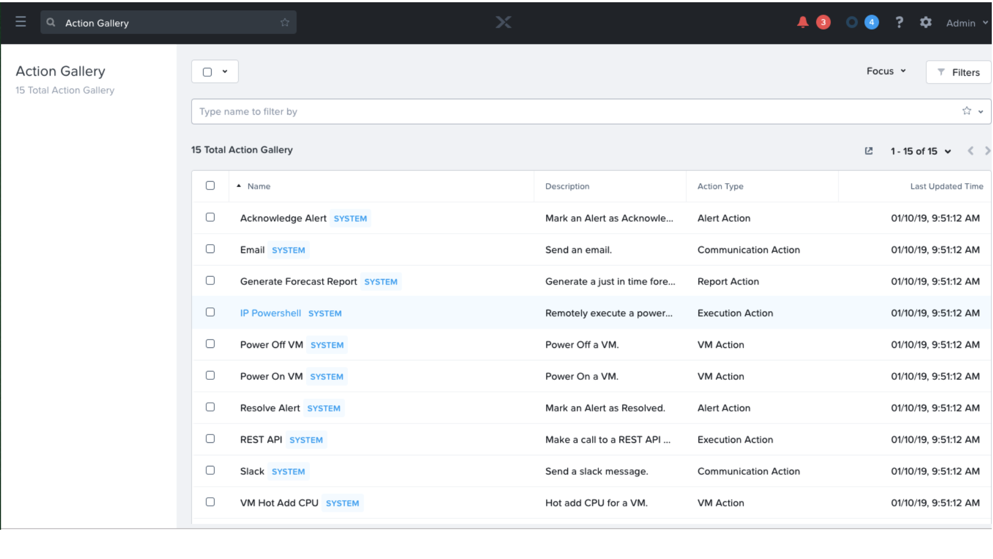

Use X-Play with Other Nutanix Products
++++++++++++++++++++++++++++++++++++++

Let's see how we can use X-Play with other Nutanix products by creatinga playbook to automatically quarantine a bully VM.

Login to the *initials*-**Linux-ToolsVM** via ssh or Console session.

- **Username** - root
- **password** - nutanix/4u

Make sure NODE_PATH has the global nodejs module directory by running the following command to set it:

.. code-block:: bash

  export NODE_PATH=/usr/lib/node_modules

Download the :download:`processapi.js <processapi.js>` file.

.. code-block:: bash

  curl -L https://s3.amazonaws.com/get-ahv-images/processapi.js -o processapi.js

Modify the PC IP address and username/password in the script.

.. code-block:: bash

  sed -i 's/127.0.0.1/<*your PC IP*>/g' processapi.js

  sed -i 's/pc user/admin/g' processapi.js

  sed -i 's/pc password/<*your PC password*>/g' processapi.js

Start the nodejs server

.. code-block:: bash

  node processapi.js&

Run the stress command to simulate the IO load

.. code-block:: bash

  stress -d 2

Let it keep running until you complete this section.

Create Alert Policy
...................

In **Prism Central** > select :fa:`bars` **> Activity > Alerts**, and Select **Alert Policy** from **Configure** Dropdown.

Click **+ New Alert Policy**

You will see the  **Create Alert Policy** window, fill out the following fields:

- **Entity Type** - VM
- **Entity (Line 1)** - One VM
- **Entity (Line 2)** - *initials*-**Linux-ToolsVM**
- **Metric** - Controller IO Bandwidth
- **Impact Type** - Performance
- **Policy Name** - *initials* - Bully VM
- **Description** - Optional
- **Auto Resolve Alerts** - Checked
- **Enable Policy** - **Unchecked**
- **Trigger alert if conditions persist for** - 0 Minutes

- **Behavioral Anomaly**
    - **Every time there is an anomaly, alert** - Checked / Warning

- **Static Threshold**
    - **Alert Critical if** - Checked / >= 250

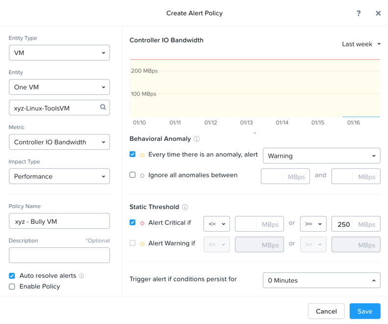

Click **Save**.

.. note::

  Customers can choose out-of-the-box alert policies (shown below) to detect the bully VM by X-FIT.

Create Custom REST API Action
.............................

In **Prism Central** > select :fa:`bars` **> Operations > Actions Gallery**.

Select **REST API** action, and then select **Clone** from the **Action** dropdown.

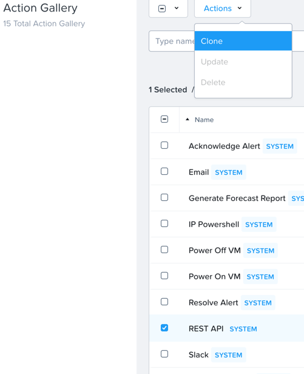

Fill in the following fields:

- **Name**  - *initials* - Quarantine a VM
- **Description** - Quarantine a VM using Flow API
- **Method**  - PUT
- **URL** - https://*<your PC IP>*:9440/api/nutanix/v3/vms/{{trigger[0].source_entity_info.uuid}}
- **Request Headers** - Content-Type: application/json

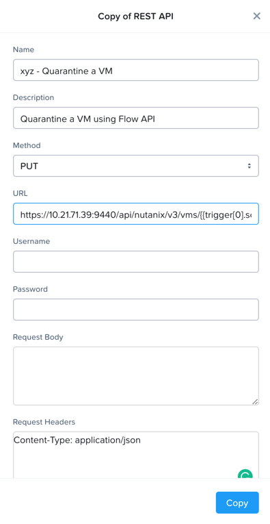

Click **Copy**.

Create Playbook
...............

In **Prism Central** > select :fa:`bars` **> Operations > Playbooks**.

Click **Create Playbook**.

Select :fa:`bell` **Alert** as Trigger, and click **Select**.

Search “Bully VM” in **Alert Policy**, and select *initials* - **Bully VM**.

Click **Add Action**, and select the :fa:`terminal` **REST API** action.

- **Method**  - GET
- **URL** - http://<IP of *Initial*-Linux-toolsVM>:3000/vm/{{trigger[0].source_entity_info.uuid}}

.. note::

  There is a bug in 5.10 that you have to click the “GET” in the drop list once even though “GET” is shown as the default value)

Click **Add Action**, and select the :fa:`terminal` *initials* - **Quarantine a VM** action.

.. note::

  There is a bug in 5.10 where the title of this action still shows as “REST API”. In 5.11 GA, you will see the title as you specified earlier.

Click **Parameters** and select **Response Body** into the request body field.

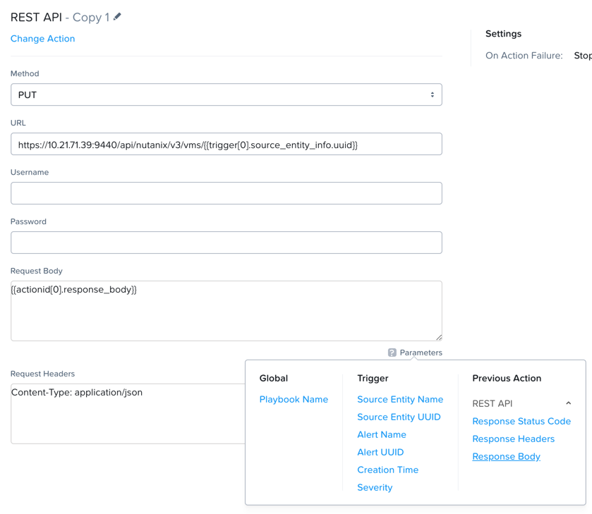

Fill in the username and password for your Prism Central.

Click **Add Action**, and select the **Acknowledge Alert** action.

Select **Alert** from the parameters.

- **Target Alert**  - {{trigger[0].alert_entity_info}}

Click **Save & Close**, and fill out the following fields:

- **Name**  - *initials* - Auto Quarantine A Bully VM
- **Description** - Optional
- **Status**  - Enabled

Click **Save**.

Cause Bully VM Condition
........................

In **Prism Central** > select :fa:`bars` **> Virtual Infrastructure > VMs**, and click *initials*-**Linux-ToolsVM**.

Click **Categories**, and make sure it is not currently quarantined and associated with any categories.

In **Prism Central** > select :fa:`bars` **> Activity > Alerts**, and Select **Alert Policy** from **Configure** Dropdown.

Select *initials* - **Bully VM**, and **Enable** the policy.

Open a console session or SSH into Prism Central, and run the **paintrigger.py** script.

- **Username** - nutanix
- **password** - nutanix/4u

.. code-block:: bash

  python PrismProLab/paintrigger.py

.. note::

  This will resolve all the alerts, force NCC check to run immediately and trigger the alert.

After 1-2 minutes check *initials*-**Linux-ToolsVM**, you should now see the VM is quarantined.

Cleanup Bully VM Condition
..........................

Un-quarantine your *initials*-**Linux-ToolsVM**.

In **Prism Central** > select :fa:`bars` **> Operations > Playbooks**.

Click the *initials* - **Auto Quarantine A Bully VM** playbook, and click the **Disable** button.

Click the **Play** tab, you should see that a play has just completed.

If the terminal session is broken (due to the quarantine), log in to *Initial*-**Linux-ToolsVM** to kill the node and stress processes.

(Optional) Endless Possibilities Using APIs
+++++++++++++++++++++++++++++++++++++++++++

This lab will show how you can easily include 3rd party tools into the X-Play.

We will using IFTTT as the example of the 3rd party tool to send a Slack message when an alert is detected. You can extend this use case to ServiceNow or other tools.

Before we setup IFTTT, ensure your *initial*-**Linux-ToolsVM** has memory size of 2gb, and if not change it to 2GB (power off, update, and power on).

If not still logged in, Login to the *initials*-**Linux-ToolsVM** via ssh or Console session.

Run stress again to generate load.

.. code-block:: bash

  stress -m 4 --vm-bytes 500M

.. note::

  It will take roughly 5min for Stress to generate the memory load to cause the alert.

Setup IFTTT
...........

Go to https://ifttt.com/, log in and search **Webhooks**.

.. note::

  If you don’t have an IFTTT (ifttt.com) account, please register one.

Click on Services, then select **Webhooks**.

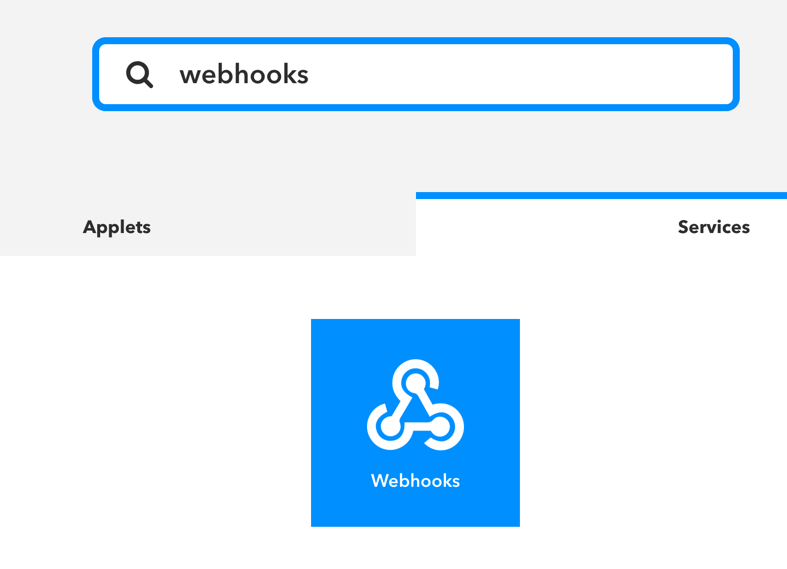

Click **Connect**.

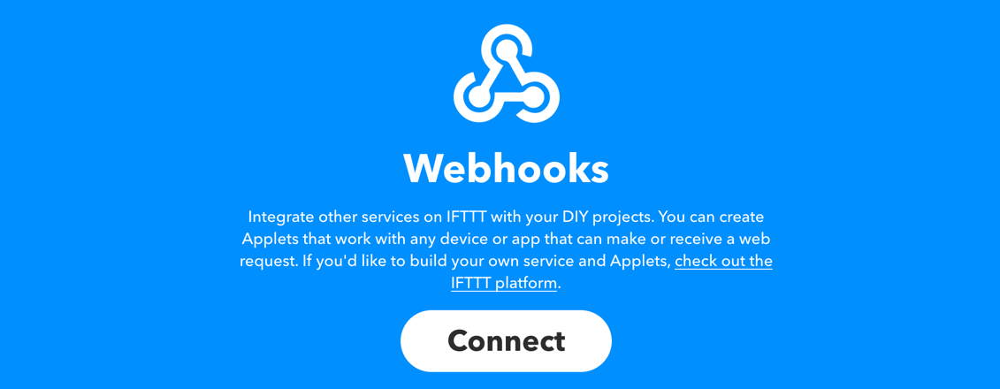

Once you connect it, Click the **Settings** button at the top right.

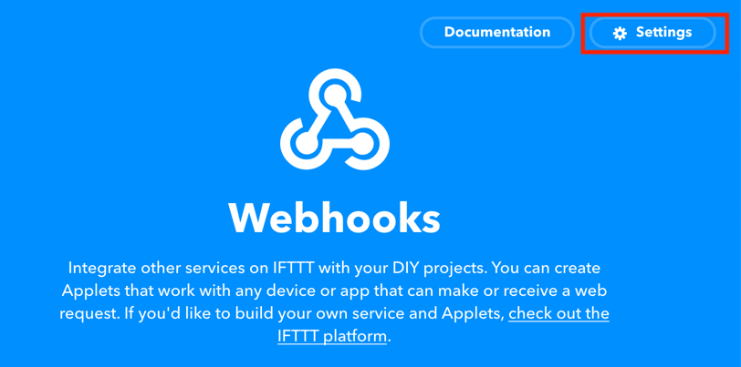

Copy the URL shown in the setting page.

The URL is similar to this. *https://maker.ifttt.com/use/xxxxxyyyyzzz*

Paste that URL into a new browser tab, and go to the page. The page that opens will show your unique webhook address.

The URL is something like this. https://maker.ifttt.com/trigger/{event}/with/key/xxxxxyyyzzz

.. note::

  Take note of the address, as this is what we will be targeting in the X-Play REST API action later.

Now you can create your own applet that will be triggered when it is called from X-Play.

In the original browser tab, click on **My Applets** (or go to https://ifttt.com/my_applets).

Click “New Applet”

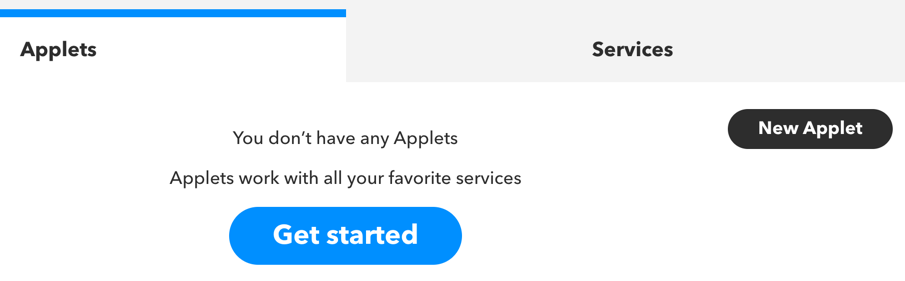

Click **+this**.

This is where you will set up the webhook URL that X-Play can trigger.

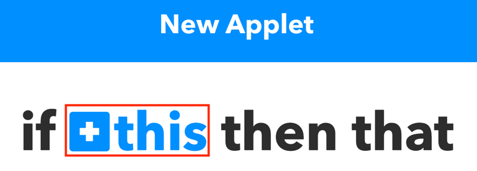

Search and click **Webhooks**.

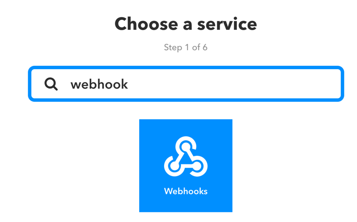

Click **Receive a web request**.

Fill your event name. This name will be part of the webhook url that you got earler.

For example, if the event name is **xplay**, the webhook URL you will use in X-Play will be something like this:

*https://maker.ifttt.com/trigger/xplay/with/key/xxxxxyyyzzz*

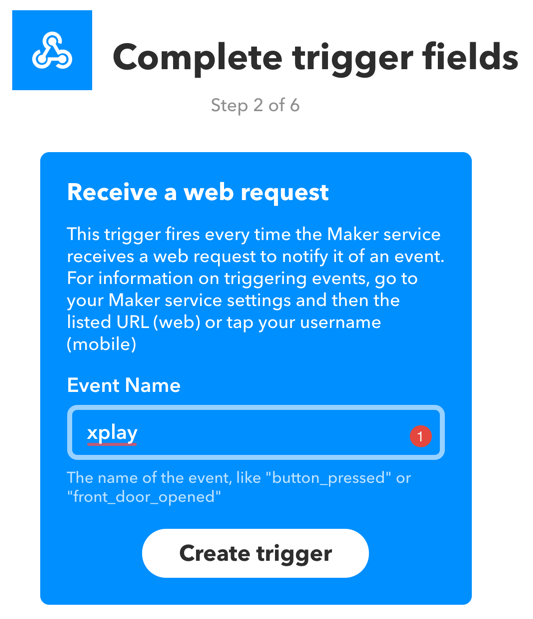

Click **Create trigger**.

You can now create the **+that** to decide what you are going to do in this applet.

You can use your imagination here. There are over 600 services you can choose here.
For example, you can call your cell phone, send you an calendar event, send a text message, or even open your garage door (**Strongly discouraged**).

If you are familiar with Zapier, you can also use that instead of IFTTT.
Zapier can connect to over 1000 services, including Salesforce, PagerDuty, and many enterprise applications.

For this lab we are using its Slack service as an example. You are free and **encouraged** to choose any other service in this step.

.. note::

  X-Play also includes a native Slack action out of the box.

Click **+that**.

Search and click **Slack**.

.. note::

  If you choose any other service, it will be the similar to the following steps.

Click **Connect**.

When prompted, sign into Slack.

Click **Post to channel** and fill in the channel and message.

You have three values can pass from from X-Play to IFTTT.
In this example, Value 1 is the Alert name, Value 2 is the VM name, and Value 3 is the Playbook name. Click “Add Ingredient” is where you insert the parameters of “Value 1/Value 2/Value 3”.

Fill in the Following:

- **Which channel** - Direct Messages & @yourSlackHandle
- **Message** - Nutanix X-FIT just detected an issue of {{Value1}} in {{Value2}} VM. Playbook "{{Value3}}" has increased its memory by 1GB. -- This message was sent by Prism Pro on {{OccurredAt}}.
- **Title** - Nutanix Prism Pro just fixed an issue for you.

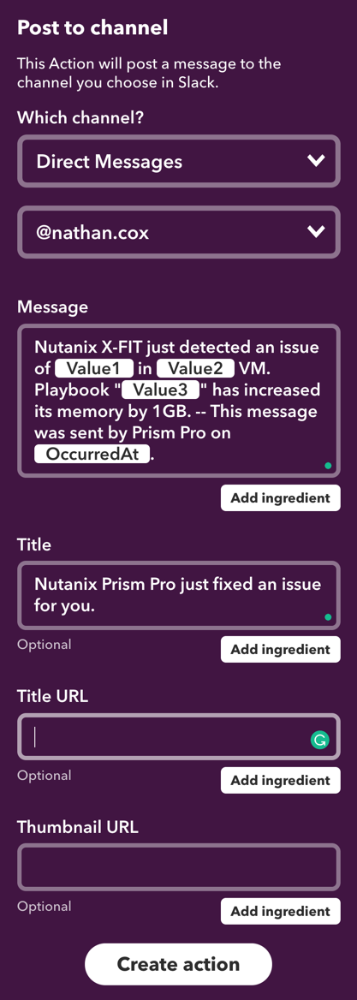

Click **Create Action**, then click **Finish**.

Now you have an IFTTT applet that can be called from X-Play through Webhook

Create Custom REST API Action
.............................

In **Prism Central** > select :fa:`bars` **> Operations > Actions Gallery**.

Select **REST API** action, and then select **Clone** from the **Action** dropdown.

Fill in the following fields:

- **Name**  - *initials* - Slack an X-Play Message by IFTTT
- **Description** - Using with IFTTT
- **Method**  - Post
- **URL** - Your IFTTT URL, will be something like this *https://maker.ifttt.com/trigger/xplay/with/key/xxxxxyyyzzz*
- **Request Body**  - { "value1": "{{trigger[0].alert_entity_info.name}}", "value2": "{{trigger[0].source_entity_info.name}}", "value3": "{{playbook.playbook_name}}" }
- **Request Headers** - Content-Type: application/json

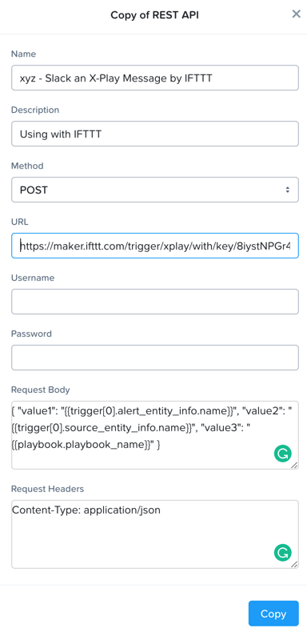

Click **Copy**.

Create Playbook
...............

In **Prism Central** > select :fa:`bars` **> Operations > Playbooks**.

Select *initials* - **Auto Remove Memory Constraint** created in the earlier lab, and click **Update** from the **Action** dropdown.

Click :fa:`ellipsis-v` next to the action **Email** and then choose **Add Action Before**.

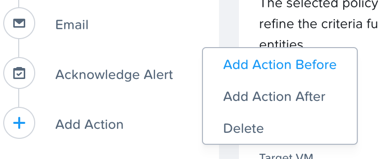

Select the :fa:`terminal` *initials* - **Slack an X-Play Message by IFTTT** action.

Click **Save & Close**

Toggle to **Enabled**, and click **Save**.

Cause Memory Constraint
.......................

In **Prism Central** > select :fa:`bars` **> Virtual Infrastructure > VMs**, and click *initials*-**Linux-ToolsVM**.

Take note of your *initials*-**Linux-ToolsVM** VM's memory capacity (should be 2 GiB).

Click **Alerts**, Select **Alert Policy** from **Configure** Dropdown.

Select *initials* - **VM Memory Constrained**, and **Enable** the policy.

Open a console session or SSH into Prism Central, and run the **paintrigger.py** script.

- **Username** - nutanix
- **password** - nutanix/4u

.. code-block:: bash

  python PrismProLab/paintrigger.py

.. note::

  This will resolve all the alerts, force NCC check to run immediately and trigger the alert.

After 2-5 minutes you should receive an email from Prism.

You also should receive the slack message. Check the message content.

Check the memory capacity on your *initials*-**Linux-ToolsVM** VM now, you should see that it has increased.

Review the Playbook Play
........................

In **Prism Central** > select :fa:`bars` **> Operations > Playbooks**.

Select your *initials* - **Auto Remove Memory Constraint**, and **disable** it.

Click **Plays**.

You should see that a Play has just completed.

Click the Play, and examine the details.

Reset VM Memory
...............

Change your *initials*-**Linux-ToolsVM** memory back to 2gb.

Takeaways
+++++++++

What are the key things you should know about **Prism Pro: XPlay**?

- Prism Pro is our solution to make IT OPS smarter and automated. It covers the IT OPS process ranging from intelligent detection to automated remediation.

- X-FIT is our machine learning engine to support smart IT OPS, including forecast, anomaly detection, and inefficiency detection.

- X-Play, the IFTTT for the enterprise, is our engine to enable the automation of daily operations tasks.

- X-Play enables admins to confidently automate their daily tasks within minutes.

Getting Connected
+++++++++++++++++

Have a question about **Prism Pro: XPlay**? Please reach out to the resources below:

+---------------------------------------------------------------------------------+
|  X-Play Product Contacts                                                        |
+================================+================================================+
|  Slack Channel                 |  #Prism-Pro                                    |
+--------------------------------+------------------------------------------------+
|  Product Manager               |  Harry Yang, harry.yang@nutanix.com            |
+--------------------------------+------------------------------------------------+
|  Product Marketing Manager     |  Mayank Gupta, mayank.gupta@nutanix.com        |
+--------------------------------+------------------------------------------------+
|  Technical Marketing Engineer  |  Brian Suhr, brian.suhr@nutanix.com            |
+--------------------------------+------------------------------------------------+
|  SME                           |                                                |
+--------------------------------+------------------------------------------------+
|  SME                           |                                                |
+--------------------------------+------------------------------------------------+
