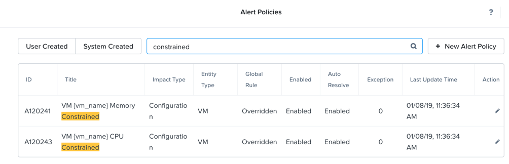

.. _xplay:

-------------------
Nutanix Prism XPlay
-------------------

Overview
++++++++

**Estimated time to complete: 30 MINUTES**

Automatically Add Memory to a VM When A Constraint is Detected
++++++++++++++++++++++++++++++++++++++++++++++++++++++++++++++

How often have you been on-call, and got that alert or service ticket for a VM that was having High memory or CPU?
Chances are a lot, and generally during dinner, while you are out with family, or sleeping.

What if you could use XPlay in Prism Pro to automatically take care of this for you when Prism Pro detected the constraint?
Good news, you can. Let's walk through how to set that up.

Create Alert Policy
...................

In **Prism Central > :fa:`fa-navicon` > Virtual Infrastructure > VMs**, and click **Alerts**

.. figure:: images/xplay_02.png

Select **Alert Policy** from the **Configure** dropdown.

.. figure:: images/xplay_03.png

Click **+ New Alert Policy**, and fill out the following fields:

- **Entity Type** - VM
- **Entity**  - All VMs
- **Metric** - Memory Usage
- **Impact Type** - Performance
- **Policy Name** - VM Memory Constrained - *initials*
- **Description** - Optional

Click **Save**.

Create Playbook
...............

In **Prism Central > :fa:`fa-navicon` > Operations > Playbooks**.

Click **Create Playbook**.

Select **:fa:`fa-bell` Alert** as Trigger, and click **Select**.

.. figure:: images/xplay_01.png

Search “VM Memory Constrained” in **Alert Policy**, and select **VM Memory Constrained - \*initials\* **.

.. figure:: images/xplay_05.png

Click **Add Action**, and select the **VM Snapshot** action.

- **Target VM** - Tomcat-*intials*

Click **Add Action**, and select the **VM Hot Add Memory** action.

- **Target VM** - Tomcat-*intials*
- **Add Absolute Memory** -
- **Absolute Maximum** -

Click **Add Action**, and select the **Email** action.

.. note::

  This action requires the SMTP server to be configured.

- **Recipient** - YourEmail@nutanix.com
- **Subject** - Added Memory to Tomcat-*intials*
- **Message** - Added Memory to Tomcat-*intials*

Click **Add Action**, and select the **Acknowledge Alert** action.

Click **Save & Close**, and fill out the following fields:

- **Name**  - Auto Remove Memory Constraint - *initials*
- **Description** - Optional
- **Status**  - Enabled

.. figure:: images/xplay_06.png

Click **Save**.

Cause Memory Constraint
.......................

In **Prism Central > :fa:`fa-navicon` > Virtual Infrastructure > VMs**.

Take note of your Tomcat-*initials* VM's memory capacity.

Open a console session, and run the **paintrigger** script.

After 1-2 minutes you should receive an email from Prism.

Check the memory capacity on your Tomcat-*initials* VM now, you should see that it has increased.

Review the Playbook Play
........................

In **Prism Central > :fa:`fa-navicon` > Operations > Playbooks**.

Select your **Auto Remove Memory Constraint - *initials* **, and click **Plays**.

You should see that a Play has just completed.

Click the Play, and examine the details.

Reduce Memory On A VM During A Maintenance Windows
++++++++++++++++++++++++++++++++++++++++++++++++++

Getting Engaged with the Product Team
+++++++++++++++++++++++++++++++++++++

+---------------------------------------------------------------------------------+
|  XPlay Product Contacts                                                         |
+================================+================================================+
|  Slack Channel                 |  #                                             |
+--------------------------------+------------------------------------------------+
|  Product Manager               |  Harry Yang, harry.yang@nutanix.com            |
+--------------------------------+------------------------------------------------+
|  Product Marketing Manager     |                                                |
+--------------------------------+------------------------------------------------+
|  Technical Marketing Engineer  |  Brian Suhr, brian.suhr@nutanix.com            |
+--------------------------------+------------------------------------------------+

Takeaways
+++++++++

- Prism Pro is our solution to make IT OPS smarter and automated. It covers the IT OPS process ranging from intelligent detection to automated remediation.
- X-FIT is our machine learning engine to support smart IT OPS, including forecast, anomaly detection, and inefficiency detection.
- X-Play, the IFTTT for the enterprise, is our engine to enable the automation of daily operations tasks.
- X-Play enables admins to confidently automate their daily tasks within minutes.
