.. _xtract_aws:

-----------
Xtract: AWS
-----------

*The estimated time to complete this lab is 60 minutes.*

Overview
++++++++

As customers adopt Nutanix AHV, they require a means of moving existing workloads on other platforms to Nutanix. While third-party tools capable of migrating workloads to AHV exist, they carry additional cost and complexity. Nutanix Xtract offers customers the same Prism-like simplicity they’ve come to expect from Nutanix, making adoption of Enterprise Cloud a breeze - all with no additional cost.

**In this lab you will deploy and configure Nutanix Xtract and use it to migrate an AWS VM instance from the cloud to your Nutanix AHV cluster.**

.. note::

  This lab does require you to sign up for your own AWS Free Tier account. While there should be no charges incurred for the EC2 instances provisioned as part of the lab, signing up for an account does require you to provide a credit card and phone number for verification.

Staging the AWS Environment
+++++++++++++++++++++++++++

In order to make the lab a self-contained experience that you can take forward with you in the field and easily repeat for future demos, events, etc., you will need to provide your own AWS account details.

Signing up for a new AWS account provides free, limited access to a number of AWS services, including up to 750 hours per month of specific **t2.micro** (1vCPU, 1GiB RAM) EC2 instances.

Open https://aws.amazon.com/free in your browser and click **Create a Free Account**.

Follow the prompts to create a **Personal** account with a **Basic** (Free) support plan.

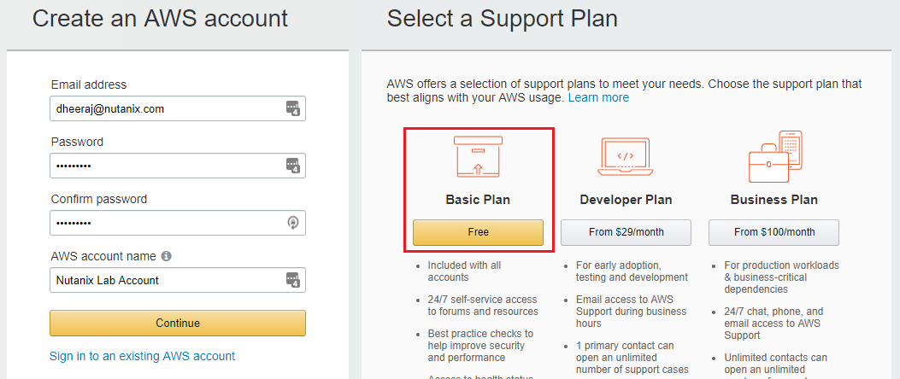

.. note::

  This lab does require you to sign up for your own AWS Free Tier account. While there should be no charges incurred for the EC2 instances provisioned as part of the lab, signing up for an account does require you to provide a credit card and phone number for verification.

After completing your account sign up, log in to the `AWS Management Console <https://aws.amazon.com/console/>`_.

Under **AWS Services**, select **EC2**.

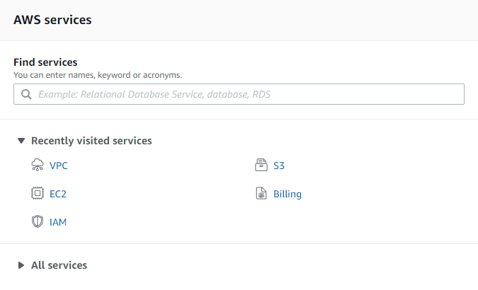

`EC2 <https://docs.aws.amazon.com/AWSEC2/latest/UserGuide/concepts.html>`_, short for Elastic Compute Cloud, is one of the primary services of AWS IaaS offerings. EC2 allows users to provision VMs, referred to as **instances**.

Click the **Launch Instance** button to begin provisioning your virtual server.

The first step is to choose the desired **Amazon Machine Image (AMI)**. `AMIs <https://docs.aws.amazon.com/AWSEC2/latest/UserGuide/AMIs.html>`_ are the equivalent of a Disk Image in AHV, providing the operating system and any pre-installed workloads of the VM.

.. note::

  Xtract does **not** currently support AMIs with `product codes <https://docs.aws.amazon.com/marketplace/latest/userguide/ami-products.html>`_, such as Paid AMIs or AMIs found in the AWS Marketplace.

Under **Quick Start**, search for the **"Free tier eligible" Ubuntu Server 18.04 LTS (HVM) 64-bit x86** AMI and click the **Select** button.

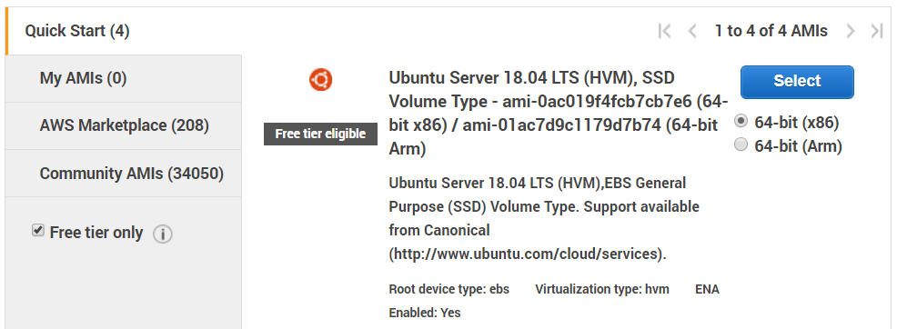

.. note::

  Xtract has qualified support for the following 64-bit guest operating systems for migration from AWS:

  - Windows Server 2012 R2, 2016
  - RHEL 7.3 to 7.5
  - CentOS 7.3 to 7.5
  - Ubuntu 14.04, 16.04, and 18.04

  For future tests/demonstrations, if you wish to migrate a Windows Server image instead of a Linux image, be aware of the following:

  - Select an appropriate instance type. Running Windows Server 2012 R2+ requires more resources than a t2.micro can offer.
  - WinRM must be enabled on the source VM as PowerShell Remoting is used for remote installation of the Nutanix Guest Tools on the source VM. Instructions for enabling WinRM on can be found in the Xtract User Guide `here <https://portal.nutanix.com/#/page/docs/details?targetId=Xtract-for-VMs-v20:v20-xtract-enable-winrm-t.html#ntask_mj1_xxw_cgb>`_.
  - You must add Inbound Rules for the instance Security Policy to allow TCP ports 5985 and 5986 for WinRM.

The CPU, memory, storage, and networking profile of the instance are defined by the **instance type**.

Select the **"Free tier eligible" t2.micro** 1vCPU, 1GiB RAM instance type and click the **Review and Launch** button at the bottom of the instance type table.

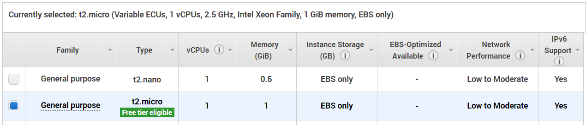

Under **Instance Details**, note that a default **Virtual Private Cloud (VPC)** has been defined for the VM's network and that a public IP address will be assigned to the VM.

A `VPC <https://docs.aws.amazon.com/vpc/latest/userguide/what-is-amazon-vpc.html>`_ is a virtual network dedicated to your AWS account that is logically isolated from other AWS virtual networks. Within a VPC you can define your own subnets and routing, as well as choose whether or not a subnet has `access to the internet <https://docs.aws.amazon.com/vpc/latest/userguide/VPC_Internet_Gateway.html#d0e22943>`_.

In order to migrate a VM from AWS using Xtract, the source VM must have a public IP configured.

Click **Launch** to deploy the instance.

When prompted to provide a keypair for authentication, select **Create a new key pair** from the drop down menu, provide a name and click **Download Key Pair**. Save the .pem file as it will be used later in the exercise.

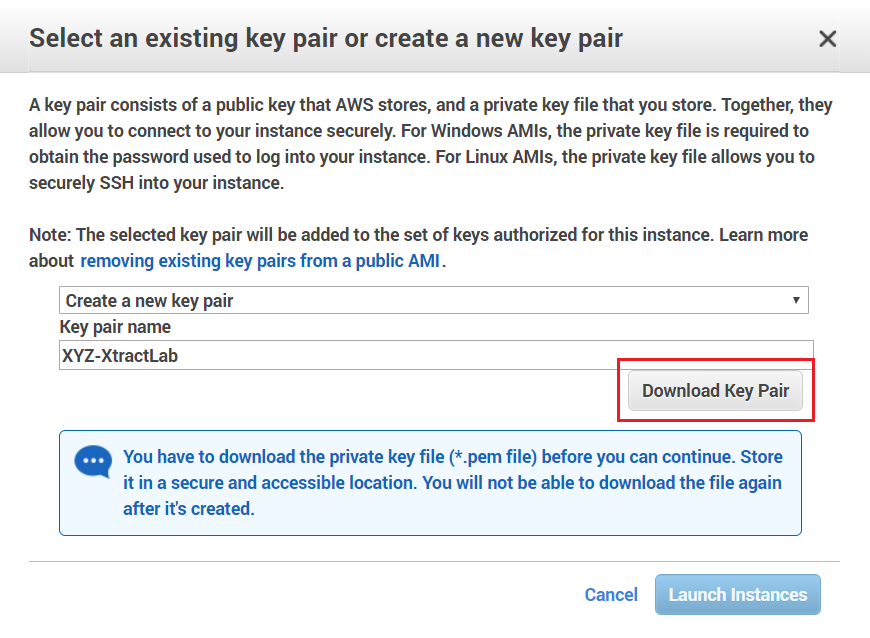

As discussed in the :ref:`calm_linux` lab, access to VMs in a public cloud environment is controlled by SSH keypairs rather than passwords. The keypair does not allow access to your AWS account itself, but is required to log into your provisioned instance.

Click **Launch instances**.

Click **View Instances** to return to the EC2 Dashboard.

Click the :fa:`pencil` icon in the **Name** field to provide a name for your Ubuntu instance (e.g. *Initials*\ -Ubuntu).

Under **Description > Security groups**, click **view inbound rules** and note that the VM is only reachable via TCP port 22 (SSH) from any source (0.0.0.0/0).

Under **Description > Root device type**, not the storage used is **Elastic Block Sotrage (EBS)**. `EBS <https://docs.aws.amazon.com/AWSEC2/latest/UserGuide/AmazonEBS.html>`_ is block storage attached to an EC2 instance and commonly used as the primary storage for file systems and databases.

.. note::

  Xtract does **not** currently support EC2 `Instance Stores <https://docs.aws.amazon.com/AWSEC2/latest/UserGuide/InstanceStorage.html>`_ (temporary block-level storage used for ephemeral caches, scratch data, etc.) or `EFS <https://docs.aws.amazon.com/AWSEC2/latest/UserGuide/AmazonEFS.html>`_ (file server style storage mounted to an EC2 instance).

The final step to prepare your source environment is to create credentials for Xtract to access the AWS environment. Similar to using keypairs for VM access, AWS **Identity and Access Management (IAM)** uses access ID/secret pairs to control user and/or programmatic access. `IAM <https://docs.aws.amazon.com/IAM/latest/UserGuide/introduction.html>`_ is used to provide role based access to a shared AWS account, defining what services, actions, and resources an account can control.

To define the permissions required by Xtract, click the **Services** drop down menu in the top toolbar and search for **IAM**.

Click **Users > Add user**.

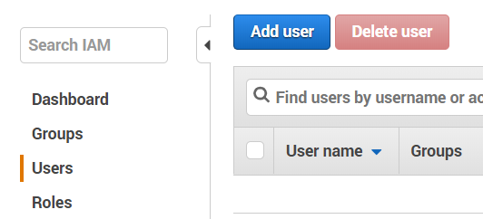

Specify a **User name** (e.g. **Xtract**) and select **Programmatric access** as this will be used purely as a service account.

Click **Next: Permissions**.

Select **Attach existing policies directly > Create policy** to launch the **Create policy** wizard in a new browser tab.

In the **Create policy** wizard, select the **JSON** tab and copy/paste the policy details below (overwriting the provided JSON stub):

.. code-block:: JSON

  {
     "Version": "2012-10-17",
     "Statement": [
         {
             "Sid": "VisualEditor0",
             "Effect": "Allow",
             "Action": [
                "ec2:DetachVolume",
                "ec2:AttachVolume",
                "ec2:DeleteSnapshot",
                "ec2:TerminateInstances",
                "ec2:DeleteTags",
                "ec2:CreateTags",
                "ec2:*Describe*",
                "ec2:RunInstances",
                "ec2:StopInstances",
                "ec2:CreateVolume",
                "ec2:DeleteVolume",
                "iam:SimulatePrincipalPolicy",
                "ec2:StartInstances",
                "ssm:DescribeInstanceInformation",
                "ec2:CreateSnapshot",
                "iam:GetUser",
                "ec2:KeyPair",
                "route53:CreateHostedZone",
                "route53:UpdateHostedZoneComment",
                "route53:GetHostedZone",
                "route53:ListHostedZones",
                "route53:DeleteHostedZone",
                "route53:AssociateVPCWithHostedZone",
                "route53:ChangeResourceRecordSets",
                "route53:DisassociateVPCFromHostedZone",
                "route53:ListResourceRecordSets",
                "route53:GetHostedZoneCount",
                "route53:ListHostedZonesByName"
             ],
             "Resource": "*"
         }
     ]
  }

.. note::

  The permissions above provide the bare minimum access required by Xtract to migrate the resources. In a product environment, the **Resource** node could be further constrained to only allow Xtract access to very specific EC2 resources.

  The permission requirements are documented in the Xtract User Guide `here <https://portal.nutanix.com/#/page/docs/details?targetId=Xtract-for-VMs-v20:v20-xtract-requirements-aws-r.html>`_.

Click **Review policy**, provide a **Name** (e.g. XtractPolicy), and click **Create policy**.

Return to the **Add user** browser tab to search for and select your newly created policy.

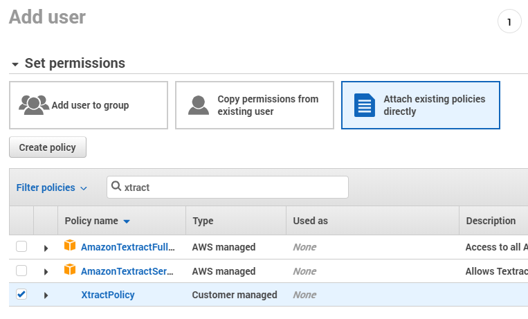

Click **Next: Tags > Next: Review > Create user**. **DO NOT CLICK CLOSE YET**.

Click the **Download .csv** button to save a copy of the **Access key ID** and **Secret access key**. Once you click **Close**, the .csv file will be the only record of the secret key.

Click **Close**.

You have now completed staging the AWS source environment for your migration.

Deploying Xtract
++++++++++++++++

If you have already completed the :ref:`xtract_esxi` lab, skip to the `Configuring a Source Environment`_ section.

Xtract is a .qcow2 virtual appliance, similar to other Nutanix tools. It is distributed as a .zip package and can be downloaded from the `Nutanix Support Portal <https://portal.nutanix.com/#/page/xtract>`_. The .zip package includes the .qcow2 disk image, as well as command line tools for Windows, macOS, and Linux that can be used to script the deployment and IP assignement of the Xtract VM.

In this exercise, you will deploy Xtract from a disk image that has already been populated on your Nutanix cluster. **It is not necessary to download the Xtract package from the Support Portal.**

In **Prism Central**, select :fa:`bars` **> Virtual Infrastructure > VMs**.

.. figure:: images/8.png

Click **Create VM**.

Fill out the following fields:

- **Name** - *Initials*\ -Xtract
- **Description** - (Optional) Description for your VM.
- **vCPU(s)** - 2
- **Number of Cores per vCPU** - 2
- **Memory** - 4 GiB

- Select **+ Add New Disk**
    - **Type** - DISK
    - **Operation** - Clone from Image Service
    - **Image** - xtract-vm-2.0.2.qcow2
    - Select **Add**

- Select **Add New NIC**
    - **VLAN Name** - Secondary
    - Select **Add**

Click **Save** to create the VM.

Select your Xtract VM and click **Power On**.

In **Prism Central > VMs > List**, identify the IP address assigned to your Xtract VM using the **IP Addresses** column.

.. note::

  By default, the X-Ray appliance will obtain an IP address via DHCP. If a static IP address is required, it can be configured via the local Xtract VM console by following the instructions `here <https://portal.nutanix.com/#/page/docs/details?targetId=Xtract-for-VMs-v20:v20-xtract-assign-ip-addresses-t.html#ntask_vlz_f1t_f1b>`_.

Open \https://*XTRACT-VM-IP*/ in a new browser tab.

Accept the End User License Agreement and provide a new password to log into the Xtract web interface (e.g. **techX2019!**).

Specify your new password and click **Log In**.

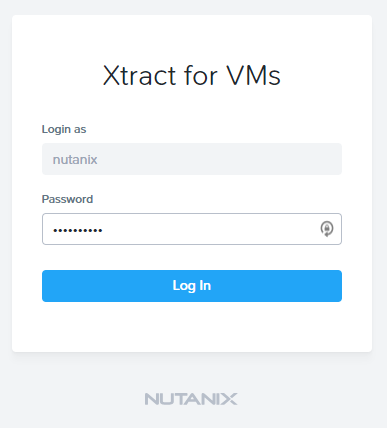

Configuring a Target Environment
++++++++++++++++++++++++++++++++

The target environment is the Nutanix AHV cluster to which you plan to migrate VMs. A single Xtract deployment can support migrations between multiple source and target environments.

Under **Target Environments**, click **+ Add Target**.

Fill out the following fields and click **Add**:

- **Target Name** - *Your Prism Central or Nutanix cluster name*
- **Nutanix Environment** - *Your Prism Central or Prism Element IP*
- **User Name** - admin
- **Password** - techX2019!

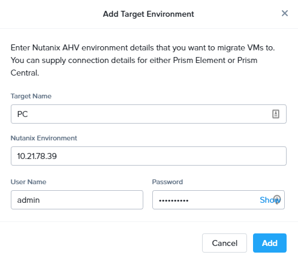

Xtract will confirm the specified PC/cluster can be accessed using the IP/FQDN and credentials provided.

Adding a Prism Central target has the added benefit of being able to target any clusters registered to that Prism Central.

Configuring a Source Environment
++++++++++++++++++++++++++++++++

The source environment is the ESXi or AWS environment from which you plan to migrate VMs.

In order to add an AWS source, you will require the **Access Key ID** and **Secret Access Key** values from the **credentials.csv** downloaded while staging your source environment.

Under **Source Environments**, click **+ Add Source**.

Fill out the following fields and click **Add**:

- **Source Environment Type** - Amazon Web Services
- **Source Name** - *Initials*\ -AWS
- **AWS Access Key ID** - *Your Access Key ID*
- **AWS Secret Access Key** - *Your Secret Access Key*

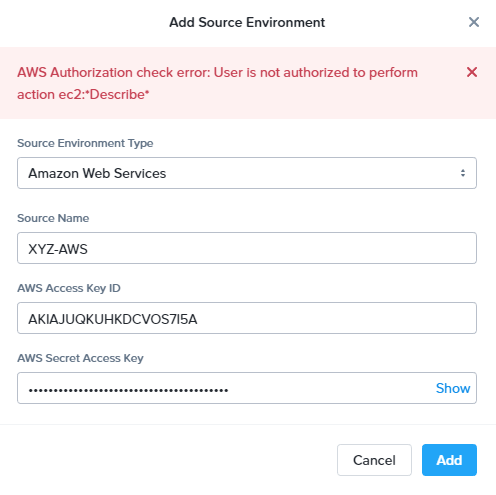

Xtract will confirm your AWS account can be accessed using the keys provided, as well as validating the access key has all of the required permissions.

Migrating VMs
+++++++++++++

Click **Create a Migration Plan**, enter a **Plan Name** (e.g. *Initials*\ -Migration), and click **Proceed**.

Select your AWS environment from the **Select Source** drop down.

Under **Region**, select the automatically populated region. Xtract will only display AWS regions with running EC2 instances.

Select the **Default** storage container as the **Target Container** for your cluster.

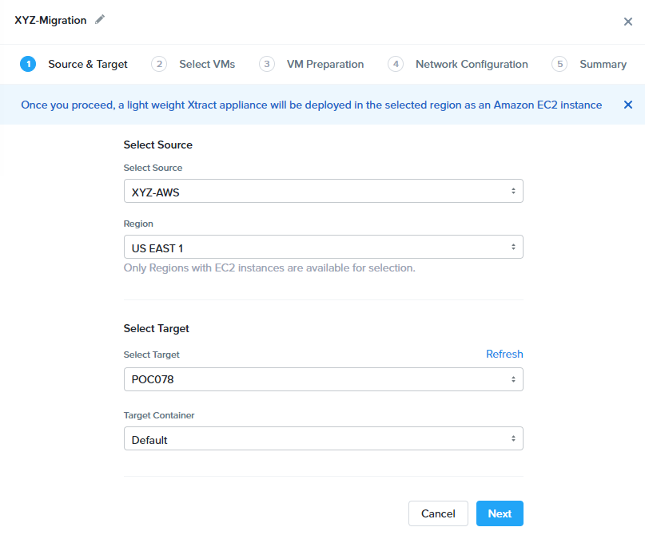

While a single Xtract deployment can support migrations between multiple source and target environments, only a single source and target can be used in an individual Migration Plan.

Click **Next**.

Click the :fa:`plus-circle` icon to add your VM to the migration plan. Multiple VMs can be migrated as part of a single Migration Plan.

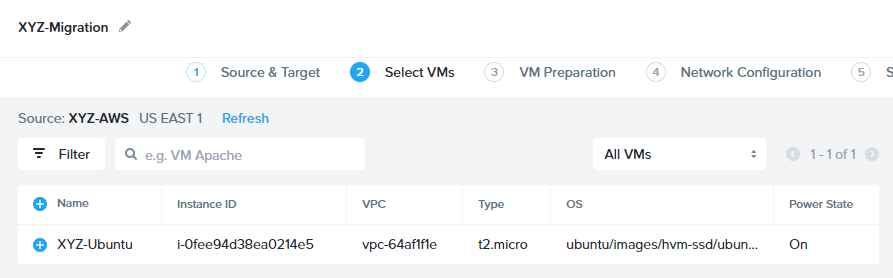

Click **Next**.

As indicated earlier in the UI, Xtract will provision an additional t2.micro instance in the source EC2 Region (e.g. US-EAST-1). The **Xtract Lite** VM is used to establish a secure connection between the Xtract appliance and the source AWS VMs, working with AWS APIs to take snapshots and transfer data from source to target.

Refresh your **EC2 Dashboard** and note that **NTNX-XTRACTLITE-INSTANCE** has been automatically deployed and started. This process should take ~2 minutes.

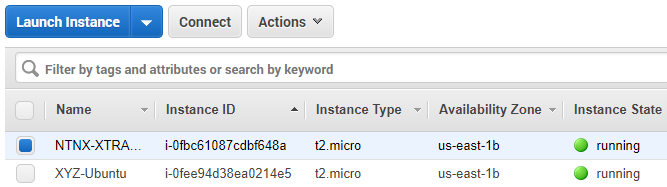

Once **Xtract Lite** is ready, you will be able to proceed with providing credentials for the source VMs.

By default, **automatic** VM Preparation is selected. VM Preparation refers to installing the **virtio** drivers within the source VM prior to migration beginning. The **virtio** drivers provide a high performance I/O interface for disk and network devices on KVM, and allow VMs that were originally deployed on an alternate hypervisor to boot on AHV.

.. note::

  While Xtract installs **virtio** drivers, it does **not** install the full Nutanix Guest Tools (NGT) package.

.. note::

  VMs can be manually prepared by an administrator if they wish to avoid providing Xtract with guest credentials to allow for automatic installation of **virtio** drivers.

Under **Linux VMs**, specify **ubuntu** as the **User Name** for the Ubuntu AMI.

.. note::

  The default user has sudo (root) priveleges, but the actual root account is disabled by default. This is common practice for Linux generic cloud images.

Select **Use Private (.PEM) file to authenticate** and **Upload** the .pem file downloaded when provisioning your AWS instance. As password based authentication is disabled on the AMI, Xtract will use the provided private key to authenticate when connecting via SSH.

.. note::

  The **Override individual VM settings** option lets you define credentials on a per VM basis. This is helpful when migrating multiple VMs and you have Windows AMIs which may have different Administrator passwords, or Linux AMIs that use different keypairs for authentication.

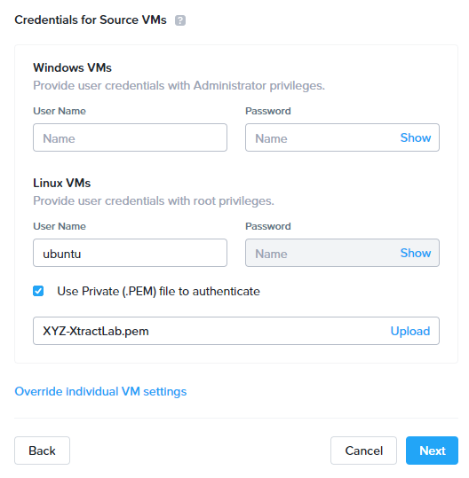

Click **Next**.

Xtract will verify the credentials against all VMs in the migration plan and alert you if any VMs fail to authenticate properly.

Next, Xtract will begin the process of automatically installing the Nutanix Guest Tools in each VM added to the plan. This process should take ~2-3 minutes.

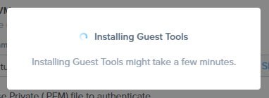

The final step is to map your AWS VPC(s) to the target AHV network(s).

Under **Target Network**, select **Secondary**.

.. note::

  **Schedule Data Seeding** can be used if you want to stage the migration to begin at a specific time, such as off-peak hours at night or over a weekend.

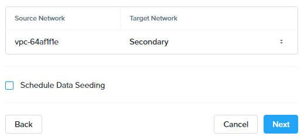

Click **Next > Save and Start** to begin the migration.

Under **Migration Plans**, click **In Progress** to view to status of your migration.

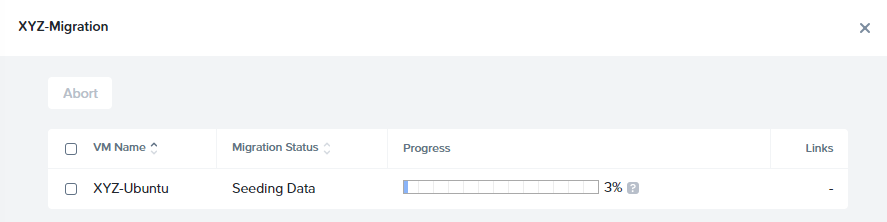

An initial VM will be taken of the VM, at which point data based on that snapshot is transferred from the source, through the Xtract VM, and to the target. As the VM can change (new data written, new applications installed, etc.) during data seeding, subsequent snapshots will be taken to continuously copy deltas to the target cluster.

The initial **Seeding Data** process will take ~15-30 minutes to complete for the VM in this exercise. Time to seed in other environments will be dependent on the amount of source data and bandwidth.

**You can now proceed to an alternate lab and return to Xtract once the Migration Status has reached Ready to Cutover**.

Once a Migration plan has reached **Ready to Cutover** it will still continue to update data as changes are made on the source. This activity keeps the source and target close to being in sync to decrease downtime during cutover. Additionally, VMs can be selected on an individual basis for cutover to allow for flexibility and planning on any brief application outages.

Select your VM and click **Cutover**.

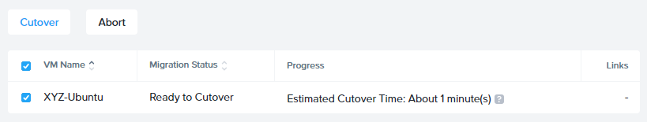

Note that proceeding will shutdown the source VM and disconnect any of its network connections. Why are these steps necessary?

Click **Continue**.

Return to your **EC2 Dashboard** and validate that the source VM is being powered off. Xtract automates a graceful shutdown of the source VM and transfers the remaining delta data to the target environment. This process will take ~2-5 minutes.

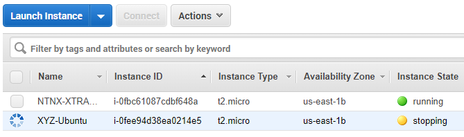

Once the final migration is completed, the migrated VM is powered on on the target AHV cluster. Click **View in Prism** and verify the VM is running and has obtained an IP address on the **Secondary** network.

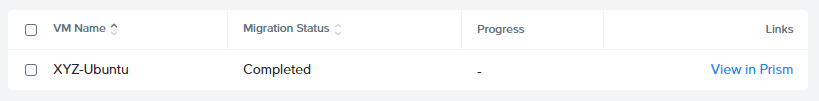

(Optional) Connecting to the VM
+++++++++++++++++++++++++++++++

As previously mentioned, the Ubuntu AMI does not have a password for the default **ubuntu** account and requires authentication via keypair.

Using the .pem file downloaded when provisioning your instance, you can connect from a macOS or Linux terminal using the following command:

``ssh -i /path/to/your-downloaded-pem.pem" ubuntu@\ *VM-IP-Address*``

See `these instructions <https://docs.aws.amazon.com/console/ec2/instances/connect/putty>`_ for steps on how to convert the .pem file to a .ppk format and connect to the VM from Windows using PuTTY.

Cleaning Up Your Source Environment
+++++++++++++++++++++++++++++++++++

The following steps should be taken to prevent any unexpected AWS charges.

Return to **Xtract**, under **Migration Plans**, select **Action > Delete > Continue** to remove your completed AWS Migration Plan.

Once the final migration plan configured for a given AWS region has been removed, Xtract will automatically power down the Xtract Lite VM.

Return to your **EC2 Dashboard** and verify that **NTNX-XTRACTLITE-INSTANCE** has been stopped.

Return to **Xtract**, under **Source Environments**, select **... > Remove > Remove** to remove your AWS source environment.

Once the source has been removed, Xtract will automatically terminate (delete) the **NTNX-XTRACTLITE-INSTANCE** for that region.

Return to your **EC2 Dashboard** and verify that **NTNX-XTRACTLITE-INSTANCE** has been terminated.

The final step is to terminate your source Ubuntu instance by right-clicking the instance and selecting **Instance State > Terminate > Yes, Terminate**.

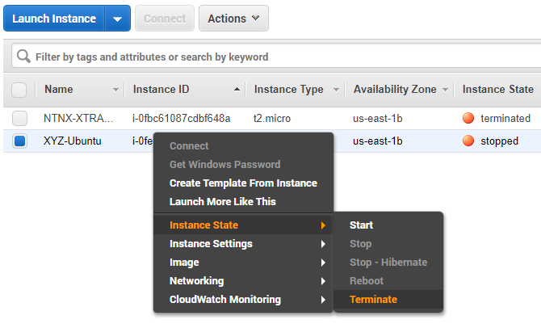

Takeaways
+++++++++

What are the key things you should know about **Nutanix Xtract**?

- Xtract is licensed at no cost for any Nutanix customer.

- Xtract for VMs simplifies bulk migration of existing VMs on AWS or ESXi to Nutanix, eliminating the friction associated with onboarding new IT infrastructure.

- Xtract features the ability to migrate all AHV certified OSes, scheduling data-seeding and migrations, multi-cluster migration management, and grouping/sorting VMs.

Getting Connected
+++++++++++++++++

Have a question about **Nutanix Xtract**? Please reach out to the resources below:

+---------------------------------------------------------------------------------+
|  Xtract Product Contacts                                                        |
+================================+================================================+
|  Slack Channel                 |  #xtract                                       |
+--------------------------------+------------------------------------------------+
|  Product Manager               |  Jeremy Launier, jeremy.launier@nutanix.com    |
+--------------------------------+------------------------------------------------+
|  Technical Marketing Engineer  |  GV Govindasamy, gv@nutanix.com                |
+--------------------------------+------------------------------------------------+
